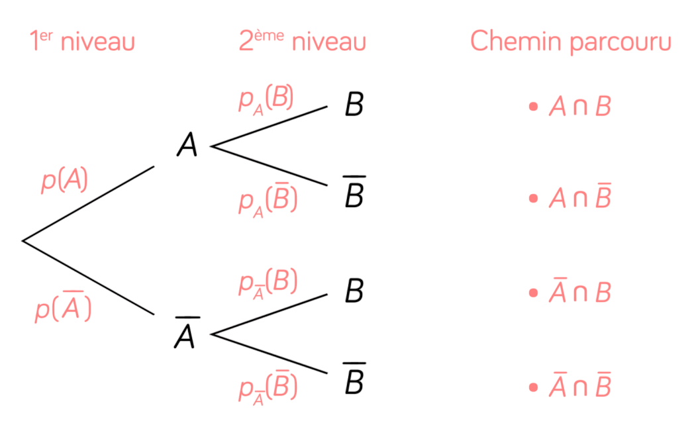
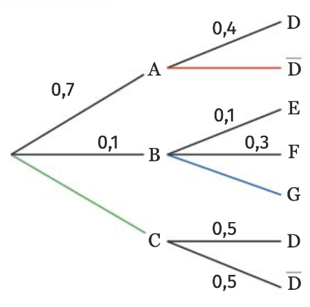

# Utiliser un arbre pondéré pour résoudre un problème

## Comment faire ?

!!! info "Lire une probabilité  à partir d’un arbre"
    On rappele la position des différentes probabilités sur l'arbre pondéré : 

    

    
    

!!! methode "Comment compléter un arbre pondéré ?"
    On cherchera à compléter les différents nœuds de l’arbre ci-dessous :

    

    
    

    1. **On fait la somme de toutes les probabilités du nœud, elle doit être égale à 1.**  
       Premièrement, on a : $\textcolor{gray}{0{,}7 + 0{,}1 + \mathbb{P}(C) = 1}$  
       Ensuite, $\textcolor{gray}{\mathbb{P}_A(D) + \mathbb{P}_A(\overline{D}) = 0{,}4 + \mathbb{P}_A(\overline{D}) = 1}$  
       Finalement, $\textcolor{gray}{\mathbb{P}(E) + \mathbb{P}(F) + \mathbb{P}(G) = 1}$.

    2. **On en déduit la probabilité manquante.**  
       Premièrement, $\textcolor{gray}{\mathbb{P}(C) = 1 - 0{,}7 - 0{,}1 = 0{,}2}$  
       Ensuite, $\textcolor{gray}{\mathbb{P}_A(\overline{D}) = 1 - 0{,}4 = 0{,}6}$  
       et $\textcolor{gray}{\mathbb{P}(G) = 1 - 0{,}1 - 0{,}3 = 0{,}6}$.

!!! methode "Comment calculer une intersection sur un arbre pondéré"
    On considère l'arbre de la méthode précédente. On cherchera à calculer $\textcolor{gray}{\mathbb{P}(A \cap D)}$.

    1. **On écrit le chemin à parcourir.**  
       Ici, $\textcolor{gray}{\mathbb{P}(A \cap D) = \mathbb{P}(A) \times \mathbb{P}_A(D)}$.

    2. **On remplace par les valeurs et on calcule.**  
       On a donc $\textcolor{gray}{\mathbb{P}(A \cap D) = 0{,}7 \times 0{,}4 = 0{,}28}$.

## S'entrainer !

#### Lire une probabilité  à partir d’un arbre

<iframe src="https://coopmaths.fr/alea/?EEEE2e0a294917e8139c16590f22272e26ee2b0a1f51138f2b1614bb272e13350f2c18292cde277b2922132b26f117e60f2f181a2a762e5e0f1e2d0a13fe133612d112c72d9a2d9d27921dfa2cce11222b3e111d2cd8268a26922a7a2d56139e1a400e8714d6165010d2139e1a400e8714d612cc2c022cdd295711110e8714da138e139e15f10e8714ce169a2b042637269b0065" class="exerciseur" allowfullscreen></iframe>

#### Calculer la probabilité d’une intersection

<iframe src="https://coopmaths.fr/alea/?EEEE2e0a294917ec26c526600f22272e26ee2b0a1f5113f32b1614bb272e13350f2c18292cde277b26f117e60f2f181a2a762e5e0f1e2d0a13fe133612d112c72d9a2d9d27921a6e2a742e0127c7111925f02c132b9f2627295129590e8714d813f2139e197e11110e8714da138e139e15f10e8714ce169a2b3e11162b4d27c72d3227012954006e" class="exerciseur" allowfullscreen></iframe>