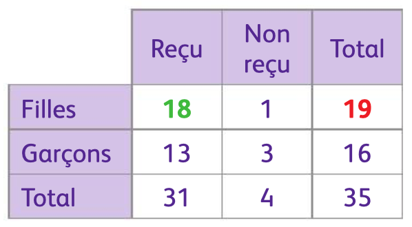

# Calculer des probabilités conditionnelles

## Comment faire ?

!!! methode "Comment calculer des probabilités conditionnelles ?"
    Le tableau ci-dessous donne le nombre d’élèves reçus au baccalauréat dans une classe de Terminale. On choisit un élève au hasard. On veut déterminer la probabilité que l’élève soit reçu sachant que c’est une fille.

    

    
    

    1. **Identifier l’évènement dont on veut calculer la probabilité et l’évènement condition.**  
       Ici, on veut calculer la probabilité de l’événement $\textcolor{gray}{R}$ : "Être reçu" avec la condition $\textcolor{gray}{F}$ : "Être une fille". On cherche donc $\textcolor{gray}{\mathbb{P}_F(R)}$.

    2. **Écrire la formule puis calculer la probabilité.**  
       On a donc :  
       $\textcolor{gray}{\mathbb{P}_F(R) = \dfrac{\mathbb{P}(F \cap R)}{\mathbb{P}(F)} = \dfrac{\dfrac{18}{35}}{\dfrac{19}{35}} = \dfrac{18}{19}}$.

    3. **Conclure.**  
       La probabilité que l’élève soit reçu sachant que c’est une fille est de $\textcolor{gray}{\dfrac{18}{19}}$.

## S'entrainer !

#### Écrire une probabilité avec les notations

<iframe src="https://coopmaths.fr/alea/?EEEE2e0a294917e614fb155d0f22272e26ee2b0a1f51132b2b1615e7272e13350f2c18292cde277b2922132b26f117e60f2f181a2a762e5e0f1e2d0a13fe133612d112c72d9a2d9d27920e8714d813f2139e15fa26ff295727802e0327802c132b9f2627295129590e8714d813f2139e197e110e2e5e26b82a762cf82b482d922d9a2bab0073" class="exerciseur" allowfullscreen></iframe>

#### Calculer des probabilités conditionnelles

!!! example "Aucun exerciseur disponible"
      Pour le moment, aucun exerciseur n’est disponible pour travailler ces compétences. Le site sera mis à jour dès qu’une ressource sera accessible.

      **Vous pouvez, toutefois, pratiquer cette compétences dans l'exerciseur "Révisions complètes" présent sur la page "Objectifs" du chapitre.**