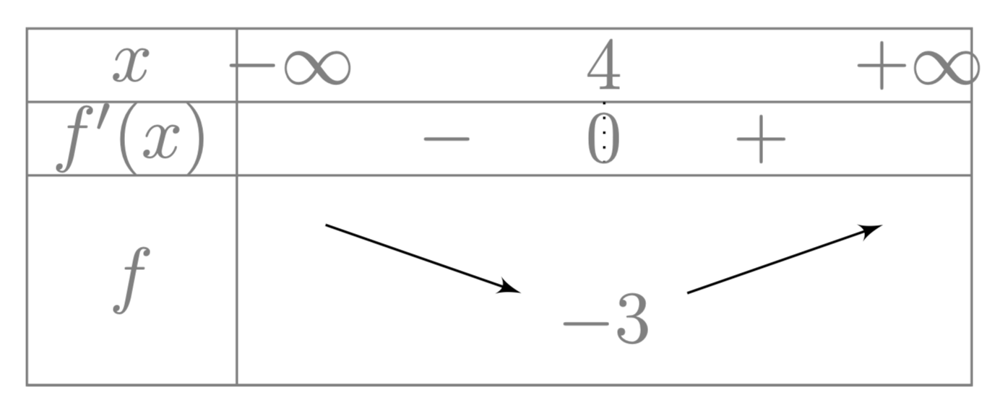

# Etudier une fonction contenant des exponentielles

## Comment faire ?

!!! methode "Comment étudier une fonction contenant des exponentielles"
    On cherche à dresser le tableau de variation de la fonction $\textcolor{gray}{f(x) = e^{x - 4} - x}$ définie sur $\textcolor{gray}{\mathbb{R}}$.

    1. **On calcule la dérivée de $f$** (voir fiches 15 à 19 + propriété)  
        Ici, $\textcolor{gray}{\forall x \in \mathbb{R},\ f'(x) = e^{x - 4} - 1}$.

    2. **On étudie le signe de la dérivée** (voir fiche 42)  
        Ici, $\textcolor{gray}{f'(x) < 0 \Leftrightarrow e^{x - 4} - 1 < 0 \Leftrightarrow e^{x - 4} < 1 \Leftrightarrow e^{x - 4} < e^0 \Leftrightarrow x - 4 < 0 \Leftrightarrow x < 4}$

    3. **On dresse le tableau de variation de $f$** (voir fiche 39)  
        

        
        

    

## S'entrainer !

Pas d'exerciseurs disponible pour cette méthode... pour le moment !