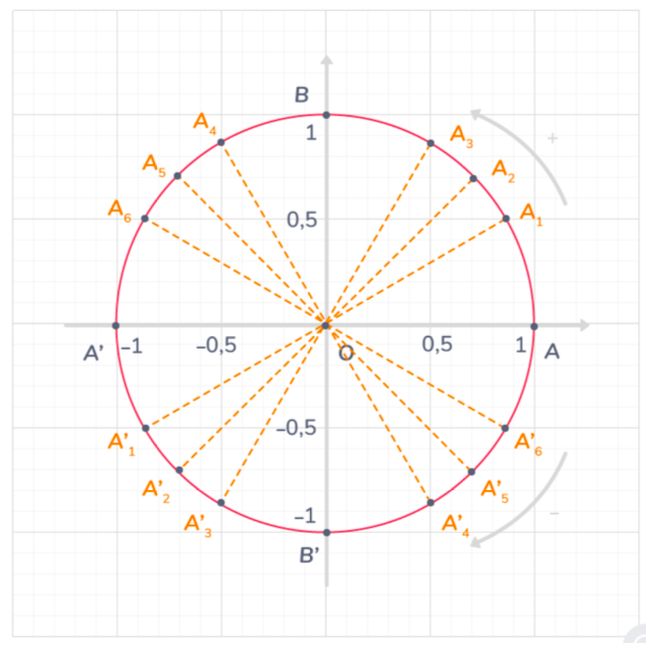

# Se repérer sur le cercle trigonométrique

## Comment faire ?

!!! methode "Comment se repérer sur le cercle trigonométrique ?"
    On prendra pour exemple le point associé au réel \( \tfrac{7\pi}{3} \).

    

    
    

    1. **Si le réel n’appartient pas à l’intervalle \( ]-\pi ; \pi] \), déterminer la mesure principale de l’angle.**  
       Ici, \( \tfrac{7\pi}{3} \notin ]-\pi ; \pi] \). Il faut donc déterminer sa mesure principale.  
       Pour ce faire, on ajoute \( 2\pi \) si le réel est inférieur à \(-\pi\) OU on soustrait \( 2\pi \) si le réel est supérieur à \( \pi \).  

        Ici, \( \tfrac{7\pi}{3} > \pi \) donc on enlève \( 2\pi \). On obtient :  \( \tfrac{7\pi}{3} - 2\pi = \tfrac{\pi}{3} \).  

    2. **On vérifie le signe de la mesure principale de l’angle.**  
       Si la mesure est positive, on se déplacera dans le sens direct, sinon dans le sens indirect.  
       Ici, \( \tfrac{\pi}{3} > 0 \) donc ça sera dans le sens direct.  

    3. **On place le point.**  
       On peut soit convertir en degré, soit utiliser les valeurs remarquables.  
       Ici, \( \tfrac{\pi}{3} \) est une valeur remarquable donc nous pouvons la placer directement.  
       Il s’agit du point \( A_3 \).

## S'entrainer !

#### Donner la mesure principale d'un angle

<iframe src="https://coopmaths.fr/alea/?EEEE2e0a29491816158f13040f22272e13461e8d132b2b1614bb272e13350f2217e60f1c272e132b2e3627c127cb277b27c817e81336133512d10f2d29592a7617f92bab2b3e2c942a72111a27c82e0727802c13295326f62c022a7611110e8714c715d22b04263328890065" class="exerciseur" allowfullscreen></iframe>

#### Placer un point sur le cercle trigonométrique

<iframe src="https://coopmaths.fr/alea/?EEEE2e0a2949181625fb152a0f22272e26ee2b0a1bcd164b2b1614bb272e13350f2a26fa17e50f2217e60f1c272e132b2e3627c127cb277b27c817e81336133512d10f2d29592a7618052a7226f22c942e03111d2ba62b4d11202e071119278026f22ccc2a7611212cd2288c2b482a9a139e1a400e8714d616992cd22c7a0065" class="exerciseur" allowfullscreen></iframe>

#### Donner la mesure d'angle d'un point du cercle trigonométrique

<iframe src="https://coopmaths.fr/alea/?EEEE2e0a294917e8142e278d0f22272e26ee2b0a1bce12c72b1614bb272e13350f2a26fa17e50f2217e60f1c272e132b2e3627c127cb277b27c817e81336133512d10f2d29592a7617f92bab2b3e2c942a72111a27c82e0727802716139e13a02633288927802716139e13a02e03111d2ba62b4d11112dc026f22ccc2a7611212cd2288c2b482a9a139e1a400e8714d616992cd22c7a0065" class="exerciseur" allowfullscreen></iframe>

