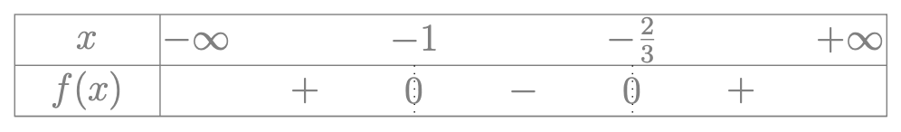

# Déterminer le signe d'un polynôme du second degré

## Comment faire ?

!!! methode "Comment déterminer le signe d'un polynôme du second degré ?"
    Prenons pour exemple la fonction polynomiale du second degré  
    $\textcolor{gray}{f(x) = 3x^2 + 5x + 2}$.

    1. **On identifie le coefficient $a$ de $x^2$.**  
       Ici, $\textcolor{gray}{a = 3}$.

    2. **On détermine les racines du polynôme** [(voir fiche 12)](../5%20-%20Second%20degré%202/fiche12.md).  
       Ici, $\textcolor{gray}{f(x) = 0 \iff x \in \{-1; -\frac{2}{3}\}}$.

    3. **Analyse du signe de $f(x)$.**  
        - Si **il n’y a pas de racine réelle**, $f(x)$ est du signe de $a$ sur $\mathbb{R}$.
        - Si **il y a une unique racine**, $f(x)$ est du signe de $a$ sauf en $x_0$ où $f(x) = 0$.
        - Si **il y a deux racines**, $f$ **s’annule** en $x_1$ et $x_2$ et **prend le signe de $a$** à l’extérieur des racines.  

        Ici, il y a deux racines réelles et $\textcolor{gray}{a > 0}$.  
        On peut donc dresser le tableau de signe suivant :

        

        
        

## S'entrainer !

<iframe src="https://coopmaths.fr/alea/?EEEE2e0a294917ec15bf26f00f22272e13461dc313fa14610f2717ea0f1d17e612c726f117e60f2f181a2a762e5e0f1e2d0a13ff133612d112c72d9a2d9d2792200e139e1a400e8714d616982bb2276327802e03278029530e8714d813f2139e197e2c7a263929542b042766112027b82bab271c2756288f0e8714d813f2139e197e" class="exerciseur" allowfullscreen></iframe>