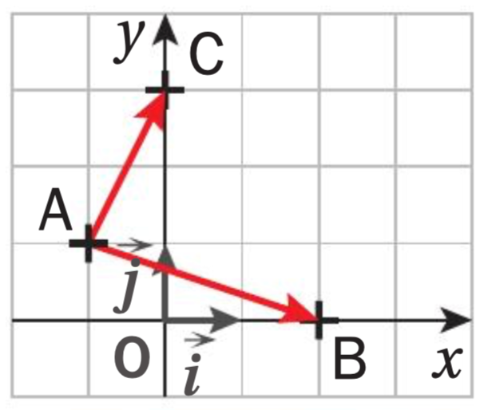

# Calculer un produit scalaire avec des normes

## Comment faire ?

!!! methode "Comment calculer un produit scalaire avec des normes ?"
    Prenons pour exemple la configuration du plan ci-contre. On cherche à calculer $\textcolor{gray}{\overrightarrow{AB} \cdot \overrightarrow{AC}}$.

    

    
    

    1. **Vérifier que le repère est bien orthonormé.**  
       Ici, $\textcolor{gray}{\|\overrightarrow{i}\| = \|\overrightarrow{j}\|}$ et les deux axes sont perpendiculaires.  
       Le repère $\textcolor{gray}{(O; \overrightarrow{i}, \overrightarrow{j})}$ est donc bien orthonormé.

    2. **On détermine les coordonnées des deux vecteurs.**  
       On a :  $\textcolor{gray}{\overrightarrow{AB} = \begin{pmatrix} 3 \\ -1 \end{pmatrix}}$ et $\textcolor{gray}{\overrightarrow{AC} = \begin{pmatrix} 1 \\ 2 \end{pmatrix}}$.

    3. **On applique la formule** :  $\overrightarrow{u} \cdot \overrightarrow{v} = x \cdot x' + y \cdot y'$.  
        On a donc :  $\textcolor{gray}{\overrightarrow{AB} \cdot \overrightarrow{AC} = 3 \times 1 + (-1) \times 2 = 3 - 2 = 1}$.

## S'entrainer !

<iframe src="https://coopmaths.fr/alea/?EEEE2e0a2949181a139926f00f22272e26ee2b0a1bcd14bb2b1614bb272e13350f1c272e132b2e3627c127cb277b27c817e81336133512d10f2d29592a7617f8263127022a762c942e03111d2cd827662959112026ee2a7229572780263b27b8111927c811102bac2ccd2bab2afe139e1a400e8714d6168a0073" class="exerciseur" allowfullscreen></iframe>
