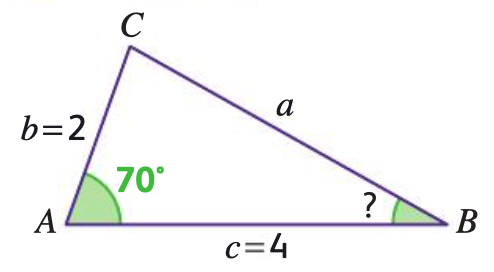

# Calculer une longueur ou un angle avec Al-Kashi

## Comment faire ?

!!! methode "Comment calculer une longueur avec Al-Kashi ?"
    On considère le triangle ABC ci-dessous. On veut calculer $\textcolor{gray}{BC = a}$.

    

    
    

    1. **On écrit la relation du théorème d’Al-Kashi en isolant directement la longueur dont on souhaite calculer la longueur.**  
       Pour calculer $a$, le théorème d’Al-Kashi s’écrit :  $\textcolor{gray}{a^2 = b^2 + c^2 - 2bc \cos(\widehat{BAC})}$.

    2. **On remplace les inconnues du membre de droite par les valeurs numériques.**  
       Ainsi, $\textcolor{gray}{a^2 = 2^2 + 4^2 - 2 \times 2 \times 4 \times \cos(70^\circ)}$.

    3. **On effectue les calculs. Attention aux réglages de votre calculatrice !**  
       Ainsi, $\textcolor{gray}{a^2 \approx 14{,}53}$.

    4. **On détermine notre longueur en prenant la racine carrée.**  
       Finalement, $\textcolor{gray}{a = \sqrt{a^2} \approx 3{,}8}$.

!!! methode "Calculer une mesure d’angle avec Al-Kashi ?"
    On considère le triangle $\textcolor{gray}{ABC}$ précédent avec $\textcolor{gray}{a = 3{,}8\,cm}$. On cherche la mesure de $\textcolor{gray}{\widehat{CBA}}$.

    1. **On écrit l’égalité d’Al-Kashi dont le côté opposé à notre angle est isolé.**  
       Ici, le côté opposé à $\textcolor{gray}{\widehat{CBA}}$ est $\textcolor{gray}{[AC]}$ de longueur $\textcolor{gray}{b}$. Ainsi,  $\textcolor{gray}{b^2 = a^2 + c^2 - 2ac \cos(\widehat{CBA})}$.

    2. **On remplace avec les données connues.**  
       On a donc : $\textcolor{gray}{2^2 = 3{,}8^2 + 4^2 - 2 \times 3{,}8 \times 4 \times \cos(\widehat{CBA}) \Leftrightarrow\ 4 = 14{,}44 + 16 - 30{,}4 \times \cos(\widehat{CBA})}$.

    3. **On isole le cosinus.**  
       Ainsi, $\textcolor{gray}{4 - 14{,}44 - 16 = -30{,}4 \times \cos(\widehat{CBA}) \Leftrightarrow\ \cos(\widehat{CBA}) = \dfrac{4 - 14{,}44 - 16}{-30{,}4}}$.

    4. **Avec la touche $\cos^{-1}$ de votre calculatrice, déterminer la mesure de l’angle.**  
       On a $\textcolor{gray}{\cos(\widehat{CBA}) \approx 0{,}869}$. Ainsi, $\textcolor{gray}{\widehat{CBA} \approx 29{,}57^\circ \approx 0{,}52\,rad}$.

## S'entrainer !

!!! example "Aucun exerciseur disponible"
      Pour le moment, aucun exerciseur n’est disponible pour travailler ces compétences. Le site sera mis à jour dès qu’une ressource sera accessible.