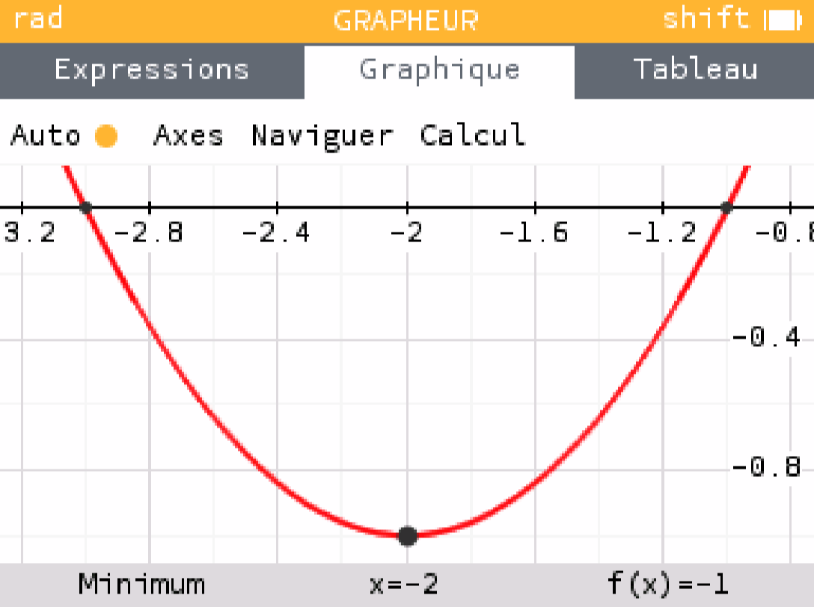
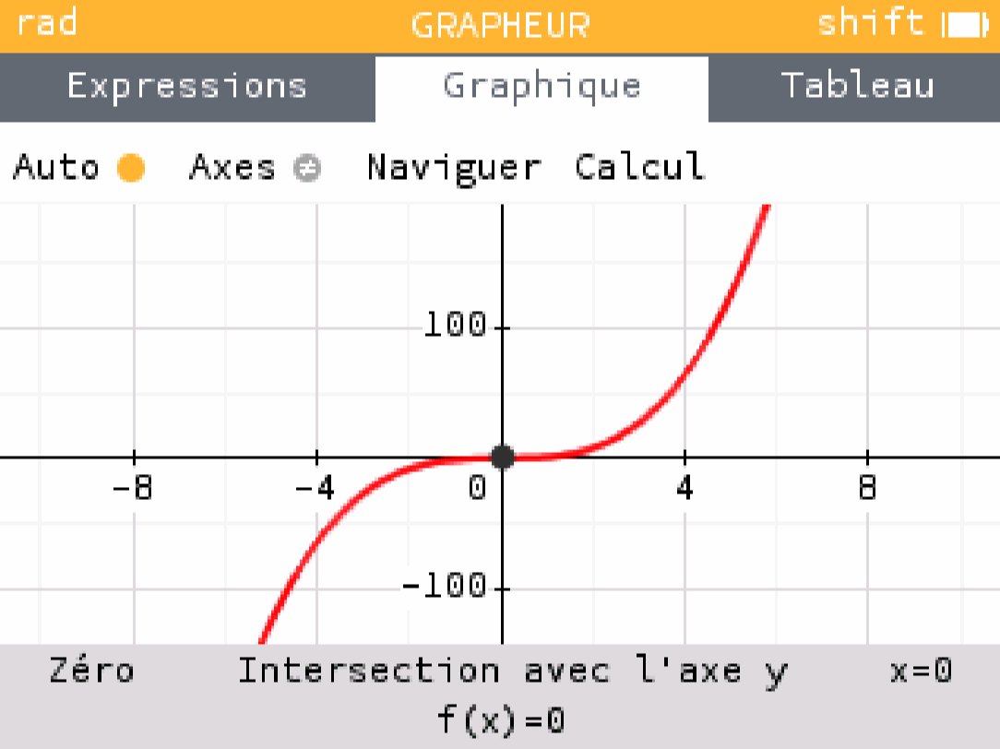

# Déterminer les extremums d'une fonction

## Comment faire ?

!!! methode "Comment déterminer les extremums d'une fonction ?"
    On considère les fonctions $\textcolor{gray}{f(x) = x^2 + 4x + 3}$ et $\textcolor{gray}{g(x) = x^3}$.

    1. **On dérive la fonction (voir fiches 15 à 19).**  
       Ici, $\textcolor{gray}{f'(x) = 2x + 4}$ et $\textcolor{gray}{g'(x) = 3x^2}$.

    2. **On cherche pour quelles valeurs de $x$ la fonction dérivée s’annule.**  
       Ici, $\textcolor{gray}{f'(x) = 0 \Leftrightarrow 2x + 4 = 0 \Leftrightarrow x = -2}$.  
       De même, $\textcolor{gray}{g'(x) = 0 \Leftrightarrow 3x^2 = 0 \Leftrightarrow x = 0}$.

    3. **On étudie le signe avant et après la ou les valeurs trouvées.**  
       Si la fonction dérivée change de signe, elle admet un extremum local, sinon non. 

        Ici, $\textcolor{gray}{f'(x)}$ est négative lorsque $\textcolor{gray}{x < -2}$ et positive quand $\textcolor{gray}{x > -2}$.  
        $\textcolor{gray}{f}$ admet donc un extremum local en $x = -2$.  

        Toutefois, malgré le fait que $\textcolor{gray}{g'(0) = 0}$, $\textcolor{gray}{g'(x)}$ reste toujours positive.  
        $\textcolor{gray}{g}$ n’admet donc pas d’extremum local en $\textcolor{gray}{0}$.  

        La représentation graphique de ces fonctions permet de confirmer ces résultats :  

         

         
         
         

    

## S'entrainer !

!!! example "Aucun exerciseur disponible"
      Pour le moment, aucun exerciseur n’est disponible pour travailler ces compétences. Le site sera mis à jour dès qu’une ressource sera disponible.