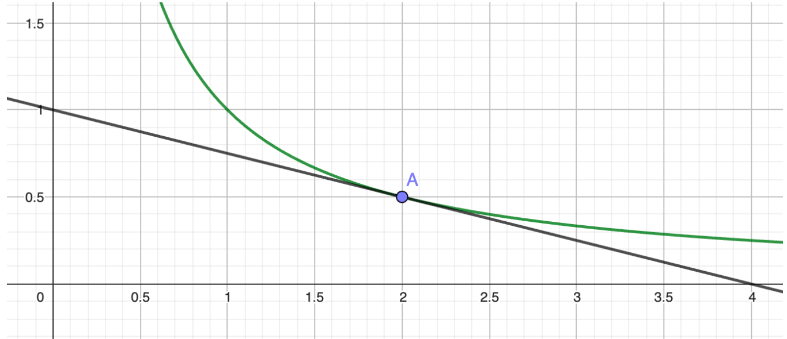

# Déterminer graphiquement un nombre dérivé

## Comment faire ?

!!! methode "Comment déterminer graphiquement un nombre dérivé ?"
    On considère la fonction \( f \) représentée ci-contre définie sur \( \mathbb{R}_+^* \), et la tangente à cette courbe au point \( A \) d’abscisse 2. On cherchera à déterminer \( f'(2) \).

    

    
    

    1. **Repérer la tangente à la courbe au point d’abscisse \( a \).**  
       Ici, la tangente au point d’abscisse 2 est dessinée en verte.

    2. **Lire le coefficient directeur de cette tangente ou le calculer avec la forme  $\frac{y_B - y_A}{x_B - x_A}$ (où \( A \) et \( B \) sont deux points de la tangente).**  
      Ici, on lit que la pente vaut  \( \textcolor{gray}{-\tfrac{1}{4}} \).

    3. **On conclut : le coefficient directeur de la tangente correspond au nombre dérivé recherché !**  
       Ici, on a donc  \( \textcolor{gray}{f'(2) = -\tfrac{1}{4}} \).

## S'entrainer !

Pas d'exerciseurs disponible pour cette méthode... pour le moment ! (Voir prérequis sur les fonctions affines)

