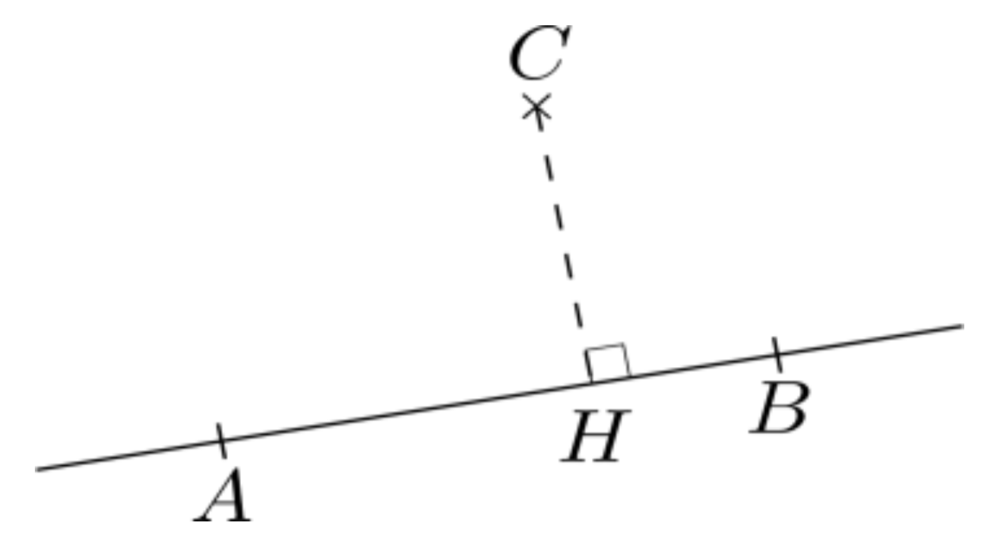

# Calculer un produit sclaire avec le projeté orthogonal

## Comment faire ?

!!! methode "Comment calculer un produit sclaire avec le projeté orthogonal ?"
    On se place dans une configuration de la définition ci-dessous. On veut calculer $\textcolor{gray}{\overrightarrow{AB} \cdot \overrightarrow{AC}}$.

    

    
    

    1. **On détermine le projeté orthogonal de $C$ sur la droite $(AB)$.**  
       Ici, le projeté orthogonal de $C$ sur $(AB)$ est $\textcolor{gray}{H}$.

    2. **$\overrightarrow{AB}$ et $\overrightarrow{AH}$ sont colinéaires, on compare donc leurs sens (identiques ou contraires).**  
       Ici, $\textcolor{gray}{\overrightarrow{AH}}$ et $\textcolor{gray}{\overrightarrow{AB}}$ sont de même sens.

    3. **On applique la formule** :  $\textcolor{gray}{\overrightarrow{AB} \cdot \overrightarrow{AC} = \|\overrightarrow{AB}\| \times \|\overrightarrow{AH}\|}$ s’ils sont dans le même sens,  $\textcolor{gray}{\overrightarrow{AB} \cdot \overrightarrow{AC} = -\|\overrightarrow{AB}\| \times \|\overrightarrow{AH}\|}$ sinon.   
        Ici, on a donc :  $\textcolor{gray}{\overrightarrow{AB} \cdot \overrightarrow{AC} = \|\overrightarrow{AB}\| \times \|\overrightarrow{AH}\|}$.

## S'entrainer !

<iframe src="https://coopmaths.fr/alea/?EEEE2e0a29491816140614970f22272e26ee2b0a1bcd151f2b1614bb272e13350f1c272e132b2e3627c127cb277b27c817e81336133512d20f2d29592a7617f8263127022a762c942e03111d2cd827662959112026ee2a72295727802d422c9427562cf8282228922cce2cf82842139e1a400e8714d616942a9a139e1a400e8714d616992cd22c7a27c8" class="exerciseur" allowfullscreen></iframe>