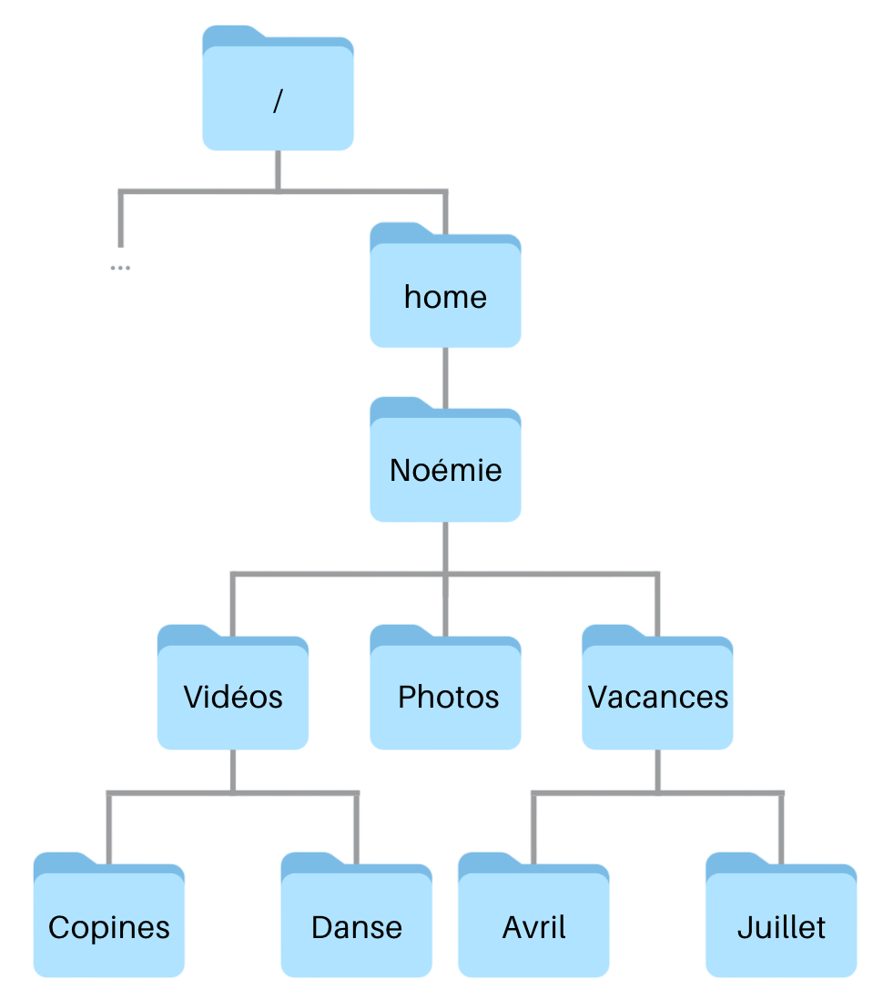
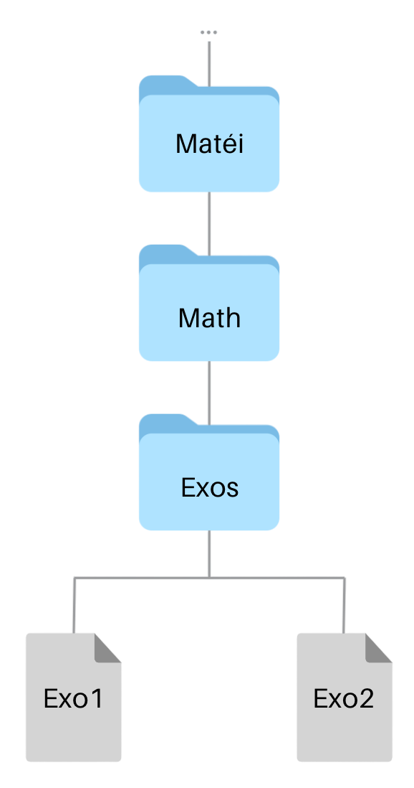
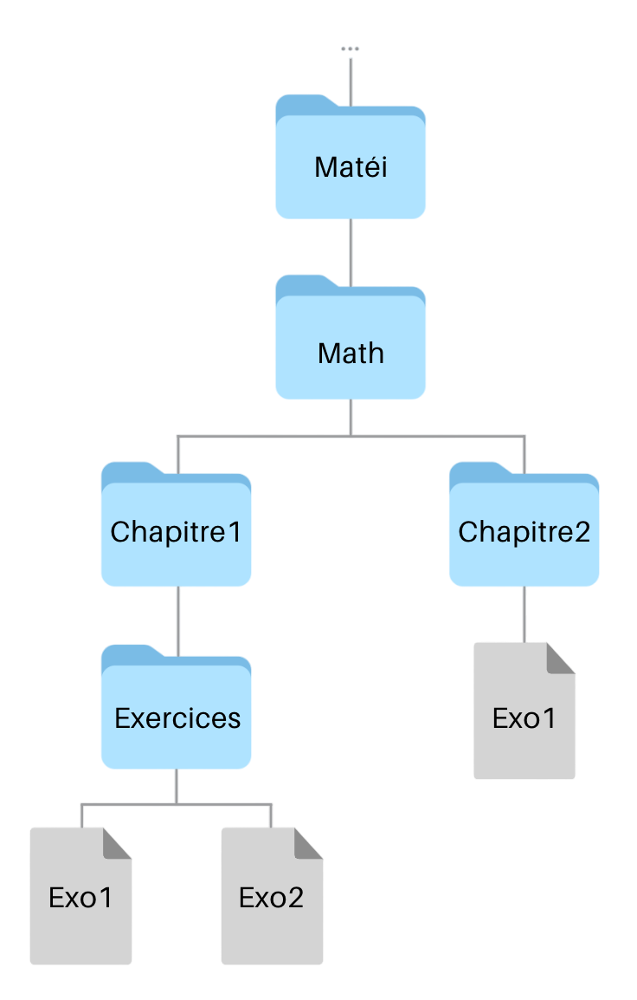

# Exercices 

Vous trouverez ci-dessous les exercices de cette séquence.

- Les exercices marqués avec :fontawesome-solid-pencil: se réalisent **sans ordinateur**.  
  Ceux indiqués par :fontawesome-solid-laptop: nécessitent **un ordinateur**.

- Le **niveau de difficulté** est indiqué par des étoiles :  
    <ul style="list-style: none;">
        <li>:fontawesome-solid-star: :fontawesome-regular-star: :fontawesome-regular-star: → Exercices pour **s'approprier les notions**.</li>
        <li>:fontawesome-solid-star: :fontawesome-solid-star: :fontawesome-regular-star: → Exercices pour **renforcer vos compétences**.</li>
        <li>:fontawesome-solid-star: :fontawesome-solid-star: :fontawesome-solid-star: → Exercices pour vous **challenger** et tester vos acquis.</li>
    </ul>

Les corrections sont généralement disponibles, mais elles ne doivent être consultées **qu'après validation de votre production par l'enseignant**.

---

## Système d'exploitation 

!!! exoordi "Exercice 1 - :fontawesome-solid-star: :fontawesome-regular-star: :fontawesome-regular-star:"
    D'après la page Wikipédia "[Liste des distributions GNU/Linux :octicons-link-external-16:](https://fr.wikipedia.org/wiki/Liste_des_distributions_GNU/Linux)", quelles sont les 4 variantes de Linux les plus populaires ? Pourquoi y a-t-il autant de variantes ?

    ??? success "Correction"
        Classement Alexa (octobre 2020) : Ubuntu, RedHat, Debian, CentOS

        Classe SimilarWeb (juin 2020) : Ubuntu, RedHat, Linux Mint, ArchLinux

        Linux est un système d'exploitation libre et gratuit, qui permet donc à tout un chacun d'utiliser le code source pour réaliser une version dérivée. Ces versions dérivées (aussi appelées **distributions**) se distinguent souvent seulement par les applications qu'elles incluent.

!!! exopapier "Exercice 2 - :fontawesome-solid-star: :fontawesome-solid-star: :fontawesome-regular-star:"
    D'après la page Wikipédia "[Logiciel libre :octicons-link-external-16:](https://fr.wikipedia.org/wiki/Logiciel_libre)", les quatre libertés fondamentales d'un logiciel libre sont : 

    - la liberté d'exécuter le programme
    - la liberté d’étudier le fonctionnement du programme et de le modifier selon ses besoins.
    - la liberté de redistribuer des copies du programme.
    - la liberté d'améliorer le programme et de distribuer ces améliorations au public.

    En vous appuyant sur vos connaissances ou sur des recherches, répondez aux questions suivantes : 

    1. Quel est l'intérêt, pour un utilisateur, que le système d'exploitation qu'il utilise soit un logiciel libre ?

    2. Quels sont les risques ou les dangers éventuels ?

    ??? success "Correction" 
        1. Un système d’exploitation libre offre plusieurs avantages :

	        * **Transparence et sécurité** : Le code source étant accessible, il peut être audité pour détecter et corriger d’éventuelles failles de sécurité.
	        * **Personnalisation et adaptabilité** : L’utilisateur peut modifier le système pour l’adapter à ses besoins spécifiques.
	        * **Gratuité et accessibilité** : La plupart des systèmes libres sont gratuits et peuvent être installés sur plusieurs machines sans restrictions.
	        * **Communauté et support** : Une large communauté d’utilisateurs et de développeurs permet d’obtenir du support et des mises à jour régulières.

        2. Malgré ses avantages, un système d’exploitation libre présente quelques risques :
	
            * **Compatibilité logicielle** : Certains logiciels propriétaires ne sont pas disponibles sur les systèmes libres (ex : certaines suites Adobe ou jeux récents).
	        * **Courbe d’apprentissage** : L’utilisation et la configuration peuvent être plus complexes pour un utilisateur non expérimenté.
	        * **Moins de support commercial** : Contrairement aux systèmes propriétaires, le support technique peut être communautaire et non assuré par une entreprise.
	        * **Risque de fragmentation** : La diversité des distributions Linux, par exemple, peut entraîner des différences de compatibilité entre certaines applications et versions du système.

!!! exopapier "Exercice 3 - :fontawesome-solid-star: :fontawesome-solid-star: :fontawesome-regular-star:"
    Quelle est la différence entre une application, un programme et un processus ? 

    ??? success "Correction"
        Un **programme** est un **ensemble de fichiers** contenant du code informatique écrit dans un langage de programmation. C’est une entité **statique**, stockée sur un disque ou un autre support, qui n’est pas encore exécutée.

        Une **application** est consitué d'un ou plusieurs programme qui fonctionnent ensemble. Elle est conçue pour être utilisé par un utilisateur.

        Un **processus** est un **programme en cours d’exécution**. Une fois lancé, il est chargé en mémoire et géré par le système d’exploitation, qui lui alloue des ressources (mémoire, processeur…). 

!!! exopapier "Exercice 4 - :fontawesome-solid-star: :fontawesome-solid-star: :fontawesome-regular-star:"
    Comment le système d'opération fait-il pour exécuter plusieurs programmes "simultanément" ?

    ??? success "Correction" 
        Le système d’exploitation exécute plusieurs programmes “simultanément” en utilisant la gestion des processus et la planification du processeur.
	
        * Il accorde à chaque programme une **tranche de temps** pour s’exécuter sur le processeur, puis passe rapidement à un autre (**ordonnancement**).
	    * Cette alternance rapide crée l’**illusion du multitâche**, même avec un seul processeur.
	    * Si l’ordinateur possède plusieurs **cœurs de processeur**, certains programmes peuvent réellement s’exécuter en parallèle.

        *Exemple : Lorsque tu écoutes de la musique tout en naviguant sur Internet, le système alterne entre les deux programmes pour qu’ils semblent fonctionner en même temps.*


---

## Interface en ligne de commande

!!! exopapier "Exercice 5 - :fontawesome-solid-star: :fontawesome-regular-star: :fontawesome-regular-star:" 
    Voici un extrait du système de fichiers de l'ordinateur de Fredo, qui a pour système d'exploitation Linux : 

     <div style="display: flex; justify-content: center; gap: 20px;">
        
     </div>

    1. Depuis le répertoire `home`, le chemin `/home/Fredo/NSI` est-il correct ? Si oui, est-il absolu ou relatif ? Justifier.

    2. Depuis le répertoire `Fredo`, déterminer le chemin absolu et le chemin relatif pour aller dans le répertoire `Exos`.

    3. Depuis le répertoire `Exos`, déterminer le chemin absolu et le chemin relatif pour aller dans le répertoire `Fiches`.

    4. Depuis le répertoire `Fiches`, déterminer le chemin absolu et le chemin relatif pour aller dans le répertoire `DS`.

    ??? success "Correction"
        1. Le chemin est bien correct. Il s'agit d'un chemin **absolu** puis il commence à la racine *`/`* de l'arborescence. Le chemin relatif aurait été : `Fredo/NSI`.

        2. Chemin absolu : `/home/Fredo/NSI/Exos`

            Chemin relatif : `NSI/Exos`

        3. Chemin absolu : `/home/Fredo/Maths/Fiches`

            Chemin relatif : `../../Maths/Fiches`
    
        4. Chemin absolu : `/home/Fredo/Maths/DS`

            Chemin relatif : `../DS`


!!! exopapier "Exercice 6 - :fontawesome-solid-star: :fontawesome-regular-star: :fontawesome-regular-star:" 
    Noémie vient d'installer Linux sur son ordinateur. Les fichiers de l'arborescence ci-dessous étaient déjà présents. Elle a dressé la liste des commandes qu'elle a utilisées pour créer l'arborescence de ses fichiers personnels : 

    <div class="grid" markdown>

    - `cd /home/Noémie`
    - `mkdir Photos`
    - `mkdir Vidéo`
    - `cd Vidéo`
    - `mkdir Copines`
    - `cd ..`
    - `mkdir Vacances`
    - `mkdir Vacances/Avril`
    - `mkdir Vacances/Juillet`
    - `mkdir /home/Noémie/Vidéo/Danse`

    { width=75% }

    </div>

    Compléter l'arborescence de fichier de Noémie.

    ??? success "Correction"
         <div style="display: flex; justify-content: center; gap: 20px;">
            
         </div>


!!! exopapier "Exercice 7 - :fontawesome-solid-star: :fontawesome-regular-star: :fontawesome-regular-star:"
    On se place à la racine de l'arborescence suivante : 

     <div style="display: flex; justify-content: center; gap: 20px;">
        
     </div>

    1. Dans cette arborescence, après avoir effectué la commande `cd b`, quel est le résultat de la commande `ls` ?

    2. Depuis le répertoire `b`, quelle commande faut-il alors effectuer pour que la commande `ls` affiche `f7 f8` ?

    ??? success "Correction"
        1. `f2 e`

        2. `ls ../c/g`


!!! exoordi "Exercice 8 - :fontawesome-solid-star: :fontawesome-solid-star: :fontawesome-regular-star:"
    Matéi veut ajouter les répertoires jaunes à son répertoire personnel. 

     <div style="display: flex; justify-content: center; gap: 20px;">
        
     </div>

    1. Allez sur [ce site :octicons-link-external-16:](https://www.cahier-nsi.fr/jslinux/). Attendre la demande de login, puis saisir le login "Matéi" avec le mot de passe "NSI".

    2. Tester la commande pour vérifier que vous êtes bien dans le répertoire `Matéi`

    3. Tester la commande pour créer un répertoire `Foot` dans le répertoire `Matéi`.

    4. Tester la commande pour se déplacer dans le répertoire `Foot`.

    5. Tester la commande pour créer les deux répertoires `Copains` et `Matchs`. 

    6. Sans changer de répertoire, tester la commande pour créer le répertoire `Boxe`.

    7. Se déplacer dans le répertoire `Boxe`

    8. Tester la commande pour créer les répertoires `Vidéos` et `Photos`. 

    9. Sans changer de répertoire courant, tester la commande pour créer les répertoires `2021` et `2022`.

    ??? success "Correction"
        1. Aucune correction nécessaire.
        2. `pwd`
        3. `mkdir Foot` puis vérifier avec `ls`
        4. `cd Foot` puis vérifer avec `pwd`
        5. `mkdir Copains Matchs` puis vérifier avec `ls`
        6. `mkdir ../Boxe` puis vérifer avec `cd ..` et `ls`.
        7. `cd ../Boxe`
        8. `mkdir Vidéos Photos` puis vérifier avec `ls`
        9. `mkdir Photos/2021 Photos/2022` puis vérifier avec `cd Photos` et `ls`.

!!! exopapier "Exercice 9 - :fontawesome-solid-star: :fontawesome-solid-star: :fontawesome-regular-star:"
    On se place à la racine de l'arborescence suivante : 

     <div style="display: flex; justify-content: center; gap: 20px;">
        
     </div>

    1. Après avoir effectué la commande `cd b`, quelles commandes faut-il exécuter pour copier le fichier `f1` dans le répertoire `d` et afficher le contenu de ce répertoire ?

    2. Quel(s) commande(s) faut-il ensuite exécuter pour que la commande `pwd` affiche `/r/c/f` ?

    ??? success "Correction"
        1. `cp ../f1 ../a/d` puis `ls ../a/d`

        2. `cd ../c/f`


!!! exoordi "Exercice 10 - :fontawesome-solid-star: :fontawesome-solid-star: :fontawesome-regular-star:"
    Matéi veut réorganiser les fichiers du répertoire `Math` représenté ci-dessous.

    <div style="display: flex; justify-content: center; gap: 20px;">
        
    </div>

    1. Allez sur [ce site :octicons-link-external-16:](https://www.cahier-nsi.fr/jslinux/). Attendre la demande de login, puis saisir le login "Matéi" avec le mot de passe "NSI".

    2. Tester la commande pour créer un répertoire `Chapitre1` dans le répertoire `Math`.

    3. Tester la commande pour déplacer le répertoire `Exos` dans le répertoire `Chapitre1` en le renommant `Exercices`

    4. Se déplacer dans le répertoire `Exercices` et tester les commandes qui vous permettent de vérifier que les fichiers du répertoire `Exos` ont bien également été déplacés.

    5. Sans changer de répertoire courant, tester une commande qui permet de créer un répertoire `Chapitre2` dans le répertoire `Math`.

    6. Sans changer de répertoire courant, tester une commande qui permet de copier le fichier `Exo1` dans le répertoire `Chapitre2`. 

    7. Représenter la nouvelle structure de fichiers de Matéi.

    ??? success "Correction"
        1. Pas de correction
        
        2. On ne demande pas explicitement de se déplacer dans le dossier `Math`, on utilisera donc la commande `mkdir Math/Chapitre1`.

        3. Tout en restant à la racine de l'arborescence, on utilise `mv Math/Exos/ Math/Chapitre1/Exercices/`. 

        4. `cd Math/Chapitre1/Exercices` puis `ls`

        5. `mkdir ../../Chapitre2`

        6. `cp Exo1 ../../Chapitre2`

        7. <div style="display: flex; justify-content: center; gap: 20px;">
        
        </div>


!!! exopapier "Exercice 11 - :fontawesome-solid-star: :fontawesome-solid-star: :fontawesome-solid-star:"
    On se place à la racine de l'arborescence suivante : 

     <div style="display: flex; justify-content: center; gap: 20px;">
        
     </div>

    1. Dans l'arbre des fichiers, quelles commandes faut-il exécuter pour déplacer les fichiers qui sont en dessous du répertoire `c` dans un nouveau répertoire `h` dont le répertoire parent est `b` ?

    2. Quelle commande faut-il executer pour supprimer la branche `a` de l'arbre des fichiers ?

    2. Dessiner l'arbre des fichiers après ces commandes.

    ??? success "Correction"
        1. `mkdir b/h/` puis `mv c/* b/h/`

            Le symbole `*` permet de déplacer le contenu d'un répertoire et non le répertoire lui-même.

        2. `rm -r a/`
            
            On utilise l'option `-r` signifiant *recursive* pour supprimer le répertoire ainsi que tous les sous-répertoires et/ou fichiers enfants. 
        2. <div style="display: flex; justify-content: center; gap: 20px;">
        
        </div>

!!! exopapier "Exercice 12 - :fontawesome-solid-star: :fontawesome-solid-star: :fontawesome-solid-star:"
    Lorsque l'on souhaite manipuler plusieurs fichiers à la fois dans le Terminal, on peut utiliser le caractère spécial `*` qui signifie "n'importe quelle séquence de caractères". Ainsi, `*.py` signifie tous les fichiers du répertoire courant qui se terminent par `.py`, et `*/f.txt` tous ceux qui s'appellent `f.txt` dans un sous-répertoire du répertoire courant.

    Cette notation s'appelle un "**glob**" car elle permet de référencer un ensemble de fichiers **glob**alement.

    Quelles sont la ou les commandes qui permettent d'effectuer chacune des actions suivantes ?

    1. Lister tous les fichiers du répertoire courant qui commencent par `img`.
    2. Créer un répertoire `sauvegarde` **au même niveau** que le répertoire courant et y copier tous les fichiers du répertoire courant.
    3. Lister tous les noms de fichiers qui se terminent par `.png` ou `.jpg` dans le répertoire courant ou les répertoires « frères » du répertoire courant.
    4. Rechercher la chaine `import` dans tous les fichiers des sous-répertoire du répertoire courant.

    ??? success "Correction"
        1. `ls img*`
        2. `mkdir ../sauvegarde` et `cp * ../sauvegarde/` 

            Sans l'option `-r`, les répertoire seront omis.

            On demande d'être au même niveau que le repertoire courant, il faut donc remonter d'un cran (avec `..`) puis utiliser `*` pour le niveau courant.
        3. `ls ../*/*.png ../*/*.jpg`
        4. `grep import */*.py`

!!! exopapier "Exercice 13 - :fontawesome-solid-star: :fontawesome-solid-star: :fontawesome-solid-star:"
    Dans un système Linux, quel est l'effet des commandes suivantes ?

    1. `rm *.txt`
    2. `cp Photos/anna.jpg Anna.jpg`
    3. `ls Python*.py`
    4. `mv *.png Photos`
    5. `cd ../..`
    6. `mv TP1.txt TP/TP2.txt`


    ??? success "Correction"
        1. Supprimer tous les fichiers du répertoire courant ayant pour extension `.txt`.
        2. Créer une copie de la photo `anna.jpg` nommée `Anna.jpg` dans le même répertoire.
        3. Liste tous les documents Python (`.py`) du répertoire courant dont le nom commence par `Python`.
        4. Déplace toutes les photos au format PNG du répertoire courant dans le dossier `Photos`.
        5. Reviens deux répertoire en arrière.
        6. Déplace le fichier `TP1.txt` du répertoire courant dans le dossier `TP` en le renommant `TP2.txt`.

---

## Gestion des droits d'accès

!!! exopapier "Exercice 14 - :fontawesome-solid-star: :fontawesome-regular-star: :fontawesome-regular-star:"
    L'affichage ci-dessous est une version simplifiée de la commande `ls -l` qui donne les noms et droits d'accès des fichiers du répertoire courant. 

    On rappelle que le premier caractère est un `d` pour les répertoires, un `-` pour les fichiers et que les trois caractères suivants sont `r`, `w` et `x`, si l'utilisateur a le droit de lecture, d'écriture et d'exécution sur le fichier ou le répertoire (`-` sinon).

    ```bash
    -rw- f1
    -r-- f2
    -rwx f3
    drw- d1
    dr-x d2
    ```

    Parmi les commandes ci-dessous, lesquelles sont permises compte tenu de ces droits d'accès et pourquoi ?

    1. `f4`
    2. `cp f1 d2/f`
    3. `cp f2 d1/f`
    4. `ls d1`
    5. `cat f1`
    6. `cp f3 f2`
    7. `f3`
    8. `cd d1`

    ??? success "Correction"
        1. La commande n'est pas valide
        2. Non permise car nous n'avons pas les droits d'écriture dans le répertoire `d2`.
        3. Non permise car nous n'avons pas les droits d'exécution sur `d1`. (On ne peux donc pas accéder au dossier)
        4. Permise, on a les droits de lecture sur `d1`.
        5. Permise, on a les droits de lecture sur `f1`.
        6. Non permise, on ne peux modifier le fichier `f2` (ici l'écraser) car nous n'avons pas les droits de lecture.
        7. Commande non valide
        8. Non permise, nous n'avons pas les droits d'exécution nécessaire à l'ouverture du répertoire.

!!! exoordi "Exercice 15 - :fontawesome-solid-star: :fontawesome-regular-star: :fontawesome-regular-star:"
    Matéi veut créer et paramétrer les droits et les permissions des fichiers du répertoire `Rugby`. Sa soeur, Angie, est dans le même groupe d'utilisateur que lui.

    1. Allez sur [ce site :octicons-link-external-16:](https://www.cahier-nsi.fr/jslinux/). Attendre la demande de login, puis saisir le login "Matéi" avec le mot de passe "NSI".
    2. Tester la commande qui permet à Matéi de créer un répertoire `Rugby` dans son répertoire personnel.
    3. Tester la commande qui permet de voir les droits et permissions sur le répertoire `Rugby`.
    4. Quels droits et permissions  possède Angie sur ce répertoire ?

        - [ ] Afficher la liste des fichiers et des répertoires qu'il contient  
        - [ ] Créer, supprimer et changer le nom des fichiers qu'il contient  
        - [ ] Ouvrir le répertoire
    5. Tester la commande qui permet d'ajouter le seul droit qu'Angie n'a pas sur le répertoire `Rugby`.
    6. Tester la commande qui permet de supprimer les droits détenus par les autres utilisateurs sur le répertoire `Rugby`.

    ??? success "Correction"
        1. Pas de correction
        2. `mkdir Rugby`
        3. `ls -l`
        4.  Angie possède les droits et permissions suivants : 

            - [x] Afficher la liste des fichiers et des répertoires qu'il contient
            - [ ] Créer, supprimer et changer le nom des fichiers qu'il contient
            - [x] Ouvrir le répertoire

        5. `chmod g+w Rugby`
        6. `chmod o-rx Rugby`

!!! exopapier "Exercice 16 - :fontawesome-solid-star: :fontawesome-solid-star: :fontawesome-regular-star:"
    Pour chacune des commandes ci-dessous, quels doivent être les droits d'accès minimaux aux fichiers `f1` et `f2` et au répertoire `d` pour que la commande soit possible ?

    1. `ls -l d/f1`
    2. `mv d/f1 f2`
    3. `rm d/f1`

    ??? success "Correction"
        1. Il nous faut les droits d'exécution sur `d` pour accéder à `f1`. Aucune contrainte sur `f1`.
        2. Il nous faut les droits de lecture et d'exécution sur `d`. Aucune contrainte sur `f1`. Droit d'écriture dans le répertoire courant. Droit d'écriture sur `f2`.
        3. Il nous faut tous les droits sur `d`, pas de contrainte sur `f1`.

!!! exopapier "Exerice 17 - :fontawesome-solid-star: :fontawesome-solid-star: :fontawesome-regular-star:"
    Écrire deux commandes différentes qui donnent les droits suivants aux fichiers situés dans le répertoire courant.

    1. Donner les droits `rwxr--r-x` au répertoire `Vidéos` qui a déjà les droits `rwxr-----`.
    2. Donner tous les droits à tous les utilisateurs sur le répertoire `Partage`.
    3. Donner les droits de lecture à tous les utilisateurs sur le répertoire `Règlement` qui a déjà les droits `rwxr-----`

    ??? success "Correction"
        1. `chmod o+r Vidéos` ou `chmod o=r Vidéos`
        2. `chmod ugo=rwx Partage` ou `chmod u+rwx,g+rwx,o+rwx Partage` ou `chmod ugo+rwx Partage`, ...
        3. `chmod ugo+r Règlement` ou `chmod o+r Règlement` ou `chmod o=r Règlement`, ...

        Remarque : On peut également remplacer `ugo` par `a`.

!!! exopapier "Exerice 18 - :fontawesome-solid-star: :fontawesome-solid-star: :fontawesome-regular-star:"
    1. Quelle commande (une seule) faut-il exécuter pour qu'un fichier `protege.txt` puisse être lu et écrit par son propriétaire, mais par personne d'autre ?
    2. Quelle commande faut-il exécuter pour que le contenu d'un dossier `sauvegarde` ne puisse pas être modifié ? 

    ??? success "Correction"
        1. Comme on ne précise rien pour les droits d'exécution, on tachera de ne pas y toucher. Ainsi, on utilisera la commande : `chmod u+rw,go-rw protege.txt`
        2. Il suffit d'enlever les droits d'écriture : `chmod ugo-w sauvegarde/`