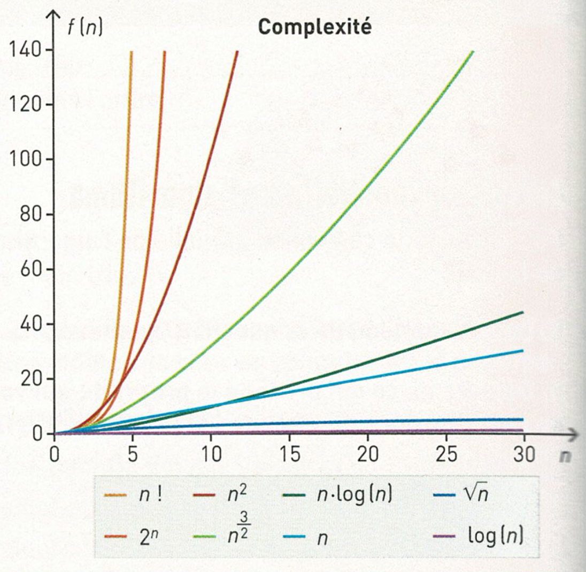

# Principe de l'algorithmique 🧩

Dans l'introduction, nous avons vu qu'un algorithme est une méthode permettant de résoudre un problème.

Mais écrire un algorithme ne suffit pas. Il faut aussi être capable de l'**analyser**.

!!! info "Objectif de cette partie"
    Dans cette partie, nous allons apprendre à répondre à trois questions essentielles :
    
    - l'algorithme est-il efficace lorsque les données deviennent nombreuses ?
    - l'algorithme finit-il toujours par s'arrêter ?
    - l'algorithme donne-t-il toujours le bon résultat ?

Pour cela, nous allons introduire plusieurs notions importantes :

- le **coût** d'un algorithme ;
- la **complexité** ;
- la notation **grand O** ;
- la **terminaison** ;
- la **correction partielle** ;
- les **variants** et les **invariants**.

---

## 1 - Le coût d'un algorithme ⏱️

Deux algorithmes peuvent résoudre le même problème, mais ne pas être aussi efficaces.

Par exemple, pour chercher une valeur dans un tableau, on peut être obligé de regarder les éléments un par un jusqu'à trouver la valeur recherchée.

Si le tableau contient 10 éléments, cela reste très rapide.

Mais si le tableau contient un million d'éléments, le choix de la méthode devient beaucoup plus important.

!!! definition "Définition : coût d'un algorithme"
    Le **coût** d'un algorithme mesure le nombre d'opérations effectuées en fonction de la taille des données.

On note souvent `n` la taille des données.

Par exemple, si un tableau contient `n` éléments, une recherche simple peut nécessiter, dans le pire des cas, jusqu'à `n` comparaisons.

C'est le cas si la valeur recherchée est absente ou située à la fin du tableau, puisqu'il faut alors parcourir tous les éléments.

```python title="Recherche simple" linenums="1"
def recherche(valeur, tableau):
    for element in tableau:
        if element == valeur:
            return True
    return False
```


!!! propriete "Propriété : Coût linéaire"
    Si le nombre d'opérations est proportionnel à `n`, on dit que l'algorithme a un **coût linéaire**.

!!! info "À retenir"
    Étudier le coût d'un algorithme permet d'estimer son efficacité lorsque la taille des données augmente.

---

## 2 - Complexité d'un algorithme 💾

Lorsqu'on analyse un algorithme, on peut s'intéresser à plusieurs formes de complexité.

!!! definition "Définition : complexité temporelle"
    La **complexité temporelle** mesure l'évolution du nombre d'opérations effectuées par un algorithme lorsque la taille des données augmente.

!!! definition "Définition : complexité spatiale"
    La **complexité spatiale** mesure la quantité de mémoire utilisée par un algorithme lorsque la taille des données augmente.

Dans ce chapitre, et plus généralement en NSI, nous nous intéresserons surtout à la **complexité temporelle**.

Il existe des complexités temporelles "classiques" que nous croiserons dans une très grande majorité des cas : 

!!! propriete "Propriété : classement des complexités"
    Plus la courbe est « plate », plus la complexité de l'algorithme est favorable.
    
    Plus elle est « pentue », plus la complexité est défavorable, ce qui peut entraîner un temps de calcul très long.

    

    Certains coûts apparaissent très souvent en algorithmique.

    | Complexité | Nom | Idée générale | Exemple |
    |---|---|---|---|
    | $O(1)$ | constante | très efficace, le coût ne dépend pas de $n$ | accéder à `tableau[0]` |
    | $O(n)$ | linéaire | on parcourt les données une fois | recherche simple |
    | $O(n^2)$ | quadratique | on effectue un parcours dans un autre parcours | tris par sélection et par insertion |

    Mais il en existe beaucoup d'autres, parmi lesquelles : 
    
    | Complexité | Nom | Idée générale | Exemple |
    |---|---|---|---|
    | $O(\log n)$ | logarithmique | très efficace, on réduit fortement la taille du problème à chaque étape | recherche dichotomique |
    | $O(n \log n)$ | quasi-linéaire | proche du linéaire, mais avec une étape de division ou de regroupement | tris efficaces comme le tri fusion |
    | $O(2^n)$ | exponentielle | très coûteuse, le nombre d'opérations double presque à chaque donnée ajoutée | exploration de toutes les possibilités |
    
    Ces complexités seront rencontrées dans des chapitres plus avancés.


Dans les tableaux précédents, on remarquera l'utilisation d'une notation particulière pour la complexité. On appelle cette notation la "notation grand O" : 

!!! definition "Définition : notation grand O"
    La notation **grand O** décrit l'ordre de grandeur du coût d'un algorithme lorsque la taille des données devient très grande.

L'idée est de ne pas chercher le nombre exact d'opérations, mais seulement la manière dont ce nombre évolue.

Par exemple :

| Nombre d'opérations | Complexité retenue |
|---|---|
| $3n + 5$ | $O(n)$ |
| $10n + 100$ | $O(n)$ |
| $2n^2 + 4n + 1$ | $O(n^2)$ |
| $n^2 + n$ | $O(n^2)$ |

On garde donc le terme qui devient dominant lorsque $n$ devient très grand.

!!! tip "Méthode"
    Pour simplifier une complexité :
    
    - on ignore les constantes multiplicatives ;
    - on ignore les termes qui deviennent négligeables ;
    - on garde le terme qui grandit le plus vite.

Par exemple :

=== "Exemple 1"

    On considère ce programme : 

    ```python title="Exemple" linenums="1"
    def exemple(tableau):
        for element in tableau:
            print(element)
    ```

    La boucle parcourt tous les éléments du tableau : $O(n)$.

    À chaque fois, elle affiche l'élément : $O(1)$.

    Sa complexité est donc $O(n) \times O(1) = O(n)$.

=== "Exemple 2"

    On considère ce programme : 

    ```python title="Un parcours simple" linenums="1"
    def afficher(tableau):
        print(tableau[0])
        for element in tableau:
            print(element)
    ```

    La ligne `print(tableau[0])` a un coût constant : $O(1)$.

    La boucle parcourt tous les éléments du tableau : $O(n)$.

    La complexité globale est donc : $O(1) + O(n) = O(n)$.

=== "Exemple 3"

    On considère un troisième algorithme : 

    ```python title="Deux boucles imbriquées" linenums="1"
    def afficher_couples(tableau):
        for i in range(len(tableau)):
            for j in range(len(tableau)):
                print(tableau[i], tableau[j])
    ```

    La première boucle s'exécute $n$ fois.

    Pour chaque valeur de $i$, la deuxième boucle s'exécute aussi $n$ fois.

    On obtient donc environ $n \times n$ opérations.

    La complexité est donc $O(n^2)$.


!!! info "À retenir"
    - Plus la complexité est élevée, plus l'algorithme devient difficile à utiliser sur de grandes quantités de données.
    - La notation grand O permet de comparer les algorithmes sans dépendre d'un ordinateur précis ou d'un temps d'exécution exact.

---

## 3 - Terminaison, correction partielle et correction totale ✅

Un algorithme efficace n'est pas forcément un bon algorithme.

Il doit aussi être correct, c'est-à-dire donner le résultat attendu.

Pour raisonner proprement, on distingue plusieurs notions.

!!! definition "Définition : terminaison"
    Prouver la **terminaison** d'un algorithme, c'est montrer que son exécution finit toujours par s'arrêter.

!!! definition "Définition : correction partielle"
    Prouver la **correction partielle** d'un algorithme, c'est montrer que si l'algorithme termine, alors le résultat obtenu est bien celui attendu.

!!! propriete "Propriété : Correction totale"
    Un algorithme est **totalement correct** lorsqu'il vérifie deux propriétés :
    
    - il termine ;
    - il est partiellement correct.

Autrement dit, pour prouver qu'un algorithme est totalement correct, il faut montrer qu'il finit bien par s'arrêter et qu'il donne le bon résultat.

!!! info "À retenir"
    La correction totale combine deux idées :
    
    - **terminaison** : l'algorithme s'arrête ;
    - **correction partielle** : s'il s'arrête, le résultat est correct.

---

## 4 - Variant de boucle 📉

Pour prouver la terminaison d'une boucle `while`, on peut utiliser un **variant de boucle**.

!!! definition "Définition : variant de boucle"
    Un **variant de boucle** est une quantité entière positive qui diminue strictement à chaque tour de boucle.
    
    Comme elle ne peut pas diminuer indéfiniment, la boucle finit par s'arrêter.

Dans l'exemple suivant, on affiche un compte à rebours.

```python title="Compte à rebours" linenums="1"
n = 5
while n > 0:
    print(n)
    n = n - 1
```

La variable `n` est un variant de boucle :

- au départ, `n` vaut `5` ;
- à chaque tour de boucle, `n` diminue de `1` ;
- lorsque `n` vaut `0`, la condition `n > 0` devient fausse.

La boucle termine donc forcément.

!!! propriete "Propriété : utiliser un variant"
    Pour prouver la terminaison d'une boucle avec un variant, il faut montrer que :
    
    - le variant est un entier positif ;
    - il diminue strictement à chaque tour de boucle ;
    - la boucle s'arrête lorsque le variant devient trop petit.

!!! info "À retenir"
    Le variant sert à prouver qu'une boucle ne peut pas continuer indéfiniment.

---

## 5 - Invariant de boucle 🔁

Pour prouver la correction partielle d'un algorithme contenant une boucle, on utilise souvent un **invariant de boucle**.

!!! definition "Définition : invariant de boucle"
    Un **invariant de boucle** est une propriété qui reste vraie :
    
    - avant le premier tour de boucle ;
    - après chaque tour de boucle ;
    - à la fin de la boucle.

Prenons un exemple simple : calculer la somme des éléments d'un tableau.

```python title="Somme des éléments d'un tableau" linenums="1"
def somme(tableau):
    total = 0
    for i in range(len(tableau)):
        total = total + tableau[i]
    return total
```

Un invariant possible est :

!!! propriete "Propriété : invariant"
    Au début de chaque tour de boucle, la variable `total` contient la somme des éléments déjà parcourus.

Par exemple, avec le tableau `[4, 7, 2]` :

| Étape | Élément lu | Valeur de `total` |
|:---:|:---:|:---:|
| Départ | aucun | `0` |
| Après `4` | `4` | `4` |
| Après `7` | `7` | `11` |
| Après `2` | `2` | `13` |

À la fin de la boucle, tous les éléments ont été parcourus.

Donc `total` contient bien la somme de tous les éléments du tableau.

!!! info "À retenir"
    L'invariant sert à prouver qu'un algorithme construit progressivement le bon résultat.

Nous utiliserons cette idée pour justifier la correction partielle des **tris par sélection** et **par insertion**.

---

## 6 - Bilan ✅

!!! info "À retenir"
    Pour analyser un algorithme, on doit se poser plusieurs questions :
    
    - **Coût** : combien d'opérations sont nécessaires selon la taille des données ?
    - **Complexité** : comment ce coût évolue-t-il lorsque les données deviennent nombreuses ?
    - **Terminaison** : l'algorithme finit-il toujours par s'arrêter ?
    - **Correction partielle** : si l'algorithme s'arrête, le résultat est-il correct ?
    - **Correction totale** : l'algorithme termine-t-il et donne-t-il le bon résultat ?
    - **Variant** : quelle quantité diminue pour garantir l'arrêt d'une boucle ?
    - **Invariant** : quelle propriété reste vraie pendant l'exécution ?

Dans les parties suivantes, nous utiliserons ces outils pour étudier des algorithmes classiques :

- parcourir un tableau ;
- rechercher une occurrence ;
- rechercher un maximum ou un minimum ;
- calculer une moyenne ;
- trier un tableau par sélection ;
- trier un tableau par insertion.