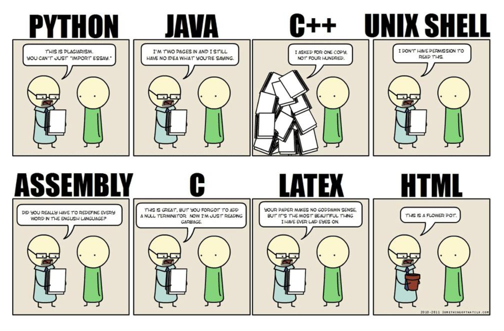

# Premiers pas en Python 🐍💻

Avant de pouvoir écrire de vrais programmes, il est important de comprendre ce qu’est un **langage de programmation**, et comment fonctionne un **programme Python**.

---

## Un langage de programmation

Un langage de programmation permet de décrire les données et les instructions qu’un ordinateur doit suivre. C’est un moyen de communication entre l’humain et la machine — et entre programmeurs eux-mêmes.

<p align="center">
    
</p>

!!! histoire "Les langages de programmations les plus populaires"
    La vidéo ci-dessous vous présente l'évolution de la popularité des langages de programmation de 1958 à 2025.

    <iframe width="789" height="444" src="https://www.youtube.com/embed/ZTPrbAKmcdo" title="Most Popular Programming Languages: Data from 1958 to 2025" frameborder="0" allow="accelerometer; autoplay; clipboard-write; encrypted-media; gyroscope; picture-in-picture; web-share" referrerpolicy="strict-origin-when-cross-origin" allowfullscreen></iframe>

---

## Python 👨‍💻

Un programme Python est une **suite d’instructions** que l’ordinateur exécute **dans l’ordre**.

!!! definition "Définition : instruction"
    Une **instruction** est une ligne de code que l’ordinateur peut comprendre et exécuter.  

    Exemple :  
    ```python linenums="1"
    print("Bonjour !")
    ```

Python est un **langage interprété** : cela signifie que chaque ligne est **lue et exécutée immédiatement**, sans passer par une étape de compilation.

Il existe plusieurs façons d’écrire et de tester du code Python. Voici deux environnements recommandés cette année :

| Environnement | Avantages                              |
|---------------|-----------------------------------------|
| [**Basthon**](https://basthon.fr) | En ligne, sans installation, parfait pour débuter ([version **console**](https://console.basthon.fr) et [version **notebook**](https://notebook.basthon.fr)) |
| [**Capytale**](https://capytale2.ac-paris.fr)     | En ligne, plateforme sur laquelle vous devrez réaliser différents TP à rendre. |
| [**Visual Studio Code**](https://code.visualstudio.com)     | Logiciel polyvalent à installer sur votre PC, vous permettant de coder dans une multitude de langage. |

!!! tip "Conseil : testez vos lignes une par une"
    En Python, on peut tester chaque ligne dans un **interpréteur** (console interactive).  
    C’est très pratique pour comprendre ce que fait une instruction ou corriger une erreur.

!!! warning "Indentation en Python"
    Python utilise l’indentation (les espaces en début de ligne) pour structurer les blocs d’instructions.

    Si l’indentation est incorrecte, le programme ne fonctionnera pas.

    *Exemple incorrect :* 

    ```python linenums="1"
    if nom == "Alice" :
    print("Bonjour") #(1)
    ```

    1. ❌ Erreur : pas indenté
        
        Il n'y a donc aucun bloc à executer dans le cas où le `nom` est bien égal à `Alice`.

    *Exemple correct :*

    ```python linenums="1"
    if nom == "Alice":
        print("Bonjour") #(1)
    ```

    1. ✅ Bien indenté
        
        Si `nom` est égal à `Alice`, alors le programme affichera `Bonjour`. 

    Une erreur d'indentation produira une `IndentationError`. Si vous apercevez cette erreur lors de l'execution de votre programme, pensez donc à bien vérifier que vous n’en avez pas oublié une !

!!! info "Résumé"
    - Un programme Python est une suite d’instructions exécutées dans l’ordre
    - Python est un langage interprété : les instructions sont exécutées immédiatement
    - On peut coder en ligne avec Basthon, ou avec un éditeur comme VSCode
    - L’indentation est obligatoire pour structurer le code (conditions, boucles, fonctions…)
