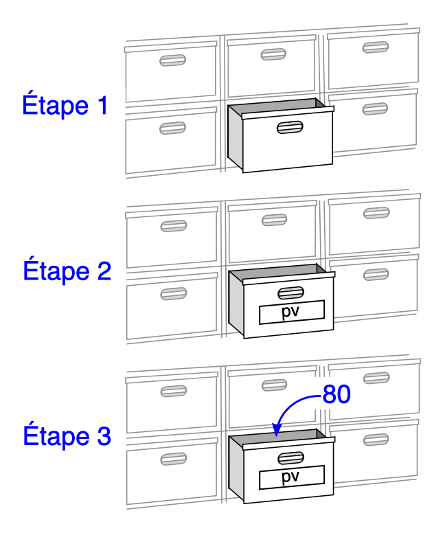

# Variables et types de base 🧠📦

Pour qu’un programme soit utile, il doit **mémoriser des données** et pouvoir les **manipuler**.  
C’est le rôle des **variables**, qui contiennent temporairement des valeurs utilisées par le programme.

---

## Les variables 🪣

!!! definition "Définition : variable"
    Une **variable** est un **nom** qui désigne une **valeur en mémoire**.  
    On peut généralement modifier cette valeur à tout moment au cours de l'exécution du programme.

!!! python "Création d'une variable"
    En Python, on crée (on **initialise**) une variable par une **affectation** :

    ```python linenums="1"
    age = 17
    nom = "Ali"
    ```

<div style="display: flex; align-items: flex-start;">

  <!-- Texte à gauche (75%) -->
  <div style="flex: 3; padding-right: 20px;">
    <p>On peut (même si ce n'est pas réellement correct) se représenter cette affectation par une métaphore, où l'on représente la mémoire de l'ordinateur comme une gigantesque commode avec d'innombrables tiroirs.</p>

    <p><strong>Étape 1 :</strong> Lorsqu'on affecte la valeur <code>80</code> à la variable <code>pv</code>, l'ordinateur commence par trouver un tiroir vide.</p>

    <p><strong>Étape 2 :</strong> Ensuite il nomme ce tiroir <code>pv</code>, comme s'il lui collait une étiquette dessus.</p>

    <p><strong>Étape 3 :</strong> Enfin il dépose dans ce tiroir la valeur <code>80</code>.</p>

    <p>Désormais – tant qu'on ne lui aura pas affecté une autre valeur – chaque fois qu'on utilisera la variable <code>pv</code> dans notre programme, l'ordinateur utilisera la valeur <code>80</code>.</p>

    <p>Si on affecte une nouvelle valeur à la variable <code>pv</code>, alors l'ancienne disparaît (on dit qu'elle est <em>écrasée</em>).</p>
  </div>

  <!-- Image à droite (25%) -->
  <div style="flex: 2;">
    
  </div>

</div>

!!! expert "Conventions de nommage"
    En développement, une "**case**" (en français "casse") fait référence à la manière dont les noms des éléments de notre code (variables, fonctions, classes, etc.) sont écrits.

    Il existe plusieurs cases couramment utilisées : 

    - **camelCase** 🐪 : La camelCase est utilisée afin de distinguer visuellement les mots constituant un élément en faisant usage de majuscules sur la première lettre de chaque mot, sauf le premier. Visuellement, cela s'apparente aux bosses d'un chameau. 

        Par exemple : `student`, `getUsers`, `nomDeMaVariable`, ...

    - **kebab-case** 🥙 : La kebab-case est utilisée afin de distinguer visuellement les mots constituant un élément en faisant usage de tirets - en guise de séparateur.

        Par exemple : `student`, `get-users`, `nom-de-ma-variable`, ...

    - **snake_case** 🐍 : La snake_case est utilisée afin de distinguer visuellement les mots constituant un élément en faisant usage de tirets du bas _ (« underscore ») en guise de séparateur. Il ne faut pas de lettres accentuées, pas d'espace, ni de mot clé du langage. 

        Par exemple : `student`, `get_users`, `nom_de_ma_variable`, ...

        ??? info "Mots clé de Python"
            | `and` | `as` | `assert` | `break` | `class` | `continue` | `def` | `del` |
            |-------|------|----------|---------|---------|------------|-------|-------|
            | `elif` | `else` | `except` | `False` | `finally` | `for` | `from` | `global` |
            | `if` | `import` | `in` | `is` | `lambda` | `None` | `not` | `or` |
            | `pass` | `raise` | `return` | `True` | `try` | `while` | `with` | `yield` |


    En **Python**, nous préfèrerons utiliser le **snake_case** (comme le logo de Python nous l'indique :simple-python:)

!!! tip "Nom de variable"
    On ne donne jamais un nom de variable au hasard, on le choisit pour qu'il soit explicite.

    C'est-à-dire que si on doit manipuler une variable qui stocke l'âge du capitaine, il faut l'écrire non pas `a` mais `age_capitaine`.
---
## Les types fondamentaux 🔤🔢

Chaque valeur manipulée par un programme a un type. Voici les types fondamentaux les plus utilisés en NSI :

<div align="center">
  <table>
    <tr>
      <th>Type</th>
      <th>Signification</th>
      <th>Description</th>
      <th>Exemples</th>
    </tr>
    <tr>
      <td><code>int</code></td>
      <td>Integer</td>
      <td>Entier (positif ou négatif)</td>
      <td>12, -24, ...</td>
    </tr>
    <tr>
      <td><code>float</code></td>
      <td>Float</td>
      <td>Nombre décimal (flottant)</td>
      <td>3.14, -0.5, ...</td>
    </tr>
    <tr>
      <td><code>str</code></td>
      <td>String</td>
      <td>Texte (chaine de caractères)</td>
      <td>"Bonjour", "Salut", ...</td>
    </tr>
    <tr>
      <td><code>bool</code></td>
      <td>Boolean</td>
      <td>Booléen (valeur logique)</td>
      <td>True, False</td>
    </tr>
  </table>
</div>


!!! python "Comment savoir le type d’une variable ?"
    En Python, on n’a pas besoin d’indiquer le type d’une variable : il est déduit automatiquement.

    Tu peux cependant utiliser la fonction `type()` pour déterminer le type d'une variable :

    ```python 
    type(42) --> <class 'int'>
    type("Salut") --> <class 'str'> 
    type(3.14) --> <class 'float'> 
    type(True) --> <class 'bool'>
    ```

---

## Les conversions de types 🔁

Parfois, il peut être utile **convertir une valeur en un autre type**.

!!! python "Conversions classiques"
    En Python, il existe des fonctions prédéfinies pour convertir d'un type fondamental à un autre. 

    - `int()` : Transforme une chaine de caractère en un entier. Par exemple, `int("42")` devient l'entier ' `42`.
    - `str()` : Transforme un entier en chaine de caractère. Par exemple, `str(42)` devient `"42"`.
    - `float()` : Transforme une chaine en nombre flottant. Par exemple, `float("3.14")` devient le nombre décimal `3.14`. 

!!! expert "Fonction `input()`"
    Lorsque l'on souhaite demander une valeur à l'utilisateur, on utilisera la fonction `input()`. Par exemple : 

    ```python linenums="1"
    age = input("Quel âge as-tu ?")
    ```

    Toutefois, `input()` renvoie toujours une **chaîne de caractères** (str), même si on tape un nombre comme dans cet exemple. Il faudra donc penser à convertir le résultat pour l'exploiter : 

    ```python linenums="2"
    age = int(age) #On convertit la chaîne de caractère en entier
    ```

---

## Affichage et concaténation 🖨️

!!! python "Fonction `print()`"
    En Python, la fonction `print()` permet d'afficher la ou les variables passées en argument dans la console.

    Exemples : 
    
    ```python 
    print("Bonjour")
    ---
    >>> Bonjour
    ```

    ```python
    age = 16
    print("Tu as ", age, " ans.")
    --- 
    >>> Tu as 16 ans.
    ```

!!! expert "Concaténation avec des chaînes"
    En Python, il est possible de concaténer plusieurs chaînes de caractères à l'aide du symbole `+` : 

    Par exemple, `"Bonjour " + "Marie"` devient `"Bonjour Marie"`.

    Ceci fonctionne également avec des variables et la fonction `print()` :

    ```python 
    debut = "Tu as "
    age = 16
    fin = " ans."
    phrase = debut + str(age) + fin
    ```

    ```python
    age = 16
    print("Tu as " + str(age) + " ans.")
    ```

!!! expert "`f-strings` : plus lisibles et puissants"
    Il est possible d'utiliser des `f-strings` pour afficher plus rapidement une concaténation de chaine de caractères et de variables. 
    
    ```python
    nom = "Luc"
    age = 16
    print(f"{nom} a {age} ans.") #(1)
    ```

    1. 
        1. La chaine commence par `f` afin d'indiquer qu'il s'agit d'une f-string. 
        2. Il n'y a qu'un seul bloc de guillemet, tout est écrit à l'intérieur.
        3. Les variables sont mises entre accolades. 

    Les **f-strings** présentent plusieurs avantages :  

    - Elles sont plus lisibles 
    - Elles permettent d’insérer directement des variables dans une chaîne (rapidité)
    - Elles évitent d'éventuelles erreurs de types.

    
---

## À retenir 📌

!!! info "Résumé"

    - Une variable est un nom lié à une valeur
    - Chaque valeur a un type : `int`, `float`, `str`, `bool`
    - `input()` renvoie une chaîne, il faut souvent la convertir
    - `print()` affiche des informations dans la console
    - On peut assembler du texte avec `+` ou avec des f-strings