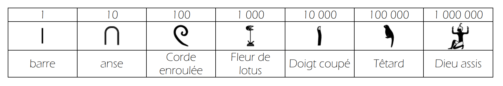
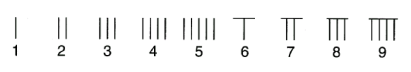
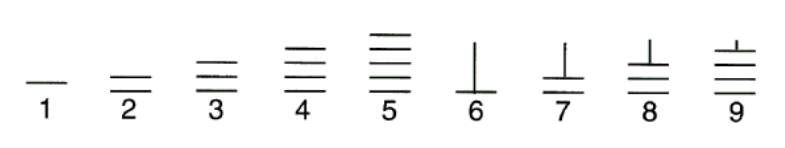

# Systèmes de numérations historiques

Avant que notre système de numération ne s’impose partout, de nombreuses civilisations ont inventé **leurs propres manières de compter**. Chacune utilisait des symboles, des bases, et des logiques différentes pour représenter les nombres.

Le but de ce TD est de découvrir que **le système décimal n’est qu’un choix parmi d’autres**, et que les humains ont toujours su faire preuve de **créativité** pour représenter les nombres.

Amusez-vous à explorer ces systèmes étranges… et parfois étonnamment logiques !

## Numération Égyptienne (entre 3000 et 300 avant J.C.) 𓀂

Les scribes égyptiens, à l’époque des pharaons, utilisaient des nombres écrits à l’aide de
symboles : les hiéroglyphes. Un bâton, une anse, une corde, une fleur de lotus, un index, un
têtard et un dieu étaient utilisés pour représenter les sept premières puissances de 10.

## Numération Babylonienne (vers 1800 avant J.C.) 🪶

Les scribes babyloniens n’utilisaient eux que deux chiffres : le clou pour l’unité et le chevron pour la dizaine. Ils écrivaient les nombres jusqu’à 59 normalement puis regroupaient
par "paquets" de $60$. Ainsi, on écrivait chaque nombre en le décomposant en "paquets" de
$1$, de $60$, de $60^2=3600$, ...

## Numération Romaine (1er siècle avant J.C.) 🏛️

Les Romains écrivaient les nombres à l’aide de sept symboles : I (1), V (5), X (10), L (50),
C (100), D (500) et M (1000).  
Chaque chiffre unitaire (I, X, C, M) ne peut être répété quetrois fois consécutives et V, L, D qu’une seule. Ils pouvaient ainsi écrire tous les nombres de 1 à 4999.  
Pour faciliter la lecture, on commençait par les groupes de chiffres ayant la plus grande valeur.  
Pour connaitre la valeur d’un nombre écrit en chiffres romains, il faut lire le nombre de gauche à droite, ajouter la valeur du chiffre, SAUF s’il est inférieur au suivant. Dance ce cas, on le soustrait.  

Par exemple : XXVII = 10 + 10 + 5 + 1 + 1 = 27 et DIX= 500 + 10 − 1 = 509 car I est inférieur à X.

## Numération "Suan Zé" (200 avant J.C.) 🧮 

Pour exprimer les nombres, les mathématiciens chinois et japonais ont souvent utilisé,
dans leurs écrits, un ingénieux système de numération combinant des barres verticales et
horizontales appelées « barres numérales ».
Pour différencier les unités, dizaines, centaines, ... les Chinois changeaient l’orientation
des barres. Ainsi, les barres verticales étaient utilisées pour les chiffres des unités, centaines,
dizaines de mille, ... :

et les barres horizontales pour les chiffres des dizaines, unitées de mille, ...

## Numération Shadock 🌀

Les Shadoks sont des créatures loufoques d’un dessin animé français culte créé par Jacques Rouxel en 1968. Avec leur logique absurde, leur langage farfelu et leurs actions illogiques, ils incarnent une satire drôle et décalée de la société et de la bureaucratie.

Dans un épisode, il est justement question de numération...

<video controls>
<source src="../../../files/NSI/Numeration/La numération Shadoks.mp4" type="video/mp4">
</video>

