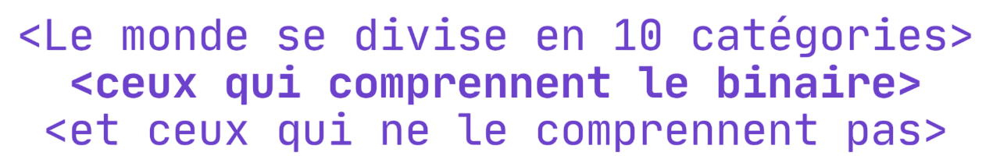

# Représentation des nombres entiers

Quand on pense aux nombres, on imagine tout de suite nos bons vieux chiffres décimaux : 0, 1, 2, 3, etc.  
Mais pour un ordinateur, tout cela **n’existe pas tel quel** : il ne connaît que deux états, **0** ou **1**.  

Alors comment fait-il pour représenter des **nombres** ?  
Et plus encore… comment peut-il manipuler des entiers négatifs, des décimaux comme $3{,}14$, ou effectuer des calculs complexes, uniquement avec des 0 et des 1 ?

Dans ce chapitre, on va découvrir que :

- les ordinateurs utilisent différents **systèmes de numération**, selon leurs besoins ;
- il existe des **techniques précises** pour représenter des entiers positifs et négatifs ;
- les nombres réels peuvent eux aussi être codés en binaire, mais avec certaines limites ;
- et il est possible de **calculer**, en binaire, presque comme on le fait à la main en base 10.

Bref, on entre dans les **coulisses du cerveau de la machine** 🔍

---

