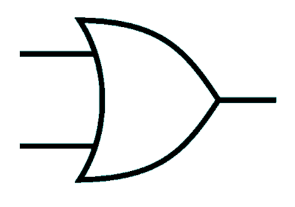
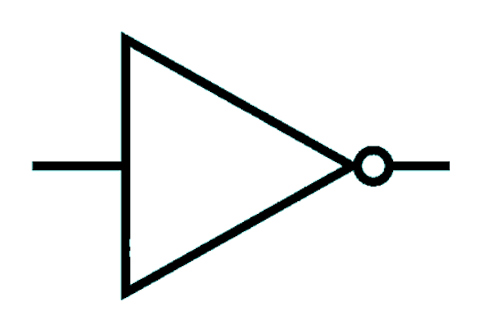
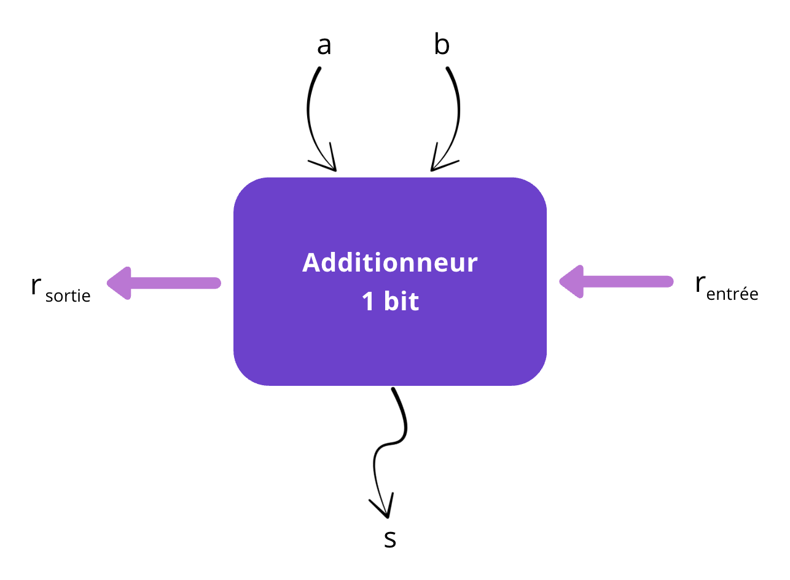

# Additionneur binaire 🧮

## De l’expression booléenne au composant électronique ⚙️

Dans un ordinateur, les opérations de calcul sont effectuées en **binaire**, à l’aide de **portes logiques**.

Des composants électroniques miniaturisés appelés **transistors** se comportent comme des interrupteurs “tout ou rien” qui laissent ou non passer un signal électrique, en fonction d’un signal de commande en entrée.

Les principes de l’**algèbre booléenne** vus à l’activité précédente s’appliquent en remplaçant  
`True` par **1** et `False` par **0**.

---

## Les portes logiques 🔌

Voici la représentation de quelques **portes logiques**, selon la **représentation américaine** (la plus utilisée) :

| **Opérateur booléen** | **Symbole de porte logique** | **Expression correspondante** | 
|:-----------------------|:-----------------------------|:------------------------------| 
| `a and b` |  | `a and b` |
| `a or b`  |    | `a or b`  |
| `not a`   |  | `not a`   |
| `a xor b` |  | `a xor b` |

!!! info "À retenir !"
    💡 Les portes logiques sont les **blocs de base** de tout circuit électronique.  
    Elles traduisent directement les opérateurs booléens vus précédemment.

---

## Observation d’un circuit logique 🔍

1. En observant le circuit logique ci-dessous, **déterminer à quel opérateur logique standard il correspond**.

    

        <iframe style="width: 70%; height: 197px; border:0; border-radius:18px;" src="https://logic.modulo-info.ch/?id=Sz5KqN&mode=static&data=N4NwXAbANA9gDgFwM5mACwJYBMCmB1DAJxwGEYAbGQlBQgVxyk1wEkA7OOhMy6sWhk2w4A8l07cKVGvRwBfKAGMYAWzgw2ONslRsYCAAyoEATzg4wAcj0JLUdSgDaARgCsBqAHYDAXSgY2MA8YLjBnBRtnYzMLa307BzAXdyhnAGZff0CAJlhQtIUAQzYsI2BTcytirASYJ2zvKAAWTICkpqhXPxCESCKSqPKYqpLa+sbnCFbAx08oAA5u0IBOBSoyitiqMaS05Y9nA2mkw9TnJd7nbIUAjeHLAJ3HDKgMv2wwgqzBzatH+zquw83neWDCTTWXDulUsPSeTSmqSOoLCrjkCgA7kQcE4XJ0-M8vATlmcCdBDgTnB1Mi40s1KXTspSOvMoKAMIUki4jqkQT45JTcm4fPygA"></iframe>
    

2. Vérifier vos résultats à l'aide du schéma intéractif ci-dessous : 

    

        <iframe style="width: 70%; height: 197px; border: 0; border-radius:18px;" src="https://logic.modulo-info.ch/?id=Sz5KqN&mode=tryout&data=N4NwXAbANA9gDgFwM5mHATvAhgcywgSxgDsARAUwBssBPMAZgFYAGAXygGMYBbOE84slTEYCZqgQ045MAHIRCWVD4oA2gEYWUAOzMAulALEwzWAFcEYdewXqJUmfNFKVYDVvX19h4wCZzlvTsWMQAJuLAktJyIaEuMGq+ulAALN5GbilQjAYwFpDBYXaRDjFh8YnJ6hDpxqraUAAcufkAnOww6BFRjp0VbvStpurMtW4jUOrqLZbqvuxG3aWyRv2qXlBeBgShVkE+xT1yq8oJA6a627vqKR0WS9GyeYqnaik1k6NXVoys7ADuBHQ5DUGmyBnWOghrUm0ygqmgIwhNyg3g09FSyIxvmRWUaUFABCwbg0o0mlz0rGR-k0ekpQA"></iframe>
    

---

## Comment réaliser le circuit électronique d’un additionneur 1 bit ? ⚙️

On se propose de réaliser un **circuit logique** permettant de faire **l’addition de deux bits**.

L’additionneur 1 bit possède **trois entrées** :  

- `a` : le **premier bit**,  
- `b` : le **deuxième bit**,  
- `rₑ` : la **retenue entrante** (éventuelle).

Il possède **deux sorties** :

- `s` : la **somme**,  
- `rₛ` : la **retenue sortante** (éventuelle).

Voici un schéma d'un tel additionneur : 

    

1. Remplis la table de vérité ci-dessous en testant le fonctionnement de l’additionneur 1 bit.  

    <iframe style="width: 100%; height: 302px; border: 0; border-radius:18px;" src="https://logic.modulo-info.ch/?id=UQ2nqs&mode=tryout&data=N4NwXAbANA9gDgFwM5mHATvAhgcywgSxgDsARAUwBssBPMAZgFYAGAXygGMYBbOE84slQFizVAhpxyYAOQiZUPigDaARgBMzKCwC6UAgBMwq6MSzdpMrDPYjV4yZfmKYKjVtXNmew8YDsUGYWsgBGNvrE6g5Sss5KYGqaUKqMjD5GqgAcgeaW6OThAB4w6GLAEjEyxegK8crqfoxQjT7ECaoAnFCaejAArghg6qrsWMQGZRWWYwa1rgkNTeoALGkRC+rd9L0DQ8vs1fbljrLVcyqMEE2ZayILSxA7gw3s-QiTJzJv5wkQTFA3dJDbJBSxIcIzI5TWQzH7KZYpZItdbKDxPIavUrRSwlOGXJZMVoJehQZboxivAZQz7fFwqP4E25GUy5WTocGsdgAdwI+RUamgnT0agCPSg9VU3TWamy6ke4oa3UywpM3XUKtF2wVku84qyyWFmy19WWpOFTUeOlYQA"></iframe>

    | **a** | **b** | **rₑ** | **s** | **rₛ** |
    |:---:|:---:|:---:|:---:|:---:|
    | 0 | 0 | 0 |  ... |  ... |
    | 0 | 0 | 1 |  ... |  ... |
    | 0 | 1 | 0 |  ... |  ... |
    | 0 | 1 | 1 |  ... |  ... |
    | 1 | 0 | 0 |  ... |  ... |
    | 1 | 0 | 1 |  ... |  ... |
    | 1 | 1 | 0 |  ... |  ... |
    | 1 | 1 | 1 |  ... |  ... |

2. Sur un exemple, montrer que le circuit logique correspond bien à une addition binaire. 
3. En vous aidant de la représentation des portes logiques de l'additionneur binaire, déterminer l'expression de la sortie `s` et `rₛ`.

    1. Expression booléenne de la **somme** `s` :  `s = (a xor b)  xor  rₑ`

    2. Expression booléenne de la **retenue sortante** `rₛ` : ...