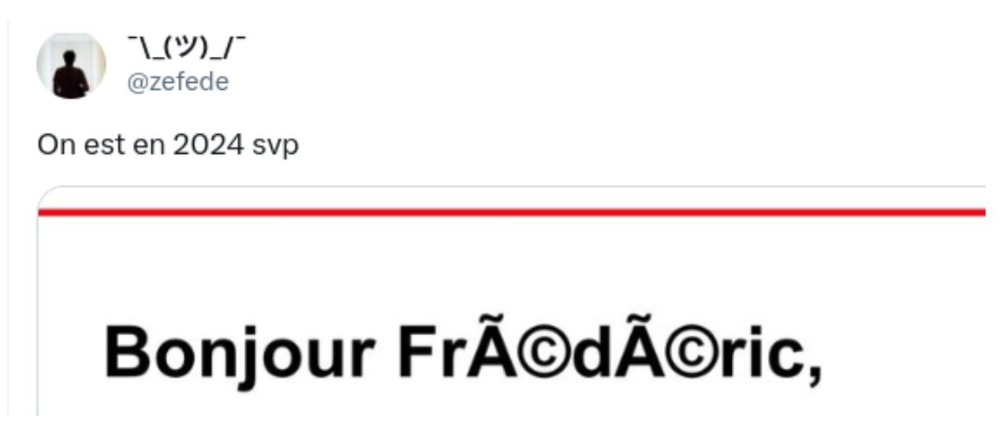

# Exercices 

Vous trouverez ci-dessous les exercices de cette séquence.

- Les exercices marqués avec :fontawesome-solid-pencil: se réalisent **sans ordinateur**.  
  Ceux indiqués par :fontawesome-solid-laptop: nécessitent **un ordinateur**.

- Le **niveau de difficulté** est indiqué par des étoiles :  
    <ul style="list-style: none;">
        <li>:fontawesome-solid-star: :fontawesome-regular-star: :fontawesome-regular-star: → Exercices pour **s'approprier les notions**.</li>
        <li>:fontawesome-solid-star: :fontawesome-solid-star: :fontawesome-regular-star: → Exercices pour **renforcer vos compétences**.</li>
        <li>:fontawesome-solid-star: :fontawesome-solid-star: :fontawesome-solid-star: → Exercices pour vous **challenger** et tester vos acquis.</li>
    </ul>

Les corrections sont généralement disponibles, mais elles ne doivent être consultées **qu'après validation de votre production par l'enseignant**.

---

## Expression booléenne

!!! exopapier "Exercice 1 - :fontawesome-solid-star: :fontawesome-regular-star: :fontawesome-regular-star:"
    Si `a` vaut `False` et `b` vaut `True`, que valent les expressions booléennes suivantes ?

    1. `a and b or not a`
    2. `not a or b and a`
    3. `b and b or (not  a and a)`
    
    ??? success "Correction"
        On rappelle :  
        - `a = False`  
        - `b = True`  
        - priorité des opérateurs : `not` > `and` > `or`

        **1.** `a and b or not a`  
        - `a and b` → `False and True` → `False`  
        - `not a` → `True`  
        - `False or True` → **True**

        **Réponse :** `True`

        **2.** `not a or b and a`  
        - `not a` → `True`  
        - `b and a` → `True and False` → `False`  
        - `True or False` → **True**

        **Réponse :** `True`

        **3.** `b and b or (not a and a)`  
        - `b and b` → `True and True` → `True`  
        - `not a and a` → `True and False` → `False`  
        - `True or False` → **True**

        **Réponse :** `True`

!!! exopapier "Exercice 2 - :fontawesome-solid-star: :fontawesome-regular-star: :fontawesome-regular-star:"
    Fanny a trouvé que l’une des lois de De Morgan permet de simplifier une expression booléenne :

    **not(a or b) = not a and not b**

    Elle souhaite la démontrer en complétant deux tables de vérité.

    Compléter les deux tableaux suivants pour montrer que les deux expressions ont exactement les mêmes résultats.

    | **a** | **b** | **a or b** | **not(a or b)** |
    |:----:|:-----:|:----------:|:----------------:|
    | False | False |      ...      |        ...          |
    | False | True  |       ...     |        ...          |
    | True  | False |      ...      |        ...          |
    | True  | True  |      ...      |        ...          |

    | **a** | **b** | **not a** | **not b** | **not a and not b** |
    |:----:|:-----:|:---------:|:----------:|:---------------------:|
    | False | False |     ...      |      ...      |     ...                  |
    | False | True  |    ...       |      ...      |      ...                 |
    | True  | False |    ...       |     ...       |      ...                 |
    | True  | True  |     ...      |       ...     |        ...               |

    ??? success "Correction"
        **1. Complétion de la première table**

        | a | b | a or b | not(a or b) |
        |:-:|:-:|:-------:|:------------:|
        | False | False | False | True |
        | False | True  | True  | False |
        | True  | False | True  | False |
        | True  | True  | True  | False |

        **2. Complétion de la deuxième table**

        | a | b | not a | not b | not a and not b |
        |:-:|:-:|:------:|:------:|:----------------:|
        | False | False | True  | True  | True |
        | False | True  | True  | False | False |
        | True  | False | False | True  | False |
        | True  | True  | False | False | False |

        **Conclusion :**  
        La colonne **not(a or b)** et la colonne **not a and not b** sont identiques :  
        ➜ Cela démontre la **première loi de De Morgan**.

!!! exopapier "Exercice 3 - :fontawesome-solid-star: :fontawesome-solid-star: :fontawesome-regular-star:"
    On considère l’expression suivante : `not(a or not b) and b`

    Elle vaut **True**.  
    Compléter la table suivante pour déterminer quelles valeurs de `a` et `b` sont possibles.

    | a | b | not b | a or not b | not(a or not b) | not(a or not b) and b |
    |:-:|:-:|:------:|:------------:|:----------------:|:------------------------:|
    | False | False |     ...       |        ...        |      ...              |           ...             |
    | False | True  |     ...       |        ...        |      ...              |           ...             |
    | True  | False |     ...       |        ...        |      ...              |           ...             |
    | True  | True  |     ...       |        ...        |      ...              |           ...             |

    ??? success "Correction"
        **Étape 1 — Calculs ligne par ligne**

        | a | b | not b | a or not b | not(a or not b) | not(a or not b) and b |
        |:-:|:-:|:------:|:------------:|:----------------:|:------------------------:|
        | False | False | True  | True  | False | False |
        | False | True  | False | False | True  | True  |
        | True  | False | True  | True  | False | False |
        | True  | True  | False | True  | False | False |

        **Étape 2 — Filtrer les cas où l’expression vaut True**

        La dernière colonne vaut True uniquement pour :  
        ➜ **a = False** et **b = True**

        **Conclusion :**  
        L’unique solution possible est : **(a = False, b = True)**.

!!! exopapier "Exercice 4 - :fontawesome-solid-star: :fontawesome-regular-star: :fontawesome-regular-star:"
    On souhaite vérifier l’identité logique suivante : `not(a and b) = not a or not b`

    Compléter les deux tables ci-dessous pour montrer que les deux expressions donnent exactement les mêmes résultats.

    | a | b | a and b | not(a and b) |
    |:-:|:-:|:--------:|:--------------:|
    | False | False |        |          |
    | False | True  |        |          |
    | True  | False |        |          |
    | True  | True  |        |          |

    | a | b | not a | not b | not a or not b |
    |:-:|:-:|:------:|:------:|:----------------:|
    | False | False |        |        |          |
    | False | True  |        |        |          |
    | True  | False |        |        |          |
    | True  | True  |        |        |          |

    ??? success "Correction"
        | a | b | a and b | not(a and b) |
        |:-:|:-:|:--------:|:--------------:|
        | False | False | False | True |
        | False | True  | False | True |
        | True  | False | False | True |
        | True  | True  | True  | False |

        | a | b | not a | not b | not a or not b |
        |:-:|:-:|:------:|:------:|:----------------:|
        | False | False | True  | True  | True  |
        | False | True  | True  | False | True  |
        | True  | False | False | True  | True  |
        | True  | True  | False | False | False |

        Les colonnes finales sont identiques → l’égalité est démontrée. **Il s'agit de la seconde égalité de De Morgan**

!!! exopapier "Exercice 5 - :fontawesome-solid-star: :fontawesome-solid-star: :fontawesome-regular-star:"
    On considère l’expression suivante : `(not a and b) or (a and not b)`

    À l'aide de la table de vérité ci-dessous, déterminer à quel opérateur logique élémentaire cette expression est équivalente (`and`, `or`, `not`, `xor`).

    | a | b | not a | not b | not a and b | a and not b | résultat final |
    |:-:|:-:|:------:|:------:|:--------------:|:--------------:|:----------------:|
    | False | False |        |        |              |              |                |
    | False | True  |        |        |              |              |                |
    | True  | False |        |        |              |              |                |
    | True  | True  |        |        |              |              |                |

    ??? success "Correction"
        | a | b | not a | not b | not a and b | a and not b | résultat final |
        |:-:|:-:|:------:|:------:|:--------------:|:--------------:|:----------------:|
        | False | False | True  | True  | False | False | False |
        | False | True  | True  | False | True  | False | True  |
        | True  | False | False | True  | False | True  | True  |
        | True  | True  | False | False | False | False | False |

        L’expression vaut True pour :

        - **a = False, b = True**
        - **a = True, b = False**

        C’est donc l’opérateur **xor**.

!!! exopapier "Exercice 6 - :fontawesome-solid-star: :fontawesome-solid-star: :fontawesome-regular-star:"
    Construire la table de vérité des expressions booléennes suivantes (avec `x`, `y` et `z` des booléens) : 

    1. `(x | y) & z`
    2. `¬(x | y)`
    3. `¬x | ¬y`
    4. `¬(x & y) | ¬x & ¬y`

    ??? success "Correction"
        On considère trois variables booléennes `x`, `y` et `z`.  
        On utilise la notation :

        - `|` pour **or**
        - `&` pour **and**
        - `¬` pour **not**

        ---

        1. Table de vérité de `(x | y) & z`

            | x | y | z | (x \| y) | (x \| y) & z |
            |:-:|:-:|:-:|:---------:|:--------------:|
            | 0 | 0 | 0 | 0 | 0 |
            | 0 | 0 | 1 | 0 | 0 |
            | 0 | 1 | 0 | 1 | 0 |
            | 0 | 1 | 1 | 1 | 1 |
            | 1 | 0 | 0 | 1 | 0 |
            | 1 | 0 | 1 | 1 | 1 |
            | 1 | 1 | 0 | 1 | 0 |
            | 1 | 1 | 1 | 1 | 1 |

            **Conclusion :** l’expression vaut `True` lorsque `z = 1` et qu’au moins un de `x` ou `y` vaut 1.

        2. Table de vérité de `¬(x | y)`

            | x | y | x \| y | ¬(x \| y) |
            |:-:|:-:|:-------:|:-----------:|
            | 0 | 0 | 0 | 1 |
            | 0 | 1 | 1 | 0 |
            | 1 | 0 | 1 | 0 |
            | 1 | 1 | 1 | 0 |

            **Conclusion :** vrai uniquement si `x = 0` et `y = 0`.

        3. Table de vérité de `¬x | ¬y`

            | x | y | ¬x | ¬y | ¬x \| ¬y |
            |:-:|:-:|:---:|:---:|:----------:|
            | 0 | 0 | 1 | 1 | 1 |
            | 0 | 1 | 1 | 0 | 1 |
            | 1 | 0 | 0 | 1 | 1 |
            | 1 | 1 | 0 | 0 | 0 |

            **Conclusion :** faux seulement lorsque `x = 1` et `y = 1`.

        4. Table de vérité de `¬(x & y) | (¬x & ¬y)`

            | x | y | x & y | ¬(x & y) | ¬x | ¬y | ¬x & ¬y | final |
            |:-:|:-:|:------:|:------------:|:---:|:---:|:----------:|:------:|
            | 0 | 0 | 0 | 1 | 1 | 1 | 1 | 1 |
            | 0 | 1 | 0 | 1 | 1 | 0 | 0 | 1 |
            | 1 | 0 | 0 | 1 | 0 | 1 | 0 | 1 |
            | 1 | 1 | 1 | 0 | 0 | 0 | 0 | 0 |

            **Conclusion :** vrai sauf lorsque `x = 1` et `y = 1`. 

!!! exopapier "Exercice 7 - :fontawesome-solid-star: :fontawesome-solid-star: :fontawesome-solid-star:"
    On veut que l’expression suivante soit **toujours `True`**, quelle que soit la valeur de `a` et `b` : 
    
    <div style="text-align: center;">
    `(a or X) and (not b or Y)`
    </div>

    Compléter `X` et `Y` par `a`, `not a`, `b`, ou `not b` pour que l’expression soit forcément vraie.

    Justifier en utilisant une table de vérité.

    ??? success "Correction"
        On veut que l’expression soit **toujours vraie** :

        - `a or X` doit toujours être `True` **et**
        - `not b or Y` doit toujours être `True`

        Ainsi, on choisi : `X = not a` et `Y = b`, l’expression devient : `(a or not a) and (not b or b)`

        Voici sa table de vérité : 

        | a | b | a or not a | not b or b | résultat |
        |:-:|:-:|:-----------:|:-----------:|:--------:|
        | False | False | True | True | True |
        | False | True  | True | True | True |
        | True  | False | True | True | True |
        | True  | True  | True | True | True |

        L’expression vaut **toujours `True`**.

        👉 Une solution est donc : **`X = not a` et `Y = b`**.

---

## Expression booléenne en Python

!!! exoordi "Exercice 8 - :fontawesome-solid-star: :fontawesome-regular-star: :fontawesome-regular-star:"
    Prédire si les variables suivantes contiennent le booléen True ou le booléen False. Contrôlez ensuite en exécutant le code et en inspectant le contenu des variables.

    ```python linenums="1"
    a = (2 > 1)
    b = (3 == 1+2)
    c = (1 < 0)
    d = (2 != 5/2)
    e = (2 != 5//2)
    f = ('a' == 'A')
    g = not a
    h = b and c
    i = b or c
    j = not c and (d or e)
    ```

!!! exoordi "Exercice 9 - :fontawesome-solid-star: :fontawesome-solid-star: :fontawesome-regular-star:"
    Dans chaque cas, x et y sont des variables contenant des entiers.

    Écrire en langage Python une expression booléenne donnant la valeur (vrai ou fausse) de chacune des phrases suivantes:

    1. `x` et `y` sont non nuls.
    2. `x` est compris entre 0 (exclus) et 10 (inclus).
    3. `x` est égal à 0 ou à 1.
    4. `x` est égal à 0 ou `y` est égal à 0, mais pas les deux en même temps.

    ??? success "Correction"
         1. `x!=0 and y!= 0` ou `(x!=0) & (y!=0)`
         2. `b= 0<x<=10` ou 
         3. `x==0 or x==1` ou `(x==0) | (x==1)`
         4. `(x==0) ^ (y==0)`


!!! exoordi "Exercice 10 - :fontawesome-solid-star: :fontawesome-solid-star: :fontawesome-solid-star:"
    On souhaite chiffrer (chiffrer est le mot utilisé en cryptographie pour crypter) le mot `"BONJOUR"` avec la clé `"MAURIAC"`. Le chiffrement retenu est un chiffrement par XOR, ce qui signifie qu'on va effectuer un XOR entre les deux nombres associés aux lettres.

    Exemple :

    - la lettre `'B'` va être chiffrée grâce au `'M'`.
    - Le code ASCII de `'B'` est 66. (on le sait car `ord('B')` renvoie 66 )
    - Le code ASCII de 'M' est 77. (on le sait car `ord('M')` renvoie 77 )
    - 66 ^ 77 vaut 15.
    - Le «caractère» associé à 15 est `'\x0f'` (on le sait car `chr(15)` renvoie `'\x0f'` )
    - Le premier caractère du mot chiffré sera donc `'\x0f'`

    Questions : 

    1. Écrire une fonction `chiffre` qui prendra en paramètre un mot `mot_clair` et un mot de passe `cle` de **même taille** que `mot_clair` et qui renvoie la chaîne de caractères obtenue en XORant `mot_clair` avec `cle`.
    2. Chiffrer le mot `"BONJOUR"` avec la clé `"MAURIAC"`.
    3. Reprendre la chaîne de caractères précédemment obtenue et la rechiffrer à nouveau avec la clé `"MAURIAC"`. Que constate-t-on ? Etait-ce prévisible ?

    ??? success "Correction"
        1. Voici la fonction : 

            ```python linenums="1"
            def chiffre(mot_clair: str, cle: str) -> str :
              """
              Chiffre le mot mot_clair avec la clé de cryptage cle avec un chiffrement XOR. 

              Arguments : 
                 - mot_clair : mot à crypter
                 - cle : clé de cryptage

              Pré-condition : Il faut que cle et mot_clair est le même nombre de lettres
              """
              assert len(mot_clair)==len(cle), "Le mot à crypter et la clé n'ont pas le même nombre de lettres"
              mot_chiffre = ''
              for i in range(len(mot_clair)):
                  code = ord(mot_clair[i]) ^ ord(cle[i])
                  mot_chiffre += chr(code)
              return mot_chiffre
            ```
        2. `'\x0f\x0e\x1b\x18\x06\x14\x11'`
        3. `'BONJOUR'`

!!! exoordi "Exercice 11 - :fontawesome-solid-skull: :fontawesome-solid-skull: :fontawesome-solid-skull:"
    Vous avez trouvé une image bien étrange : 

    <div style="text-align:center;">
    
    </div>

    Un visage semble se deviner derrière un champ de fleurs... mais quel est ce visage ?

    L'image du champ de fleurs ne vous est pas inconnue, d'ailleurs en cherchant bien vous l'avez retrouvée dans vos dossiers :

    <div style="text-align:center;">
    
    </div>

    On dirait que le personnage-mystère a voulu se fondre dans le champ de fleurs...

    **XORez-vous découvrir qui est ce personnage-mystère ?**

    [Rendez-vous sur Capytale](https://capytale2.ac-paris.fr/web/c/6465-8045951)

    ??? tip "Astuce"
        - Récupérer le code RGB d'un pixel : 

            ```python
            >>> img_myst.getpixel((125, 80))
            (54, 217, 174)
            ```
        - Modifier la couleur d'un pixel : 

            ```python
            >>> img_new.putpixel((30,70), (255,0,0))
            >>>     
            ```
        - Afficher une image : 

            ```python
            >>> img_mask.show()
            >>>     
            ```
        - Sauvegarder une image : 

            ```python
            >>> img_new.save("solution.png")
            >>>     
            ```

    ??? success "Correction"

        ```python linenums="1"
        from PIL import Image

        img_myst = Image.open('mystere.bmp')
        img_mask = Image.open('mask.jpg')

        largeur = img_myst.width
        hauteur = img_myst.height

        img_new = Image.new('RGB', img_myst.size)

        for x in range(largeur):
            for y in range(hauteur):
                pix_myst = img_myst.getpixel((x, y))
                pix_mask = img_mask.getpixel((x, y))
                new_pix = (pix_myst[0] ^ pix_mask[0], pix_myst[1] ^ pix_mask[1], pix_myst[2] ^ pix_mask[2])
                img_new.putpixel((x,y), new_pix)

        img_new.show() 
        ```

!!! exoordi "Exercice 11 - :fontawesome-solid-skull: :fontawesome-solid-skull: :fontawesome-solid-skull:"
    Résoudre le Pydéfi [La clé endommagée](https://pydefis.callicode.fr/defis/MasqueJetable/txt)

    ??? success "Correction"

        Voici le programme : 

        ```python linenums="1"
        for decalage in range(0, len(message)-40):
            resultat_partiel = []
            for i in range(min(len(cle_partielle), len(message))):
                resultat_partiel.append(message[i+decalage] ^ cle_partielle[i])

            texte_partiel = ''.join(chr(b) if 32 <= b < 127 else '.' for b in resultat_partiel)

            print(decalage, ":", texte_partiel)
        ```

        On obtient ainsi, pour un décalage de 503 : 

        ```
        503 : ERALLIEMENTHABITUELACOLOGNENOUSDECIDERON
        ```

        Le rendez-vous est donc à Cologne


---

## Expression booléenne en électronique

!!! exopapier "Exercice 13 - :fontawesome-solid-star: :fontawesome-regular-star: :fontawesome-regular-star:"
    Comprendre ce mème : 

    <div style="text-align:center;">
    
    </div>

    ??? success "Correction"

        Voici une autre visualisation possible : 

        <div style="text-align:center;">
        
        </div>

!!! exoordi "Exercice 14 - :fontawesome-solid-star: :fontawesome-solid-star: :fontawesome-regular-star:"
    Voici un schéma intéractif : 

    <iframe style="width: 100%; height: 210px; border: 0; border-radius:18px;" src="https://logic.modulo-info.ch/?id=YYBVxy&mode=tryout&data=N4NwXAbANAxg9gWwA5wHYFNUBcDOZgCWqADPlgJ5LpgDkRNUKeA2gIwBMxUArMQLpQCAEzBdUAQwTUa4mgF9BqVmUrT6jOCw5dWEfoJGsoEqbQBG8qONRDSwClVrWhDJmGYBmVlz0Ci79igPATgAVywwABYFOAAnOwdpONdNdy8dXj9Ud24oCBDwsAB2BQAPOITVWnLYlJZIop1ifX9mAA4oAE4CiO8FVDgsSscaAaw6nN4obxbs1iMw3vYY8OGk8InmCE5p5r9DDzkFAHcCWPQWZi52ATY826NgqCueB51WB8DWJ+ZIqDbbkUunw+HIgA"></iframe>

    1. A quelle expression binaire correspond ce circuit ?
    2. Dresser sa table de vérité.

    ??? success "Correction"
        1. `not( (a and b) xor (a or b))`
        2. Voici la table de vérité : 

            | a | b | a and b | a or b | (a and b) xor (a or b) | not((a and b) xor (a or b)) |
            |:-:|:-:|:--------:|:-------:|:----------------------:|:-----------------------------:|
            | 0 | 0 |    0     |    0    |           0            |               1               |
            | 0 | 1 |    0     |    1    |           1            |               0               |
            | 1 | 0 |    0     |    1    |           1            |               0               |
            | 1 | 1 |    1     |    1    |           0            |               1               |


!!! exoordi "Exercice 15 - :fontawesome-solid-star: :fontawesome-solid-star: :fontawesome-solid-star:"
    1. Dresser la table de vérité de : `a or (a and not b)`
    2. Aller sur ce [site web](https://logic.modulo-info.ch)
    3. Reproduire le circuit correspondant à cette expression booléenne
    4. Vérifier votre résultat. 

    ??? success "Correction"
        1. Voici la table de vérité : 

            | a | b | not b | a and not b | a or (a and not b) |
            |:-:|:-:|:-----:|:------------:|:------------------:|
            | 0 | 0 |   1   |      0       |         0          |
            | 0 | 1 |   0   |      0       |         0          |
            | 1 | 0 |   1   |      1       |         1          |
            | 1 | 1 |   0   |      0       |         1          |

        2. Il semblerait que `a or (a and not b)` soit équivalent à `a`.
        3. Pas de correction 
        4. Voici le circuit : 
   
            <iframe style="width: 100%; height: 137px; border: 0; border-radius:18px;" src="https://logic.modulo-info.ch/?id=1a6IPK&mode=tryout&data=N4NwXAbANAxg9gWwA5wHYFNUBcDOZgCWqADPlgJ5LpgDkRNUKeA2gIwBMxUAzMQLpQCAEzBdUAQwTUa4mgF9BqVmUrT6jOCw5dWxfoJGsoEqbQBG8qHABOpYBSq0bDJmGYAWABxd3+om-YeATgAVywwdwVQrDsHaWiXTTcAVmSfPxFkhVQ4GJVHGhysRJZ2TihdP1RIKzCwAHYFcVQhWNVaZqESt240qABOKrdPAeC63TkFAHcCa3QWZi52AQ8oZJWjCBX60ahFqE8Nrm4+PjkgA"></iframe>

        5. Pas de correction 


!!! exoordi "Exercice 16 - :fontawesome-solid-star: :fontawesome-solid-star: :fontawesome-solid-star:"
    1. Aller sur ce [site web](https://logic.modulo-info.ch)
    2. Vérifier les 2 lois de De Morgan (exercices 2 et 4)

    ??? success "Correction"
        1. Première loi : `not(a or b) = not a and not b`

            <iframe style="width: 100%; height: 130px; border: 0; border-radius:18px;" src="https://logic.modulo-info.ch/?id=1a6IPK&mode=tryout&data=N4NwXAbANAxg9gWwA5wHYFNUBcDOZgCWqATPlgJ5LpgDkRNUKeA2hAAxQDMbAulAQBMwHVAEME1GqJoBffqk5lKk+ozgt2UAIxte-IVqhiJtAEayocAK5Y2SqrWtYGTMM07EOEAKx9BYbzk4ACc7YAoHGhCXdTctHygfP1Q4wy1iPicwLU45VDhbe0l85zUWYm8vX3lsgBZLG2zA+TCIlVQYllrajm4-A2hjSWk5Ii0i2lVXZm6OHT1-LQB2I3FJczyC8fDlWhLOt28dLgWUrQAOBqxsgE5NrFIdyP2yw+P55LBPK6+tOVFUAJWrspICDqweolqkQ3MRiFBiJxMo1iLUgjZtm1HDZwUtjkl9F9AnIAO4EYLoFjMOZaPjMNIZKD0zjaWp0rTeKDVenQC7slaedk3BGM5jEQyIumohG+HgyIA"></iframe>

        2. Seconde loi : `not(a and b) = not a or not b`

            <iframe style="width: 100%; height: 130px; border: 0; border-radius:18px;" src="https://logic.modulo-info.ch/?id=1a6IPK&mode=tryout&data=N4NwXAbANAxg9gWwA5wHYFNUBcDOZgCWqATPlgJ5LpgDkRNUKeA2hAAxQDMbAulAQBMwHVAEME1GqJoBffqk5lKk+ozgt2UAIxte-IVqhiJtAEayocAK5Y2SqrWtYGTMM07EOEAKx9BYbzlUOFt7SWDnNRZiby9feTAtABZLG0TA+TtgCgc6VBd1NySkjm4-A2hjSWk5Ii0w2lVXZmKOHT1-LQB2I3FJcyCQ+uzlWgiClm8dLg7URIAOVKxEgE5BrFIR3PGotym23T85zyWwYi05J2GcyScJty7pn3KzjNFUASyb2neBe+ZunEjm5iNBiF0+E4zvNLgAnL6jGhwWH-CAlKDPBLMYgrGaQtKcC5yADuBFh6BYAO8UHiAOgWnmfABPU8TOIi2STI4oKZhnBTMJUBivNxOLZhjKPBkQA"></iframe>


--- 

## Encodage des caractères

!!! exopapier "Exercice 17 - :fontawesome-solid-star: :fontawesome-regular-star: :fontawesome-regular-star:"
    Halima se demande si la correspondance entre les codes ASCII et les caractères a été choisie au hasard.

    Compléter le **codage binaire** dans le tableau ci-dessous.  
    Que remarque-t-on sur le codage d’une lettre **minuscule** et de sa **majuscule** ?

    | Caractère | Décimal | Hexa | Binaire |
    |:---------:|:-------:|:----:|:--------:|
    | a | 97 | 61 | 1100001 |
    | A | 65 | 41 | ........ |
    | b | 98 | 62 | ........ |
    | B | 66 | 42 | ........ |

    ??? success "Correction"
        Complétons les codes binaires :

        | Caractère | Décimal | Hexa | Binaire |
        |:---------:|:-------:|:----:|:--------:|
        | a | 97 | 61 | 1100001 |
        | A | 65 | 41 | 1000001 |
        | b | 98 | 62 | 1100010 |
        | B | 66 | 42 | 1000010 |

        **Remarque importante :**  
        Les binaires des majuscules et minuscules **ne diffèrent que d’un seul bit** :  
        → pour les minuscules, le **6ᵉ bit** (en partant de la gauche) vaut `1`.  
        → pour les majuscules, il vaut `0`.

        C’est donc un choix parfaitement **logique et structuré**, pas du hasard !

!!! exopapier "Exercice 18 - :fontawesome-solid-star: :fontawesome-regular-star: :fontawesome-regular-star:"
    1. Un webmestre souhaite réaliser un site web comportant un lexique français-japonais. Quel encodage des caractères lui conseiller ?
    2. Un ingénieur programme un microcontrôleur avec très peu de mémoire, en français et en anglais. Quel encodage lui conseiller ?

    ??? success "Correction"
          1. Pour un site multilingue incluant le **japonais**, il faut utiliser **UTF-8**, qui gère tous les alphabets du monde.

          1. Sur un microcontrôleur avec peu de mémoire, il faut un encodage **compact**.  
          → **ISO-8859-1 (Latin-1)** suffit pour les langues européennes simples (anglais + français sans caractères rares).  
          C’est plus léger qu’UTF-8.

!!! exoordi "Exercice 19 - :fontawesome-solid-star: :fontawesome-solid-star: :fontawesome-regular-star:"
    Voici une capture effectuée sur Twitter en 2024 : 

    <div style="text-align:center;">
    
    </div>

    1. Grâce à la fonction `ord` puis à la fonction `bin`, écrire en binaire le nombre associé au caractère `é` en UTF-8.
    2. Sur 11 bits, le nombre `11101001` va s'écrire `00011101001`. En séparant ces 11 bits en deux groupes de 5 bits et 6 bits (`00011` et `101001`), et en les encapsulant selon les règles de l'UTF-8, on obtient les deux octets `11000011 10101001`. Convertir les deux octets obtenus en notation décimale (grâce à int) puis en hexadécimal (grâce à hex).
    3. Si le logiciel considère **à tort** que les deux octets utilisés pour coder le **é** en UTF-8 servent en fait à coder deux caractères en ISO 8859-15, quels seront ces deux caractères ?

    <div style="text-align:center;">
    
    </div>

    ??? success "Correction"
        1. En UTF-8, `é` est associé au nombre `11101001` : 

            ```python
            >>> ord('é')
            233
            >>> bin(233)
            '0b11101001'
            ```

        2. On obtient : 

            ```python
            >>> int('11000011', 2)
            195
            >>> hex(195)
            '0xc3'
            >>> int('10101001', 2)
            169
            >>> hex(169)
            '0xa9'
            ```

        3. Le premier octet, `c3` en hexadécimal, sera perçu en ISO 8859-15 comme le caractère `Ã`.
   
            Le deuxième octet, `a9` en hexadécimal, sera perçu en ISO 8859-15 comme la lettre `©`.

            Finalement, ce qui aurait dû être un `é` en UTF-8 se retrouvera être un `é` en ISO 8859-15.


!!! exopapier "Exercice 20 - :fontawesome-solid-star: :fontawesome-solid-star: :fontawesome-regular-star:"
    Dans une gare, on peut lire l’affichage suivant :

    > **Train Némes-Mâcon : retardé**

    En vous aidant de la table de caractères, proposer une **explication** à cet affichage étrange.

    <div style="text-align:center;">
    
    </div>

    ??? success "Correction"
        Le texte affiché provient d’un **mauvais décodage** du fichier.

        Le texte original était encodé en **UTF-8**, mais l’écran de la gare l’a **interprété comme s’il était en ISO-8859-1** (Latin-1).

        Conséquence :  
        - les caractères accentués (`é`, `â`, `é`) sont découpés en **octets UTF-8**,  
        - puis interprétés séparément comme des caractères Latin-1,  
        - ce qui donne des symboles comme `é`, `â`, `é`.

        C’est un cas classique d’erreur :  
        **encodage UTF-8 + décodage Latin-1 = texte illisible**.


!!! exoordi "Exercice 21 - :fontawesome-solid-star: :fontawesome-solid-star: :fontawesome-regular-star:"
    Décoder l'expression suivante, écrite en ASCII :

    `1101100 1100101 1110011 100000 1001110 1010011 1001001 100000 1100011 100111 1100101 1110011 1110100 100000 1101100 1100101 1110011 100000 1101101 1100101 1101001 1101100 1101100 1100101 1110101 1110010 1110011`

    ??? tip "Aide"
        - La fonction `split(" ")` permet de décomposer une chaine de caractère en une liste, en se servant de l'espace `" "` comme caractère séparateur : 

            ```python linenums="1"
            >>> msg = '1101100 1100101 1110011'
            >>> msg = msg.split(' ')
            >>> msg
            ['1101100', '1100101', '1110011']
            ```
        - `int("1101100", 2)` permet de récuperer facilement la valeur en base 10 du nombre binaire `1101100` : 

            ```python linenums="1"
            >>> int("1101100", 2)
            108
            ```
        - `chr` permet de récupérer le caractère associé à un codes ASCII : 

            ```python linenums="1"
            >>> chr(108)
            'l'
            ```

    ??? success "Correction"
        Voici le programme : 

        ```python linenums="1"
        msg = '1101100 1100101 1110011 100000 1001110 1010011 1001001 100000 1100011 100111 1100101 1110011 1110100 100000 1101100 1100101 1110011 100000 1101101 1100101 1101001 1101100 1101100 1100101 1110101 1110010 1110011'
        msg = msg.split(' ')
        s = ''
        for k in msg :
            s += chr(int(k ,2))
        print(s)
        ```