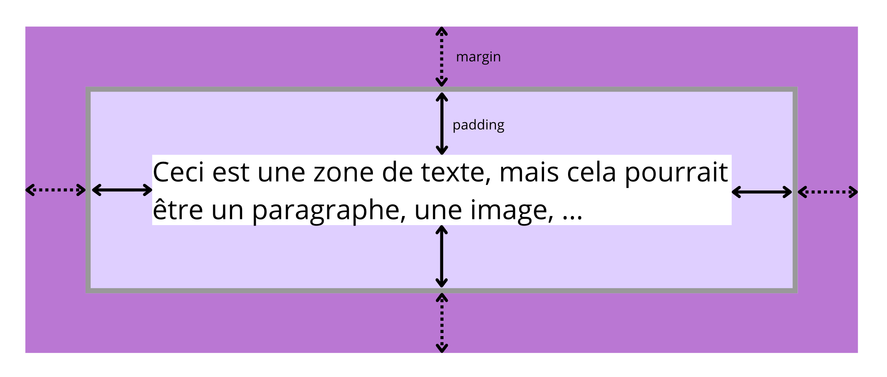

# CSS : éléments pratiques 🧰🎨

Dans cette partie, nous allons découvrir les **principales propriétés CSS** permettant de modifier concrètement l’apparence d’une page web.

Ces propriétés sont celles que vous utiliserez le plus souvent pour **mettre en forme** et **organiser visuellement** vos pages.

---

## Couleurs 🎨

!!! css "Propriétés de couleur"
    Le CSS permet de modifier la couleur du texte, du fond et des bordures.

    Principales propriétés :
    
    - `color` : couleur du texte
    - `background-color` : couleur de fond
    - `border-color` : couleur de la bordure

!!! info "Formats de couleurs"
    Une couleur peut être définie de plusieurs manières :

    - Couleur nommée (exemple : `color: red;`)
    - [Hexadécimal](https://htmlcolorcodes.com) (exemple : `background-color: #ffeecc;`)
    - RGB (exemple : `color: rgb(0, 0, 255);`)

---

## Bordures 🧱

!!! css "Propriétés de bordure"
    Les bordures permettent d’encadrer un élément.

    Propriétés principales :

    - `border-width` : pour l'épaisseur de la bordure (en pixel `px`)
    - `border-style` : pour le type de bordure (`solid`, `dashed`, `dotted`, ...)
    - `border-color` : pour la couleur de la bordure

!!! tip "Syntaxe raccourcie"
    Il est possible de définir les trois propriétés en une seule ligne. 

    Au lieu d'écrire : 

    ```css linenums="1"
    div {
        border-width: 2px;
        border-style: solid;
        border-color: black;
    }
    ```

    On peut simplement écrire : 
    
    ```css linenums="1"
    div {
        border: 2px solid black;
    }
    ```

---

## Dimensions et espacements 📐

!!! css "Dimensions"
    Le CSS permet de définir la taille des éléments.

    Propriétés :

    - `width` : pour la largeur
    - `height` : pour la hauteur

!!! css "Espacements"
    Le CSS permet de gérer l’espace autour et à l’intérieur des éléments.

    - `padding` : espace intérieur
    - `margin` : espace extérieur

    

!!! tip "Positionnement simple"
    Certaines propriétés permettent d’ajuster la position d’un élément.

    - `top`
    - `right`
    - `bottom`
    - `left`

    (Ces propriétés seront détaillées dans la partie « pour aller plus loin ».)

---

## Mise en forme du texte 📝

!!! css "Propriétés de texte"
    Le CSS permet de personnaliser l’apparence du texte.

    Propriétés courantes :

    - `font-size` : Taille de la police
    - `font-family` : Police d'écriture (Arial, ...)
    - `font-weight` : Épaisseur de la police d'écriture
    - `font-style` : Style de la police (italique, ...)
    - `text-decoration` : Décoration (surligné, sousligné, barré, ...)
    - `font-variant` : Variations (petites majuscules, ...)

---

## Affichage des éléments 📦

!!! css "Propriété `display`"
    La propriété `display` contrôle la manière dont un élément est affiché.

    Valeurs principales :

    - `inline` : Elles seront affichées les unes à côté des autres.
        
        Les boîtes de type en-ligne ne peuvent contenir que d'autres boîtes de type en-ligne. Ces boîtes ont des marges internes et externes nulles par défaut.
    - `block` : Elles seront affichées les unes en dessous des autres, alignées sur le bord gauche.

        Les boîtes de type bloc peuvent contenir d'autres boîtes de type bloc et/ou des boîtes de type en-ligne. Par défaut, la plupart des éléments bloc possèdent des marges internes et externes non nulles, parfois différentes selon les navigateurs.
    - `inline-block` : Les boîtes auxquelles on attribue cette propriété auront les «avantages» des deux types précédents. Elles seront :

        - affichées les unes à côtés des autres ;
        - alignées sur leur bord inférieur ;
        - réduites à la largeur minimum pour leur contenu (elles ne prennent pas toute la largeur de leur conteneur).
    - `none` : Une boîte avec cette propriété ne sera pas affichée, ainsi que toute boîte qu'elle contiendrait. Les autres conteneurs se placent dans le flux d'affichage comme si cette boîte n'existait plus.

        Cette propriété s'utilise par exemple pour les menus : les sous-menus sont par défaut en display: none; et passent en display: block; lorsqu'on les survole.

        ⚠️ Un élément en `display: none` n’occupe plus aucune place dans la page.


--- 

## Mise en page avec CSS Grid 🧩

!!! info "CSS Grid"
    CSS Grid permet de créer des mises en page organisées en lignes et colonnes.

    Exemple simple :
    ```css linenums="1"
    .conteneur {
        display: grid;
        grid-template-columns: 1fr 3fr;
    }
    ```

    👉 Cette disposition crée deux colonnes de largeur différente.

!!! tip "Analyse de la syntaxe"
    Dans l'exemple précédent, on a déclaré `grid-template-columns: 1fr 3fr`. Cela signifie que chaque ligne de la grille sera constituée de deux cellules, la première occupant $1/(1+3) = 25\%$ de la largeur du conteneur, la seconde occupant les $75\%$ restant.


---

## Centrer des éléments 🎯

!!! css "Centrage"
    Le CSS propose plusieurs techniques pour centrer des éléments.

    - Centrer du texte :

        ```css linenums="1"
        p {
            text-align: center;
        }
        ```

    - Centrer un bloc horizontalement :

        ```css linenums="1"
        div {
            margin: 0 auto;
        }
        ```

    - Hauteur d’une ligne de texte :

        ```css linenums="1"
        p {
            line-height: 1.5;
        }
        ```

---

## Interaction : survol de la souris 🖱️

!!! css "Pseudo-classe `:hover`"
    La pseudo-classe `:hover` permet de modifier l’apparence d’un élément lors du passage de la souris.

    ```css linenums="1"
    a:hover {
        color: red;
    }
    ```

---

## À retenir 📌

!!! info "Résumé"
    - Le CSS permet de gérer couleurs, tailles et espacements
    - Les bordures encadrent les éléments
    - Le texte peut être entièrement personnalisé
    - `display` contrôle l’affichage des éléments
    - CSS Grid permet des mises en page simples
    - `:hover` ajoute de l’interactivité