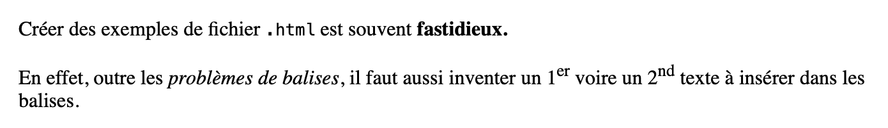
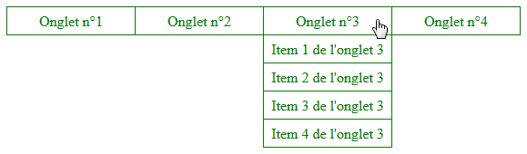

# Exercices 

Vous trouverez ci-dessous les exercices de cette séquence.

- Les exercices marqués avec :fontawesome-solid-pencil: se réalisent **sans ordinateur**.  
  Ceux indiqués par :fontawesome-solid-laptop: nécessitent **un ordinateur**.

- Le **niveau de difficulté** est indiqué par des étoiles :  
    <ul style="list-style: none;">
        <li>:fontawesome-solid-star: :fontawesome-regular-star: :fontawesome-regular-star: → Exercices pour **s'approprier les notions**.</li>
        <li>:fontawesome-solid-star: :fontawesome-solid-star: :fontawesome-regular-star: → Exercices pour **renforcer vos compétences**.</li>
        <li>:fontawesome-solid-star: :fontawesome-solid-star: :fontawesome-solid-star: → Exercices pour vous **challenger** et tester vos acquis.</li>
    </ul>

Les corrections sont généralement disponibles, mais elles ne doivent être consultées **qu'après validation de votre production par l'enseignant**.

---

## HTML - Principe et premières balises

!!! exoordi "Exercice 1 - :fontawesome-solid-star: :fontawesome-regular-star: :fontawesome-regular-star:"
    Rechercher sur le web les balises HTML permettant de : 
    
    1. Mettre un mot en gras
    2. Mettre un mot en italique
    3. Mettre un mot en style `code`
    4. Mettre un mot en exposant

    ??? success "Correction"
        1. `<strong>`
        2. `<em>`
        3. `<code>`
        4. `<sup>`
   
!!! exoordi "Exercice 2 - :fontawesome-solid-star: :fontawesome-solid-star: :fontawesome-regular-star:"
    Compléter le code nécessaire entre les deux balises `<body>` et `</body>` afin d'avoir une prévisualisation qui ressemble à l'image ci-dessous (le copier/coller ne fonctionnera pas sur l'image, les pointillés sont à remplacer par son nom).

    

    ---

    {{ html_playground("demo", "<!DOCTYPE html>
<html lang=\"fr\">
    <head>
        <meta charset=\"utf-8\">
        <title>Premières balises</title>
    </head>
    <body>
        Bonjour...
    </body>
</html>") }}

    ??? success "Correction"

        ```html linenums="1"
        <!DOCTYPE html>
        <html lang="fr">
            <head>
                <meta charset="utf-8">
                <title>Premières balises</title>
            </head>
            <body>
                <p>
                    Bonjour à tous.<br>
                    Je m'appelle ... et je suis ici pour m'exercer en <strong>HTML</strong>.
                </p>
                <p>
                    Dans cet exercice, je code mon 1<sup>er</sup> fichier <code>.html</code>.
                    Vivement que l'on puisse insérer des images, créer des liens
                    vers d'autres pages et utiliser de jolies couleurs grâce au
                    <strong>CSS</strong>.
                </p>
            </body>
        </html>
        ```

!!! exoordi "Exercice 3 - :fontawesome-solid-star: :fontawesome-solid-star: :fontawesome-regular-star:"
    Avant tout, commencez par créer un répertoire nommé `Site_exo_3` (par exemple) dans lequel vous pourrez stocker les différents fichiers conçus au cours de cet exerice. 

    1. Lancez un éditeur de texte
    2. Créez un nouveau fichier.
    3. L'`enregistrer sous...` le nom `essai01.html` dans votre répertoire. 
        
        ⚠️ Vérifiez que le type de ce fichier est `Hyper Text Markup Language`.
    4. Allez dans le répertoire dans lequel vous avez sauvegardé ce fichier puis double-cliquer sur essai01.html. Normalement le navigateur internet doit s'ouvrir… sur une page blanche. Si oui, fermez cette page, sinon, recommencez depuis la question 1°/.

!!! exoordi "Exercice 4 - :fontawesome-solid-star: :fontawesome-solid-star: :fontawesome-solid-star:"
    Repérer et corriger toutes les erreurs de syntaxe dans le code ci-dessous.
    
    Le rendu final doit correspondre à l'image ci-dessous : 

    

    ---

    {{ html_playground("demo", "<!DOCTYPE html>
<html lang=\"fr\">
    <head>
        <meta charset=\"utf-8\">
        <title>Corriger les erreurs</title>
    </head>
    <body>
        <p>Créer des exemples de fichier <code>.html<code> est souvent
		<strong>fastidieux.</p></strong>
		<p>En effet, outre les </em>problèmes de balises<em>, il faut
		aussi inventer un 1<sup>er</sup> voire un 2<sub>nd</sup> texte
		à insérer dans les balises.
		</p>
    </body>
</html>") }}

    ??? success "Correction"

        ```html linenums="1"
        <!DOCTYPE html>
        <html lang="fr">
            <head>
                <meta charset="utf-8">
                <title>Corriger les erreurs</title>
            </head>
            <body>
                <p>
                Créer des exemples de fichier <code>.html</code> est souvent
                <strong>fastidieux.</strong>
                </p>
                <p>
                En effet, outre les <em>problèmes de balises</em>, il faut aussi
                inventer un 1<sup>er</sup> voire un 2<sup>nd</sup> texte à insérer
                dans les balises.
                </p>
            </body>
        </html>
        ```

!!! exoordi "Exercice 5 - :fontawesome-solid-star: :fontawesome-solid-star: :fontawesome-solid-star:"
    A l'aide d'un éditeur de texte, créer un fichier simple `.html`, nommé `favoris.html` avec pour contenu les informations suivantes :

    - Nom et Prénom en gras
    - Le texte suivant : Sites utiles en NSI

---

## HTML - Titres, listes et balises génériques

!!! exoordi "Exercice 6 - :fontawesome-solid-star: :fontawesome-regular-star: :fontawesome-regular-star:"
    Testez le rendu par défaut de chaque niveau de titre entre les balises <body>.

    ---

    {{ html_playground("demo", "<!DOCTYPE html>
<html lang=\"fr\">
    <head>
        <meta charset=\"utf-8\">
        <title>Les titres HTML</title>
    </head>
    <body>
        ...
    </body>
</html>") }}

!!! exoordi "Exercice 7 - :fontawesome-solid-star: :fontawesome-solid-star: :fontawesome-regular-star:"
    Reprendre le fichier `favoris.html` (de l'exercice 5) avec un éditeur de texte.

    1. Dans ce fichier, mettre :
        1. son nom et son prénom en titre 1 en haut de la page ;
        2. «Mes sites utiles en NSI» en titre 2 après le paragraphe déjà écrit.
    2. Ouvrir `favoris.html` à l'aide du navigateur pour constater le rendu. Ne pas hésiter à appeler le professeur pour vérification.

!!! exoordi "Exercice 8 - :fontawesome-solid-star: :fontawesome-solid-star: :fontawesome-regular-star:"
    En s'inspirant du code déjà entré dans le formulaire, écrire le code Html permettant d'afficher la liste ci-dessous :
    
    

    --- 

    {{ html_playground("demo", "<!DOCTYPE html>
<html lang=\"fr\">
    <head>
        <meta charset=\"utf-8\">
        <title>Liste d'éléments html</title>
    </head>
    <body>
		<ol type=\"A\">  
			<li> Item 1 </li>
			<li> Item 2 </li>
			<li> Item 3 </li>
		</ol>
        
    </body>
</html>") }}

    ??? success "Correction"
        ```html
        <!DOCTYPE html>
        <html lang="fr">
            <head>
                <meta charset="utf-8">
                <title>Liste d'éléments html</title>
            </head>
            <body>
                <ol type="A">
                    <li>Document et en-tête
                        <ol type="1">
                            <li>Doctype</li>
                            <li>head</li>
                        </ol>
                    </li>
                    <li>Structure
                        <ol type="1">
                            <li>header </li>
                            <li>article</li>
                            <li>section</li>
                            <li> footer</li>
                        </ol>
                    </li>
                    <li>Groupes
                        <ol type="1">
                            <li>Paragraphe</li>
                            <li>Les listes
                                <ol type="a">
                                    <li>Liste non ordonnée</li>
                                    <li>Liste ordonnée</li>
                                </ol>
                            </li>
                            <li>Balises bloc génériques : div</li>				
                        </ol>
                    </li>						
                </ol>
            </body>
        </html>
        ```

!!! exoordi "Exercice 9 - :fontawesome-solid-star: :fontawesome-solid-star: :fontawesome-regular-star:"
    Reprendre le fichier `favoris.html` avec un éditeur de texte.

    1. Dans ce fichier, ajouter les trois sites suivants sous forme d'une liste non ordonnée après le second titre :
        
        - Espace Numérique de Travail
        - Site d'exercices en Html/Css & Python ;
        - Documentation Mozilla sur le HTML
        - Documentation Mozilla sur le CSS

        Pour l'instant, on ne fait pas de liens hypertextes vers ces sites.

    2. Ouvrir `favoris.html` à l'aide du navigateur pour constater le rendu. Ne pas hésiter à appeler le professeur pour vérification.

---

## Arborescence

!!! exoordi "Exercice 10 - :fontawesome-solid-star: :fontawesome-solid-star: :fontawesome-regular-star:"
    Compléter le code Html ci-dessous (en remplaçant le point d'interrogation) pour que le logo de l'académie de Lyon apparaisse dans la fenêtre d'affichage :

    

    Il fauda se rendre sur le site de l'académie de Lyon pour récupérer l'URL de de cette image.

    ---

    {{ html_playground("demo", "<!DOCTYPE html>
<html lang=\"fr\">
    <head>
        <meta charset=\"utf-8\">
        <title>Liens externes</title>
    </head>
    <body>
        <p>Voici le logo de l'académie de Lyon :</p>
        
    </body>
</html>") }}

    ??? success "Correction"

        On aurait : 

        ```html
        <!DOCTYPE html>
        <html lang="fr">
            <head>
                <meta charset="utf-8">
                <title>Liens externes</title>
            </head>
            <body>
                <p>Voici le logo de l'académie de Lyon :</p>
                
            </body>
        </html>
        ```

!!! exoordi "Exercice 11 - :fontawesome-solid-star: :fontawesome-solid-star: :fontawesome-regular-star:"
    Modifier le code précédent afin que l'image serve d'ancre pour un lien externe vers le site de l'académie de Lyon. Ce site doit s'afficher dans une nouvelle fenêtre.

    ---

    {{ html_playground("demo", "<!DOCTYPE html>
<html lang=\"fr\">
    <head>
        <meta charset=\"utf-8\">
        <title>Liens externes</title>
    </head>
    <body>
        <p>Voici le logo de l'académie de Lyon :</p>
        
    </body>
</html>") }}

    ??? success "Correction"

        On aurait : 

        ```html
        <!DOCTYPE html>
        <html lang="fr">
            <head>
                <meta charset="utf-8">
                <title>Liens externes</title>
            </head>
            <body>
                <p>
                    Voici le logo de l'académie de Lyon.<br>
                    Cliquer dessus permet d'ouvrir le site de l'académie.
                </p>
                <a href="https://www.ac-lyon.fr" target="_blank">
                    
                </a>
            </body>
        </html>
        ```

!!! exoordi "Exercice 12 - :fontawesome-solid-star: :fontawesome-solid-star: :fontawesome-solid-star:"
    Reprendre le fichier `favoris.html` avec un éditeur de texte.

    1. Dans ce fichier, ajouter des liens hypertextes vers : 
        1. EcoleDirecte
        2. Ce site web
        3. La documentation Mozilla sur le HTML
        4. La documentation Mozilla sur le CSS
    2. Ouvrir `favoris.html` à l'aide du navigateur pour constater le rendu. 

!!! exopapier "Exercice 13 - :fontawesome-solid-star: :fontawesome-solid-star: :fontawesome-regular-star:"
    Il faudra utiliser l'arborescence du site affiché ci-contre pour visualiser les «passages» d'un fichier à l'autre, les remontées ou descentes d'un dossier à un autre...

    

    Remplacer chaque point d'interrogation par le lien relatif qui convient.

    1. Je suis en train de consulter le fichier `page1.html`.
        
        Quelle balise et quel lien permettent d'afficher la page contenue dans le fichier `page2.html` (qui est dans le même dossier que `page1.html`) ?

    2. Je suis en train de consulter le fichier `accueil.html`.

        Quel lien permet d'afficher la page contenue dans le fichier `page1.html` qui appartient au dossier `autres_pages_du_site` (qui est dans le même répertoire que `accueil.html`) ?

    3. Je suis en train de consulter le fichier `page2.html`.

        Quel lien permet d'afficher l'image `Une_image.png` dans cette page ? En d'autres termes, comment remonter d'un répertoire puis aller dans le dossier `images_du_site` afin d'atteindre ce fichier image ?


    ??? success "Correction"
        1. `<a href="page2.html">lien vers la page 2</a>`
        2. `<a href="autres_pages_du_site/page1.html">lien vers la page 1</a>`
        3. ``

!!! exoordi "Exercice 14 - :fontawesome-solid-star: :fontawesome-solid-star: :fontawesome-regular-star:"
    A REFAIRE AVEC LA NOUVELLE ARBORESCENCE

    L'image ci-dessous présente un extrait de l'arborescence du présent site. La page actuelle est `liens_internes.html`.

    

    Compléter le code ci-dessous afin que les images dont le nom commence par «Liens_internes» s'affichent les unes à côté des autres.

    ---

    {{ html_playground("demo", "<!DOCTYPE html>
<html lang=\"fr\">
    <head>
        <meta charset=\"utf-8\">
        <title>Liens internes</title>
    </head>
    <body>
        <p>Voici les images demandées :</p>
    </body>
</html>", base_href="../../../files/NSI/HTML/exo14_15_arbo/exo_liens/") }}

    ??? success "Correction"
        On aurait : 

        ```html
        <!DOCTYPE html>
        <html lang="fr">
            <head>
                <meta charset="utf-8">
                <title>Liens internes</title>
            </head>
            <body>
                <p>Voici les images demandées :</p>
                
                
                
            </body>
        </html>
        ```

!!! exoordi "Exercice 15 - :fontawesome-solid-star: :fontawesome-solid-star: :fontawesome-regular-star:"
    La mise en page d'un site est assurée par un fichier .css. Ce fichier s'importe entre les balises `<head>`.

    Remplacer `???` afin d'importer le fichier `liens_internes.css` qui se trouve dans le répertoire `[css_exo]` situé au même niveau que les répertoires `[exo_liens]` et `[icones_cours_html_css_nsi]` (cf. exercice précédent).

    ---

    {{ html_playground("demo", "<!DOCTYPE html>
<html lang=\"fr\">
    <head>
        <meta charset=\"utf-8\">
        <title>Liens internes</title>
		<!-- Importation des feuilles de style CSS -->
		<link rel=\"stylesheet\" href=\"???\">
    </head>
    <body>
        <p>Dans cette phrase, le mot <strong>rouge</strong> doit être écrit
		en <strong>rouge</strong>, alors que le lien ci-dessous ne sera
		plus souligné et s'affichera sur fond jaune :
		</p>
        <a href=\"liens_internes.html\">Un lien qui peut «donner le tournis»...</a>
    </body>
</html>", base_href="../../../files/NSI/HTML/exo14_15_arbo/exo_liens/") }}

    ??? success "Correction"
        On aurait : 

        ```html
        <!DOCTYPE html>
        <html lang="fr">
            <head>
                <meta charset="utf-8">
                <title>Liens internes</title>
                <!-- Importation des feuilles de style CSS -->
                <link rel="stylesheet" href="../css_exo/liens_internes.css">
            </head>
            <body>
                <p>Dans cette phrase, le mot <strong>rouge</strong> doit être écrit
                en <strong>rouge</strong>, alors que le lien ci-dessous ne sera
                plus souligné et s'affichera sur fond jaune :
                </p>
                <a href="liens_internes.html">Un lien qui peut «donner le tournis»...</a>
            </body>
        </html>
        ```

!!! exoordi "Exercice 16 - :fontawesome-solid-star: :fontawesome-solid-star: :fontawesome-solid-star:"
    1. Chercher sur internet une image (libre de droits !) puis enregistrer cette image dans son répertoire personnel.
    2. Reprendre le fichier `favoris.html` avec un éditeur de texte. Afficher l'image téléchargée précédemment après la liste des sites utiles.
    3. Ouvrir `favoris.html` à l'aide du navigateur pour constater le rendu. 

!!! exoordi "Exercice 17 - :fontawesome-solid-star: :fontawesome-solid-star: :fontawesome-regular-star:"
    Le code HTML ci-dessous présente les compétences issues du bulletin officiel de NSI.
    
    Compléter ce code afin que :
    
    - chaque lien «Décrire», «Concevoir», «Collaborer», «Communiquer» et «Responsabiliser» renvoie vers le paragraphe correspondant ;
    - chaque lien «Haut de page» renvoie vers le haut de la page (sic).

    ---

    {{ html_playground("demo", example_file="files/NSI/HTML/liens_intra_page.html") }}

    ??? success "Correction"
        On aurait : 

        ```html
        <!DOCTYPE html>
        <html lang="fr">
        <head>
            <meta charset="utf-8">
            <title>Liens intra-page</title>
        </head>

        <body>
            <h1>Compétences à évaluer en NSI</h1>
            <p>
            <a href="#decrire">Décrire</a> -
            <a href="#concevoir">Concevoir</a> -
            <a href="#collaborer">Collaborer</a> -
            <a href="#communiquer">Communiquer</a> -
            <a href="#responsabiliser">Responsabiliser</a>
            </p>

            <h2 id="decrire">Décrire et expliquer une situation, un système ou un programme</h2>
            <ul>
            <li>Justifier dans une situation donnée, un codage numérique ou l'usage d'un format approprié, qu'un programme réalise l'action attendue...</li>
            <li>Détailler le déroulement d'une communication numérique, le rôle des constituants d'un système numérique, le rôle des éléments constitutifs d'une page web, ce qu'effectue tout ou partie d'un programme ou de l'algorithme associé, l'enchaînement des événements qui réalisent la fonction attendue par un programme...</li>
            </ul>
            <p><a href="#">Haut de page</a></p>

            <h2 id="concevoir">Concevoir et réaliser une solution informatique en réponse à un problème</h2>
            <ul>
            <li>Analyser un besoin dans un système d'information, le fonctionnement d'un algorithme...</li>
            <li>Structurer une formule logique, des données, une arborescence, une page web, une approche fonctionnelle en réponse à un besoin...</li>
            <li>Développer une interface logicielle ou une interface homme-machine, un algorithme, un programme, un document ou fichier numérique...</li>
            </ul>
            <p><a href="#">Haut de page</a></p>

            <h2 id="collaborer">Collaborer efficacement au sein d'une équipe dans le cadre d'un projet</h2>
            <ul>
            <li>Agir au sein d'une équipe dans des rôles bien définis, en interaction avec le professeur.</li>
            <li>Rechercher et partager une information, une documentation, une explication.</li>
            <li>Maîtriser l'utilisation d'outils numériques collaboratifs du type ENT, système de gestion de contenu (CMS), groupe de travail, forums...</li>
            </ul>
            <p><a href="#">Haut de page</a></p>

            <h2 id="communiquer">Communiquer à l'écrit et à l'oral</h2>
            <ul>
            <li>Documenter un projet numérique pour en permettre la communication en cours de réalisation et à l'achèvement, tout en précisant le déroulement et la finalité du projet.</li>
            <li>Présenter le cahier des charges relatif à un projet ou un mini-projet, la répartition des tâches au sein de l'équipe, les phases successives mises en œuvre, le déroulement de l'ensemble des opérations...</li>
            <li>Argumenter les choix relatifs à une solution (choix d'un format, d'un algorithme, d'une interface...).</li>
            </ul>
            <p><a href="#">Haut de page</a></p>

            <h2 id="responsabiliser">Faire un usage responsable des sciences du numérique en ayant conscience des problèmes sociétaux induits</h2>
            <ul>
            <li>Avoir conscience de l'impact du numérique dans la société notamment de la persistance de l'information numérique, de la non-rivalité des biens immatériels, du caractère supranational des réseaux, de l'importance des licences et du droit.</li>
            <li>Mesurer les limites et les conséquences de la persistance de l'information numérique, des lois régissant les échanges numériques, du caractère supranational des réseaux.</li>
            </ul>
            <p><a href="#">Haut de page</a></p>
        </body>
        </html>
        ```


---

## CSS - Principes fondamentaux

!!! exoordi "Exercice 18 - :fontawesome-solid-star: :fontawesome-solid-star: :fontawesome-regular-star:"
    Pour visualiser l'imbrication et la dénomination des balises, on importe (à nouveau) un fichier .css. Ce fichier met en forme les groupes de balises ayant pour nom de classe rouge, vert, bleu, gras, souligne ou italique (les mises en forme obtenues sont évidentes). En attribuant ces attributs à différentes balises `<span>`, essayez d'obtenir l'affichage ci-dessous :

    

    ---

    {{ html_playground("demo", "<!DOCTYPE html>
<html lang=\"fr\">
    <head>
        <meta charset=\"utf-8\">
        <title>Groupes de balises</title>
		<link rel=\"stylesheet\" href=\"html_generique01.css\">
    </head>
    <body>
        <p>
			Un exemple de texte coloré, chamarré, surchargé par une
			mise en forme bien trop abondante. Cela permet d'explorer
			l'imbrication des balises ainsi que la notion d'héritage
			des styles. Le plus dur étant toujours de faire un texte
			assez long pour pouvoir être intéressant.
		</p>
    </body>
</html>", base_href="../../../files/NSI/HTML/fichiersCSS/") }}

    ??? success "Correction"
        On aurait : 

        ```html linenums="1"
        <!DOCTYPE html>
        <html lang="fr">
            <head>
                <meta charset="utf-8">
                <title>Groupes de balises</title>
                <link rel="stylesheet" href="html_generique01.css">
            </head>
            <body>
                <p>
                    Un <span class="gras">exemple</span> de texte
                    <span class="rouge">coloré, <span class="vert">chamarré,
                    <span class="bleu">surchargé par une</span> mise en forme</span>
                    bien trop abondante</span>. Cela permet d'<span class="souligne">explorer</span>
                    <span class="italique">l'imbrication des <span class="rouge">balises</span>
                    ainsi que la notion <span class="gras">d'héritage des styles</span></span>.
                    <span class="souligne">Le plus <span class="bleu">dur</span></span> étant
                    toujours de faire <span class="gras">un texte <span class="italique">assez long</span>
                    pour pouvoir être <span class="vert">intéressant</span></span>.
                </p>
            </body>
        </html>
        ```


!!! exoordi "Exercice 19 - :fontawesome-solid-star: :fontawesome-solid-star: :fontawesome-regular-star:"
    Par défaut, chaque nouvel item d'une liste doit être affiché sous le précédent. Pour établir un menu déroulant, il faut donc distinguer la liste formant les onglets du menu, les listes formant les items de chaque onglet et les listes usuelles utilisées dans la page web.

    

    Modifiez le code HTML ci-dessous pour obtenir un menu déroulant fonctionnel grâce au fichier CSS importé. 

    Les noms (des classes ou des identifiants) utilisés sont `menu`, `onglet` et `item`.

    ---

    {{ html_playground("demo", "<!DOCTYPE html>
<html lang=\"fr\">
    <head>
        <meta charset=\"utf-8\">
        <title>Classes et identifiants</title>
		<link rel=\"stylesheet\" href=\"html_generique02.css\">
    </head>
    <body>
        <ul>
			<li>Onglet n°1
				<ul>
					<li>Item 1 de l'onglet 1</li>
					<li>Item 2 de l'onglet 1</li>
					<li>Item 3 de l'onglet 1</li>
				</ul>
			</li>
			<li>Onglet n°2
				<ul>
					<li>Item 1 de l'onglet 2</li>
					<li>Item 2 de l'onglet 2</li>
				</ul>
			</li>
			<li>Onglet n°3
				<ul>
					<li>Item 1 de l'onglet 3</li>
					<li>Item 2 de l'onglet 3</li>
					<li>Item 3 de l'onglet 3</li>
					<li>Item 4 de l'onglet 3</li>
				</ul>
			</li>
			<li>Onglet n°4
				<ul>
					<li>Item 1 de l'onglet 4</li>
				</ul>
			</li>
		</ul>
    </body>
</html>", base_href="../../../files/NSI/HTML/fichiersCSS/") }}

    ??? success "Correction"
        On aurait : 

        ```html linenums="1"
        <!DOCTYPE html>
        <html lang="fr">
            <head>
                <meta charset="utf-8">
                <title>Classes et identifiants</title>
                <link rel="stylesheet" href="html_generique02.css">
            </head>
            <body>
                <ul id="menu">
                    <li class="onglet">Onglet n°1
                        <ul class="item">
                            <li>Item 1 de l'onglet 1</li>
                            <li>Item 2 de l'onglet 1</li>
                            <li>Item 3 de l'onglet 1</li>
                        </ul>
                    </li>
                    <li class="onglet">Onglet n°2
                        <ul class="item">
                            <li>Item 1 de l'onglet 2</li>
                            <li>Item 2 de l'onglet 2</li>
                        </ul>
                    </li>
                    <li class="onglet">Onglet n°3
                        <ul class="item">
                            <li>Item 1 de l'onglet 3</li>
                            <li>Item 2 de l'onglet 3</li>
                            <li>Item 3 de l'onglet 3</li>
                            <li>Item 4 de l'onglet 3</li>
                        </ul>
                    </li>
                    <li class="onglet">Onglet n°4
                        <ul class="item">
                            <li>Item 1 de l'onglet 4</li>
                        </ul>
                    </li>
                </ul>
            </body>
        </html>
        ```