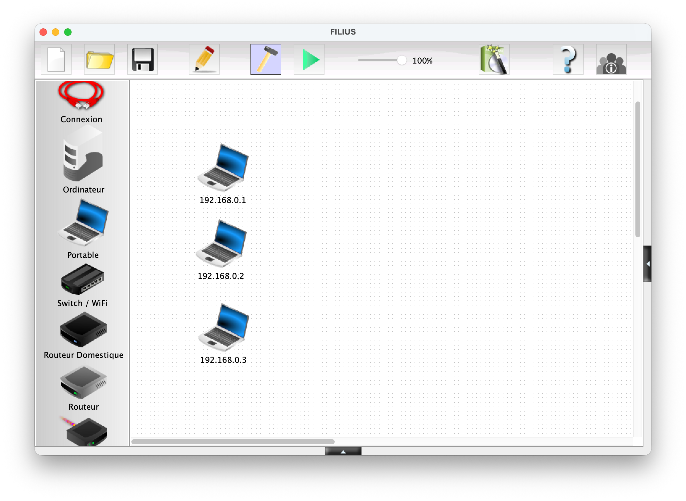
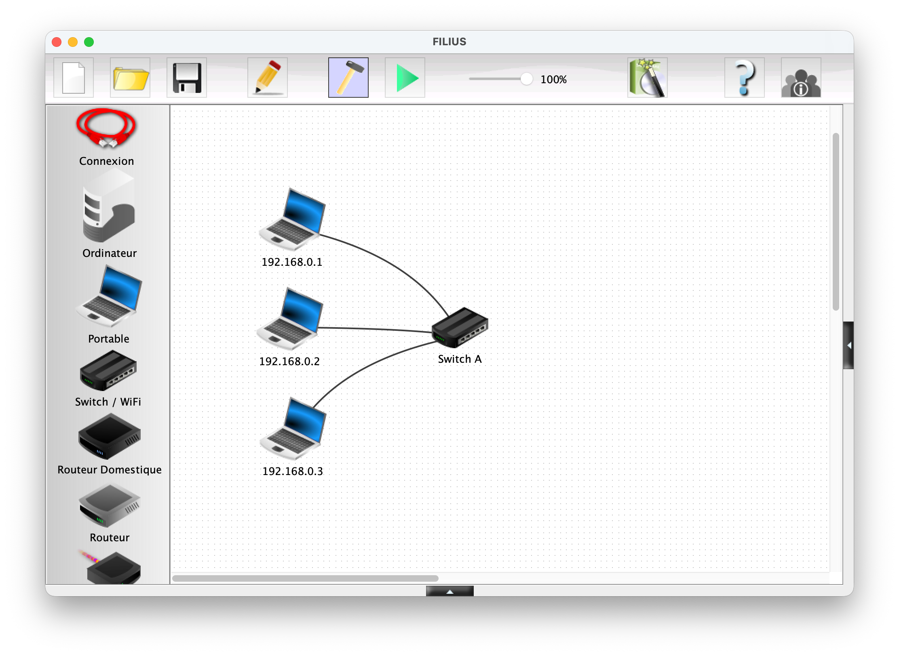
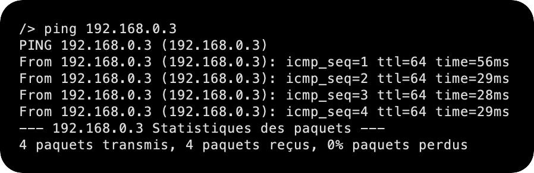
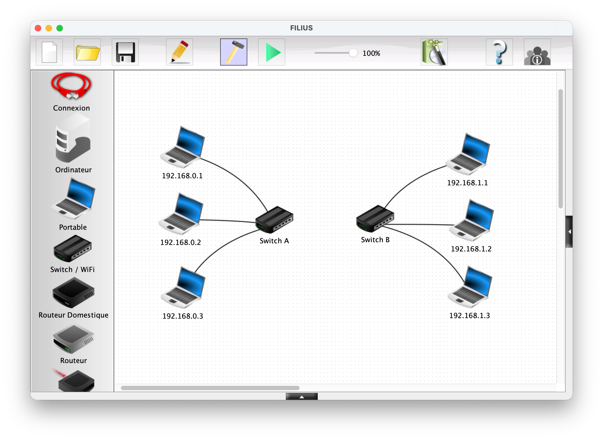
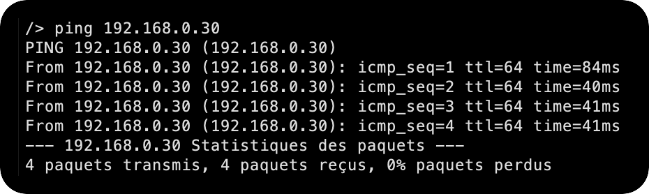

# Architecture de réseau 🧩

Dans cette partie, on va comprendre **comment est construit un réseau** (à petite et à plus grande échelle) et pourquoi certains réglages (IP, masque, passerelle...) sont indispensables pour communiquer.

!!! example "TP Filius"
    Le TP **Filius** (dans les boites violettes comme celle-ci) sera notre fil rouge : nous allons construire un réseau petit à petit, en alternant : test, observation, correction.

    Pour cela : 

    1. Rendez-vous sur le [site officiel de Filius](https://www.lernsoftware-filius.de/Herunterladen)
    2. Télécharger la version correspondant à votre système d'exploitation. 
    3. Ouvrez le logiciel. La fenêtre ci-dessous devrait apparaître : 

    

---

## Premier réseau local (LAN) 🏠

!!! definition "Architecture de réseau"
    L'**architecture de réseau** décrit :  

    - les **équipements** (ordinateurs, switch, routeur, point d'accès...),
    - la **topologie** (qui est branché à qui ?),
    - et le **plan d'adressage** (quelles adresses IP ? quels sous-réseaux ?).

Chaque machine connectée à un réseau possède une **carte réseau** (Ethernet, Wi-Fi...), qui a une "identité" matérielle.

!!! definition "Adresse MAC"
    Une **adresse MAC** (abréviation de *Media Access Control*) est un identifiant **unique** associé à une carte réseau (Ethernet, Wi-Fi, 4G, 5G, ...) **lors de sa fabrication** en usine.   
    Une adresse MAC s'écrit en général sous forme de **6 octets en hexadécimal**, par exemple : `fc:aa:14:75:45:a5` ;

!!! info "À quoi ça sert ?"
    Sur un réseau local, l'adresse MAC permet notamment à certains équipements (comme le **switch**) de savoir **à quel endroit** envoyer une trame.

    De plus, les **trois premiers octets** correspondent au **code du fabricant**. Un site comme [macvendorlookup.com](https://www.macvendorlookup.com/) vous permet de retrouver le fabricant d'une adresse MAC quelconque.

!!! example "TP Filius : Premières machines"
    Dans le logiciel Filius : 
    
    1. Ajouter trois ordinateurs **portable**.
    2. Cliquer sur chacun d'entre eux pour observer qu'ils possèdent tous une adresse MAC différente. 
    3. Dans le champ `Adresse IP`, saisir respectivement `192.168.0.1`, `192.168.0.2` et `192.168.0.3` et cocher `Utiliser l'adresse IP comme nom`. 

    Vous devriez obtenir l'affichage suivant : 

    

Toutefois, à ce stade, nos trois ordinateurs ne sont pas reliés entre eux et ne peuvent donc pas communiqué ou échanger quelconques informations... C'est ici qu'entre en jeu les **commutateurs** (aussi appelés **switch**) : 

!!! definition "Commutateur (switch)"
    Un **commutateur** (ou **switch**) est un équipement informatique qui relie plusieurs machines sur un même réseau local. 
    
    et 

!!! tip "Commutateur vs Hub"
    Avant l'apparition des **commutateurs**, il étaient fréquent de rencontrer des **hubs** (beaucoup plus rare aujourd'hui). 

    - Un **commutateur** n'envoie pas tout à tout le monde : il apprend quelles adresses MAC se trouvent derrière chacun de ses ports, puis **transmet seulement au bon destinataire**.

    

    - Un **hub** est plus "bête" : il **recopie** ce qu'il reçoit vers **tous** ses ports, même si le message ne concerne qu'une seule machine.

    

!!! example "TP Filius : Ajout d'un switch et tester un ping"
    Nous allons maintenant connecter nos trois ordinateurs portables ensemble à l'aide d'un switch puis vérifier que deux machines d'un même LAN peuvent communiquer.

    1. Placer un **switch** à côté des trois machines, le renommer `Switch A`.
    2. À l'aide de l'outil **Connexion**, relier chaque ordinateur au switch : 
        
    3. Passer en **mode simulation** (triangle vert)
    4. Cliquer sur l'ordinateur `192.168.0.1`
    5. Lancer **Installation des logiciels**
    6. Installer **Ligne de commande**, puis **Appliquer les modificiations**
    7. Ouvrir l'application **Ligne de commande**
    8. Saisir `ping 192.168.0.3`

    ✅ Attendu : le ping **répond** (même sous-réseau + switch = communication locale).

    ??? success "À observer"
        Le résultat du ping devrait être le suivant : 

        
        

---

## Sous-réseaux et masque de sous-réseau 🧠

!!! example "TP Filius : Un second réseaux !"
    Après avoir quitter le mode simulation, ajouter un deuxième sous-réseau de la manière suivante : 

    

    ⚠️ Bien penser à renommer les switchs et modifier les adresses IP des ordinateurs portables. 

On pourrait croire que "si je branche tout ensemble, tout communique".
En réalité, ce n'est pas que topologique : c'est aussi **numérique**.

!!! example "TP Filius : Premiers essaies de connexions"
    1. Relier le **Switch A** et le **Switch B** par une connexion.

         
    2. Lancer le PC `192.168.0.1`.
    3. Ouvrir l'application **ligne de commandes**.
    4. Effectuer un ping vers le PC `192.168.1.2`.

        ??? success "Résultat du ping"
            Cela ne marche pas. 
            
            L'ordinateur refuse d'envoyer le ping vers la machine `192.168.1.2`. *(spoil : car elle n'est pas dans son sous-réseau)*

            
    
    5. Temporairement, renommons la machine `192.168.1.2` en `192.168.0.30`. 
    6. Tester à nouveau le ping depuis la machine `192.168.0.1`.

        ??? success "Résultat du ping"
            Cela marche. Les paquets sont bien acheminés.

            

Essayons d'expliquer pour un tel résultat ce produit... 

!!! definition "Adresse IP"
    Une **adresse IP** (de l'anglais *Internet Protocol*) est une suite de chiffres ou de lettres qui identifie une machine de façon unique sur un réseau.

    En IPv4, elle s'écrit avec **4 nombres** (octets) entre 0 et 255 soit un total de 32 bits, par exemple `192.168.0.12`.

    En IPv6, elle est composée de 8 champs hexadécimaux de 16 bits délimités par deux points, par exemple `2a03:2880:f145:82:face:b00c:0:25de`

    Actuellemet, les adresses IPv4 et IPv6 continuent à cohabiter. 

!!! definition "Masque de sous-réseau"
    Le **masque** indique quelle partie de l'adresse IP correspond au **réseau** et quelle partie correspond à la **machine**.  
    Il sert à savoir si une destination est :

    - **dans mon sous-réseau** (envoi direct sur le LAN),
    - ou **hors de mon sous-réseau** (il faut passer par un routeur).

!!! methode "Reconnaître un sous-réseau avec le masque `255.255.255.0`"
    Si le masque est `255.255.255.0`, alors deux machines sont dans le même sous-réseau si elles ont les **3 premiers nombres identiques**.

    Dans cette configuration, 256 machines peuvent donc techniquement appartenir à un même sous-réseau. (Dans les faits, on réservera les adresses finissant par 0 et 255).

    Exemple : `192.168.0.1` et `192.168.0.33` sont ensemble, mais `192.168.1.2` est ailleurs.

Comme ceci est le réglage par défaut de Filius, cela explique pourquoi `192.168.0.33` et `192.168.0.1` sont sur le même sous-réseau et peuvent donc communiquer, et pourquoi `192.168.1.2` et `192.168.0.1` ne sont pas sur le même sous-réseau.

!!! methode "Reconnaître un sous-réseau avec le masque `255.255.0.0`"
    Avec `255.255.0.0`, ce sont les **2 premiers nombres** qui doivent être identiques.

    Il pourra donc y avoir $256^2 = 65636$ machines dans le même sous-réseau. 

!!! example "TP Filius : Changement de masque de sous-réseaux"
    1. Renommer la machine `192.168.0.30` en `192.168.1.2` et modifier son masque en `255.255.0.0`.
    2. Modifier également le masque de `192.168.0.1` en `255.255.0.0`.
    3. Tester à nouveau le ping de `192.168.0.1` vers `192.168.1.2`.

        ??? success "Résultat du ping"
            Cela marche. Les deux machines appartiennent maintenant au même sous-réseau.

            

Lorsqu'une machine A veut envoyer un message à une machine B, elle doit déterminer si cette machine :

- **appartient au même sous-réseau** : auquel cas le message est envoyé directement via un ou plusieurs switchs.
- **n'appartient pas au même sous-réseau** : auquel cas le message doit d'abord transiter par un routeur (voir 3.)

Quelle opération permet de distinguer cette appartenance à un même sous-réseau ?

Appelons `IP_A` et `IP_B` les adresses IP respectives des machines A et B.
Appelons `M` le masque de sous-réseau.
Notons `&` l'opérateur de conjonction entre nombres binaires : 

!!! propriete "Appartenance au même sous-réseau"
    A et B appartiennent au même sous-réseau ⇔ `IP_A & M = IP_B & M`

*Exemple :  
Considérons trois machines A, B, C d'IP respectives `192.168.129.10`, `192.168.135.200` et `192.168.145.1`, configurées avec un masque de sous-réseau égal à `255.255.248.0`.*

| | Machine A | Machine B | Machine C |
|:---:|:-------------:|:-------------:|:-------------:|
|IP | 192.168.129.10 | 192.168.135.200 | 192.168.145.1 |
|M  | 255.255.248.0 | 255.255.248.0 |  255.255.248.0 | 
|IP & M | 192.168.128.0 | 192.168.128.0 | 192.168.144.0 | 

!!! tip "Rappel des règles de calcul" 
    On rappelle que : 

    - Pour tout octet `x`, `x & 255 = x` ainsi que `x & 0 = 0`
    - Ici, `129 & 248` s'écrit en binaire `10000001 & 11111000` qui vaut `10000000`, soit `128` en décimal.

*Conclusion : les machines A et B sont sous le même sous-réseau, mais pas la machine C.*

!!! info "Coherence avec la première explication"
    Lorsqu'un masque de sous-réseau est égal à `255.255.255.0`, l'opération de conjonction `&` avec chaque IP ne laissera intacts que les 3 premiers octets, le dernier sera égal à 0. 
    
    Donc si deux adresses s'écrivent `A.B.C.X` et `A.B.C.Y`, elles appartiendront forcément au même sous-réseau (typiquement, c'est le cas de `192.168.0.33` et `192.168.0.1`).

!!! expert "Pour aller plus loin : la notation CIDR"
    D'après ce qui précède, 2 informations sont nécessaires pour déterminer le sous-réseau auquel appartient une machine : son IP et le masque de sous-réseau. Une convention de notation permet d'écrire simplement ces deux renseignements : la **notation CIDR**.

    *Exemple : Une machine d'IP `192.168.0.33` avec un masque de sous-réseau `255.255.255.0` sera désignée par `192.168.0.33 / 24` en notation CIDR.*

    Le suffixe `/ 24` signifie que le masque de sous-réseau commence par 24 bits consécutifs de valeur 1 : le reste des bits (donc 8 bits) est à mis à 0.  
    Autrement dit, ce masque vaut `11111111.11111111.11111111.00000000`, soit `255.255.255.0`.
    De la même manière, le suffixe `/ 16` donnera un masque de `11111111.11111111.00000000.00000000`, soit `255.255.0.0`.
    Ou encore, un suffixe `/ 21` donnera un masque de `11111111.11111111.11111000.00000000`, soit `255.255.248.0`.

    

---

## Relier deux sous-réseaux : routeur, passerelle et routage 🛣️

### Routeur et passerelle

!!! definition "Routeur"
    Un **routeur** relie **plusieurs sous-réseaux**. Il possède généralement **une interface réseau par sous-réseau**.

!!! definition "Passerelle (par défaut)"
    La **passerelle** est l'adresse IP du routeur que la machine utilise quand elle veut parler à une adresse **hors de son sous-réseau**.

---

### Routage et table de routage (idée) 🧭

!!! definition "Routage"
    Le **routage** est le fait de choisir **par où faire passer** un paquet pour atteindre un autre réseau.

!!! definition "Table de routage (idée)"
    Une **table de routage** est un ensemble de règles (dans un routeur) qui indiquent :
    "pour atteindre tel réseau, il faut envoyer vers telle sortie / tel prochain routeur".

!!! methode "Les 3 étapes (version simple)"
    1. Je vérifie si la destination est dans mon sous-réseau (grâce au masque).
    2. Si oui : j'envoie directement sur le LAN (via le switch).
    3. Si non : j'envoie à ma **passerelle** (le routeur), qui se charge de transmettre.

---

!!! example "TP Filius 3 (fil rouge) : ajouter un routeur + configurer les passerelles"
    **Objectif :** faire communiquer deux sous-réseaux différents.

    1. Mettre en place deux sous-réseaux :
        - Réseau A : `192.168.0.X / 24`
        - Réseau B : `192.168.1.X / 24`
    2. Ajouter un **routeur** entre les deux switchs.
    3. Configurer le routeur (exemple classique) :
        - Interface côté réseau A : `192.168.0.254` (masque `255.255.255.0`)
        - Interface côté réseau B : `192.168.1.254` (masque `255.255.255.0`)
        - Activer le routage (si option "routage automatique" disponible)
    4. IMPORTANT : configurer la **passerelle** sur les PC :
        - PC1 (réseau A) : passerelle = `192.168.0.254`
        - PC3 (réseau B) : passerelle = `192.168.1.254`
    5. Tester le `ping` de PC1 vers PC3.

    ✅ Attendu : le ping **réussit**.

    !!! tip "Encore mieux : traceroute"
        Fais un `traceroute` (ou outil équivalent dans Filius) : on doit voir un passage par la passerelle.

=== "Sur un vrai PC (à connaître)"
    - `ipconfig` (Windows) / `ip a` (Linux) : voir IP + masque + passerelle
    - `ping adresse` : tester si une machine répond
    - `tracert adresse` (Windows) / `traceroute adresse` (Linux) : voir les "sauts" (routeurs traversés)

---

## 4) Point d'accès et cas d'une box 📶

!!! definition "Point d'accès (Wi-Fi)"
    Un **point d'accès** permet à des appareils de se connecter en **Wi-Fi** à un réseau local.

!!! info "Box Internet"
    Une box domestique combine souvent plusieurs rôles :
    - **switch** (répartir la connexion en Ethernet),
    - **point d'accès** (Wi-Fi),
    - **routeur** (relier le réseau local à Internet).

---

## En résumé ✅

- [x] Un LAN fonctionne bien avec des IP cohérentes + un switch
- [x] Le **masque** définit ce qui est "local" ou "extérieur"
- [x] Pour joindre un autre sous-réseau, il faut un **routeur** et une **passerelle**
- [x] Le routage, c'est choisir le chemin des paquets (table de routage = idée)
- [x] Une box fait souvent switch + routeur + point d'accès