# Protocoles de communication 📡📦

Dans un réseau, les machines ne communiquent pas "au feeling" : elles suivent des **protocoles**, c'est-à-dire des règles communes pour **se comprendre** et **éviter les erreurs**.

!!! definition "Protocole"
    Un **protocole** est un ensemble de normes/règles (format des messages, ordre des échanges, actions à effectuer...) qui permet à deux machines de **communiquer correctement**.

---

## Les couches réseau 🧅

Les bits transmis d'un ordinateur à un autre contiennent, en plus des **données utiles** (le mot «bonjour» dans un email), une **multitude de données** (tout aussi utiles) qui vont aider à l'**acheminement** de ces bits au **bon endroit**, puis au **bon ordinateur**, puis au **bon logiciel**.

Les différents protocoles qui régissent cette transmission sont regroupés dans ce qui est appelé un **modèle**. On en distinguera principalement deux : 

!!! definition "Modèle OSI"
    Le **modèle OSI** (de l'anglais *Open Systems Interconnection*, 1984) est organisé en 7 couches : physique, liaison, réseau, transport, session, présentation, application. 
    
    C'est un **modèle théorique** qui sert de référence pour inspirer d'autres architectures pour l'interconnexion de réseaux.

!!! definition "Modèle Internet"
    Le **modèle Internet** (aussi appelé modèle **TCP/IP**, 1974) est organisé en 4 couches : liaison, réseau, transport, application. 

    **Dans la suite de ce cours, nous évoquerons principalement le modèle Internet (TCP/IP).**

Ces deux modèles respectent toutefois les mêmes principes:

- Chaque couche ne peut communiquer qu’avec une **couche adjacente**
- Chaque couche est **indépendante** : les informations d’une couche ne peuvent être utilisées dans une autre (cela permet l’évolution des communications dans le temps : IPv4 va devenir IPv6 sans qu’on doive tout réécrire)

!!! info "Lien entre les deux modèles"
    Ces deux modèles coïncident suivant le schéma ci-dessous. Ce sont des modèles d'une certaine rigidité. Leur utilisation dans la pratique est parfois plus floue, avec des protocoles à cheval sur plusieurs couches.

    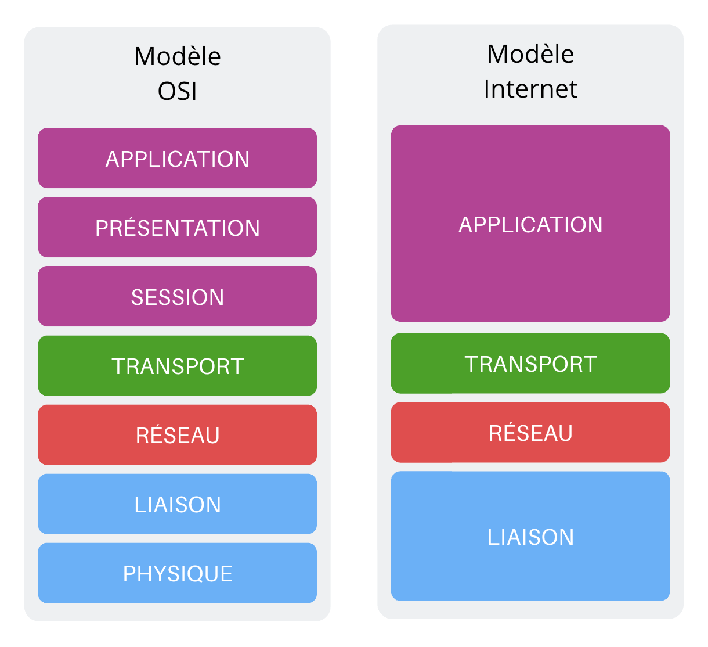

---

## Le modèle Internet : qui fait quoi ? 🧩

Comme indiqué dans la partie précédente, le modèle Internet est composé de 4 couches : la couche de liaison, la couche réseau, la couche de transport et la couche d'application. 

Chacune de ces couches possède leur propre protocole, que nous avions déjà rencontré l'an passé en SNT. 

!!! definition "Protocole IP (couche réseau)"
    Le **protocole IP** (de l'anglais *Internet Protocol*) est un ensemble de normes utilisées pour acheminer des données de son émetteur vers son récepteur, de routeur en routeur grâce aux **adresses IP**.

    Son rôle principal est de **trouver un chemin**, pas de garantir que tout arrive.

!!! definition "Protocole TCP (couche de transport)"
    Le **protocole TCP** (de l'anglais *Transmission Control Protocol*) est un ensemble de normes utilisées pour rendre la communication **fiable** : il numérote, vérifie, remet dans l'ordre et retransmet si besoin.

!!! definition "Protocole HTTP (couche d'application)"
    Le **protocole HTTP** (de l'anglais *HyperText Transfer Protocol*) est un ensemble de normes qui permet au navigateur d'échanger avec la machine sur laquelle le site web est hébergé : un navigateur envoie une **requête**, un serveur renvoie une **réponse** (page, image, données...).

!!! definition "Protocole DNS (couche d'application)"
    Le **protocole DNS** (de l'anglais *Domain Name System*) est un ensemble de normes qui permet au navigateur d'accéder à l'adresse IP d'un serveur à partir d'un nom de domaine. 
    
    C'est donc un "annuaire" : il associe un **nom de domaine** (ex : `www.exemple.fr`) à une **adresse IP**.

En résumé : le **DNS** trouve l'IP, **HTTP** échange le contenu, **TCP** fiabilise, et **IP** achemine.

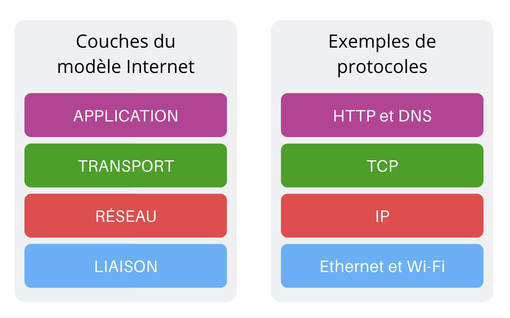

---

## Transmission et réception 📦🏷️

Quand on envoie (ou reçoit) un message, les données passent de couche en couche.
À chaque étape, on ajoute des informations techniques (adresses, numéros, contrôle...) : c'est l'**encapsulation**.

!!! definition "Encapsulation"
    L'**encapsulation** consiste à **ajouter un en-tête** (et parfois une fin) autour des données à chaque couche.
    Ces informations servent à : **identifier**, **acheminer** et parfois **contrôler** le message.

!!! propriete "Déroulement de la transmission"
    Lors de son **émission**, un message va subir successivement toutes les transformations effectuées par chaque couche, depuis sa création (couche 4) jusqu'à sa transmission physique (couche 1).

    === "Couche 4 - Application"

        Cette couche regroupe les protocoles nécessaires à la bonne **mise en forme d'un message** (au sens large: compression, cryptage, ...) avant sa transmission.

        Ces protocoles peuvent être de **nature très différente** : protocole **HTTP** pour la transmission de pages web, protocole **FTP** pour le transfert de fichiers, protocoles **POP ou IMAP** pour le courrier électronique...

        

    === "Couche 3 - Transport"

        Le protocole majeur de cette couche est le **protocole TCP** :

        - il s'assure que l'émetteur et le récepteur sont prêts à échanger des messages.
        - il découpe en **segments numérotés** le message à transmettre (côté émetteur) ou bien **recompose le message total** en remettant les segments dans l'ordre (côté récepteur).

        Les éléments échangés avec la couche inférieure sont appelés des **segments**.
  
        !!! info "Ports"
            Une machine peut établir **plusieurs connexions TCP en même temps**. Afin de les distinguer on ajoute une information supplémentaire : **le port réseau**.

            Les ports sont des nombres sur 16 bits, donc il existe $2^{16}=65536$ valeurs possibles, de **0 à 65535**.

            Ils sont généralement ajoutés à la fin de l’adresse IP après le symbole `:` (deux points). Par exemple : `192.168.1.2:80`

            Chaque fois que vous ouvrez deux onglets dans le navigateur, celui-ci établit une connexion avec une machine différente et se voit attribuer un port de réception différent.

        

    === "Couche 2 - Réseau"

        C'est la couche où chaque segment numéroté est **encapsulé** dans un **paquet** qui, suivant le **protocole IP**, va contenir son **adresse source** et son **adresse de destination**. 
        
        C'est à ce niveau que se décide si le message doit rester dans le réseau local ou être envoyé sur un autre réseau via la passerelle du routeur.

        Les éléments échangés avec la couche inférieure sont appelés des **paquets**.

        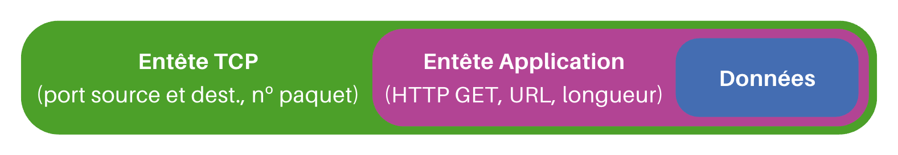

    === "Couche 1 - Liaison"

        C'est l'encapsulation finale du message, pour transmettre des trames à travers le réseau physique, en bits. Elle dépend donc du matériel.

        On y trouve donc:

        - la résolution d'adresses : suivant le **protocole Ethernet**, les informations sont transmises d'une carte réseau à une autre, grâce à leur **adresse MAC**. Il s'agit donc d'associer une adresse physique (MAC) à une adresse IP : c'est le rôle du **protocole ARP**.
        - des routines d'accès au réseau : selon le medium de communication, par signal lumineux (fibre optique), par ondes (wifi), par courant électrique (Ethernet)...

        Les éléments échangés avec la couche inférieure sont appelés des **trames**.

        

!!! warning "Vocabulaire (à connaître)"
    Comme indiqué ci-dessus, selon la couche, on ne parle pas du même "morceau" de message :

    - **Segment** : unité de données de la couche **transport** (ex : TCP).
    - **Paquet** : unité de données de la couche **réseau** (ex : IP).
    - **Trame** : unité de données de la couche **liaison** (ex : Ethernet / Wi-Fi).

!!! tip "Déroulement de la réception"
    Lorsque ce même message sera **réceptionné**, les transformations seront effectuées **dans l'ordre inverse**, jusqu'à la présentation du message au destinataire.

    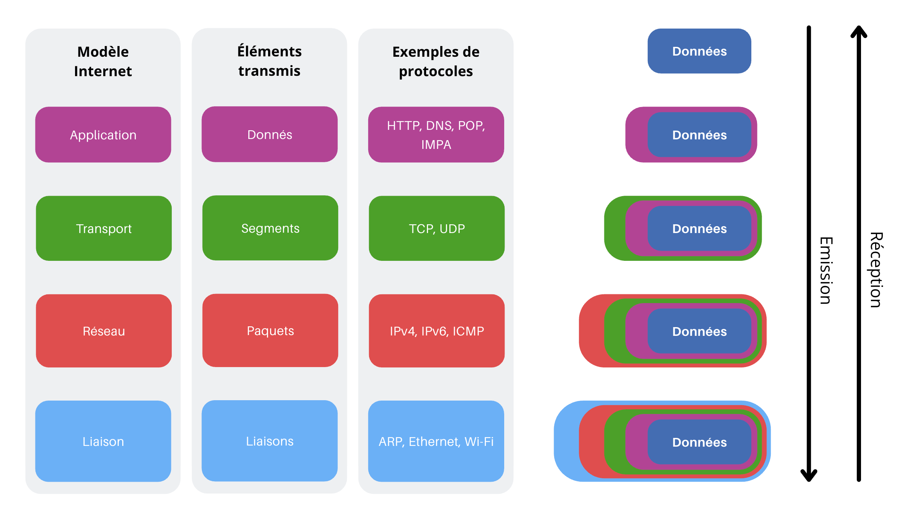

!!! expert "Pour aller plus loin : Neutralité du web"
    Lors de son parcours, une trame peut être **partiellement décapsulée** et remonter à la couche 3, avant de redescendre et de continuer son chemin. C'est le cas notamment lors du passage dans un routeur. 
    
    Toutefois, lors de son acheminement, le contenu réel du message n'est jamais ouvert : les paquets transmis sont acheminés de manière identique, qu'ils contiennent les éléments constitutifs d'une vidéo YouTube ou d'un email à votre cousin.

    Ce principe fondateur, actuellement menacé par certains acteurs politiques et industriels, est connu sous l'expression «**la neutralité du net**».

---

## Observation avec Filius 🔎

Objectif de la fin de ce TP : **voir réellement ce qui se passe** quand on fait un `ping` :

- comment une machine retrouve une **adresse MAC** à partir d'une **adresse IP** (protocole ARP),
- comment un **switch** apprend où sont les machines (table SAT),
- ce qui change quand on traverse un **routeur** (changement de trame, IP conservée).

!!! example "TP Filius 2 - Partie 1 - Avant la communication"
    1. Télécharger et ouvrir le fichier [ping_switch.fls](../../files/NSI/Reseaux/ping_switch.fls) avec Filius: deux machines sont reliées par un switch.
    2. Lancer la simulation et cliquer sur le switch pour consulter sa table SAT. Que constate-t-on?
    3. Sur la machine `192.168.0.10`, taper dans le terminal la commande arp -a pour obtenir sa table de correspondance IP <-> MAC. À quoi correspond la seule ligne de cette table?

    ??? success "Affichage à obtenir"
        La table de SAT est vide. 

        La seule ligne de la table de correspondance correspond à l'adresse de broadcast (diffusion générale sur le réseau local) car le PC n'a pas encore appris d'adresses MAC de voisins. 

        

!!! example "TP Filius 2 - Partie 2 - Communication"
    1. Sur la machine `192.168.0.10`, lancer un ping vers la machine `192.168.0.11`, puis contrôler la table SAT du switch ainsi que la table de correspondance IP <-> MAC de `192.168.0.10`.

        ??? success "Affichages à obtenir"
            La table SAT du switch possède maintenant deux lignes (les deux PC).

            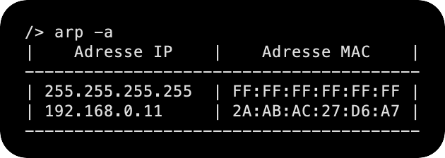

            et la table ARP (`arp -a`) connaît maintenant l'adresse MAC de `192.168.0.11` :

            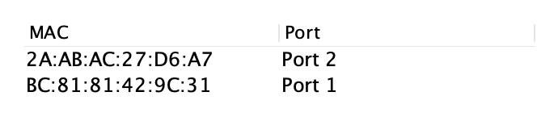
    2. Observer les échanges de données (clic droit sur la machine `192.168.0.10`). Cliquer sur chaque ligne pour en voir le détail.

        ??? success "Analyse des messages"
            On observe plusieurs échanges de données : 

            === "Message 1 - Qui possède l'IP `192.168.0.11` ?"

                Cette première ligne est une requête **ARP**. ARP est un protocole qui s'interface entre la couche réseau (appelée *Internet* sur Filius) et la couche liaison (appelée *Réseau* sur Filius).  
                Comme indiqué dans le commentaire, elle consiste à un appel à tout le réseau : "Est-ce que quelqu'un ici possède l'IP `192.168.0.11` ?

                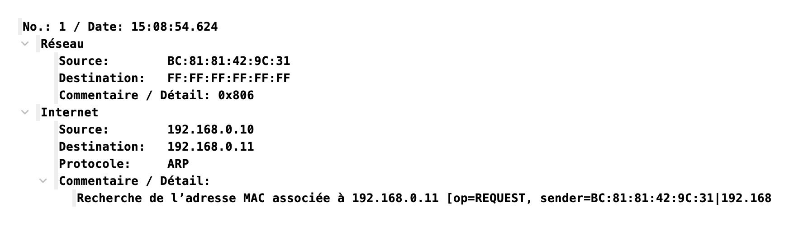

                Il faut comprendre ici une idée clé :

                - Sur un réseau local, pour transmettre physiquement, on a besoin de l'**adresse MAC** (couche liaison).
                - L'**adresse IP** (couche réseau) identifie la machine et reste présente dans le paquet, mais **elle ne suffit pas** pour construire la trame Ethernet.

                C'est pour cela que, avant d'envoyer le ping, `192.168.0.10` doit d'abord trouver l'adresse MAC correspondant à l'IP `192.168.0.11` : c'est le rôle de **ARP**.

                La commande `arp -a` effectuée dans un terminal de la machine `192.168.0.10` nous a permis de voir qu'elle ne connaissait encore personne dans son sous-réseau. En effet, la table de correspondance IP <-> MAC ne contiennait que l'adresse de broadcast `255.255.255.255`, qui permet d'envoyer un message à tout le réseau.

                Constatant qu'elle ne sait pas quelle est l'adresse MAC de `192.168.0.11`, la machine `192.168.0.10` commence donc par envoyer un message à tout le sous-réseau, par l'adresse MAC de broadcast `FF:FF:FF:FF:FF:FF`. Le switch va lui aussi lui aussi relayer ce message à tous les équipements qui lui sont connectés (dans notre cas, un seul ordinateur).

            === "Message 2 : "Moi !"

                La machine `192.168.0.11` s'est reconnu dans le message de broadcast de la machine `192.168.0.10`. Elle lui répond pour lui donner son adresse MAC.

                

                C'est à partir de ce moment que la machine `192.168.0.10` sait comment communiquer avec `192.168.0.11`. Elle l'écrit dans sa table `arp`, afin de ne plus avoir à émettre le message n°1 et que le switch, qui a vu passer sur ses ports 0 et 1 des messages venant des cartes MAC `BC:81:81:42:9C:31` et `2A:AB:AC:27:D6:A7` a mis à jour sa table SAT

            === "Message 3 : Envoi du `ping`"

                La machine `192.168.0.10` envoie le `ping` : 

                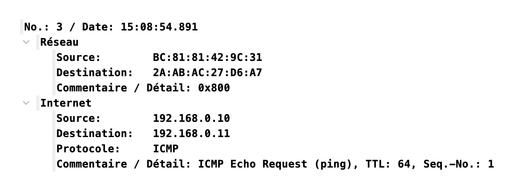

            === "Message 4 : Retour du `pong`"

                La machine `192.168.0.11` répond au `ping` par un `pong` : 

                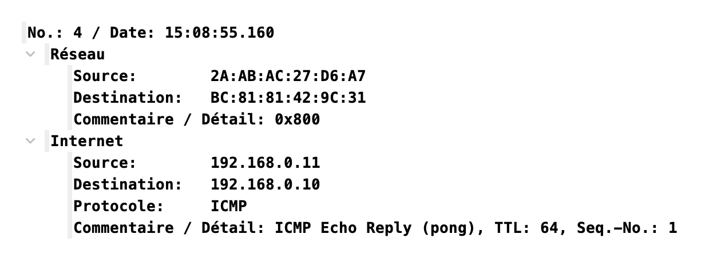

!!! example "TP Filius 2 - Partie 3 - Communication à travers un routeur"
    L'objectif est maintenant d'observer les différentes étapes lors d'un ping entre des machines de sous-réseaux différents:

    

    1. Télécharger et ouvrir le fichier [ping_routeur.fls](../../files/NSI/Reseaux/ping_routeur.fls) avec Filius.
    2. Noter la configuration des machines `192.168.0.1 / 24` et `192.168.1.1 / 24` (adresses MAC) et du routeur (adresses IP et MAC sur chaque sous-réseau).
    3. Effectuer un `ping` entre les machines `192.168.0.1` et `192.168.1.1` et analyser les messages émis/reçus (sur les deux machines et le routeur).

    ??? success "Analyse des messages"
        Configuration 

        - la machine `192.168.0.1 / 24` : adresse MAC `F9:E1:D6:0B:29:03`
        - la machine `192.168.1.1 / 24` : adresse MAC `D3:79:96:B8:5C:A4`

        Le routeur est configuré ainsi :

        - interface sur le réseau A :
  
            - IP : `192.168.0.254`
            - MAC : `77:C2:22:C9:5C:E7`
  
        - interface sur le réseau B :

            - IP : `192.168.1.254`
            - MAC : `66:E5:4E:7D:0B:B0`

        === "Étape 0 : Le routeur signale sa présence"

            Lors de l'observation des messages reçus ou émis par la machine `192.168.0.1`, on peut être intrigué par ce tout premier message reçu, émis par le routeur :

            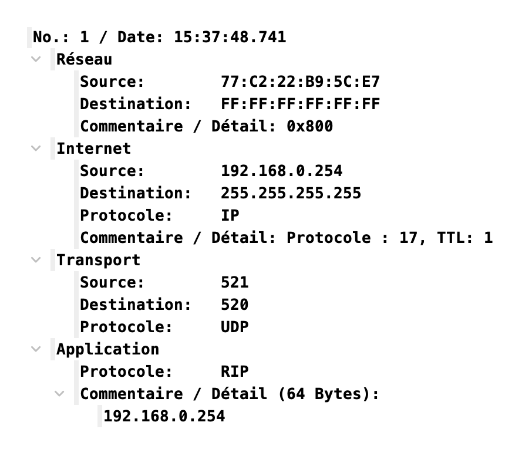

            On peut y distinguer les 4 couches du modèle Internet.  
            Le routeur, par ce message distribué à tous les éléments du sous-réseau A (il envoie un message équivalent sur son sous-réseau B), déclare sa présence, et le fait qu'il possède deux interfaces, une pour chaque réseau.   
            Il se positionne ainsi comme une passerelle : «c'est par moi qu'il faudra passer si vous voulez sortir de votre sous-réseau».   
            Dans cette trame envoyée figure son adresse MAC, de sorte que tous les membres de son sous-réseau pourront donc communiquer avec lui.

        === "Étape 1 : De `192.168.0.1` vers le routeur"

            La machine `192.168.0.1 / 24` calcule que la machine `192.168.1.1 / 24` avec laquelle elle veut communiquer n'est **pas** dans son sous-réseau.  
            Elle va donc envoyer son message à sa passerelle, qui est l'adresse du routeur dans son sous-réseau.

            Cette première trame est :

            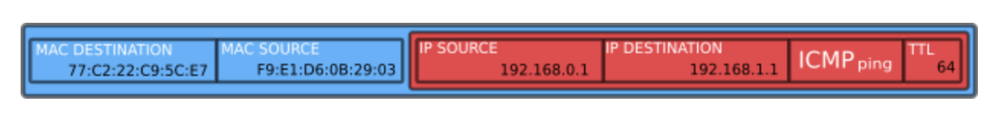

        === "Étape 2 : Le routeur décapsule la trame"

            Le routeur est un équipement de réseau de couche 3 (couche réseau). Il doit observer le contenu du paquet IP (sans remonter jusqu'au contenu du message) pour savoir, suivant le procédé de routage (voir cours de Terminale), où acheminer ce paquet.

            Dans notre cas, l'adresse IP `192.168.1.1` de destination lui est accessible : elle fait partie de son sous-réseau B.

            Le routeur va modifier la valeur du TTL (*Time To Live*), en la décrémentant de 1. Si, après de multiples routages, cette valeur devenait égale à 0, ce paquet serait détruit. Ceci a pour but d'éviter l'encombrement des réseaux avec des paquets ne trouvant pas leur destination.

            ??? expert "Pour aller plus loin : NAT"
                Dans notre cas, le routeur va laisser intacte l'adresse IP Source. Ce n'est pas toujours le cas. 
                
                Dans le cas classique de la box qui relie votre domicile à internet, le routeur contenu dans celle-ci va remplacer l'adresse locale de votre ordinateur ou smartphone (ex `192.168.0.26`) par son IP publique (celle apparaissant sur [whatsmyip.com](http://whatsmyip.com), par exemple). Elle effectue ce qu'on appelle une **translation d'adresse (NAT)**. 
                
                Pourquoi ? Parce que sinon la réponse du serveur distant que vous interrogez serait envoyée sur une adresse locale (votre adresse `192.168.0.26`), qui est introuvable depuis un réseau extérieur. Il faut donc remplacer toutes les adresses locales par l'IP publique de votre box. 
                
                De plus, pour éviter que la réponse du serveur web que vous avez interrogé ne soit affichée sur l'ordinateur de vos parents, le routeur affecte des ports différents à chaque machine de son sous-réseau. Ce port est inclus dans le message transmis au serveur, et il l'est aussi dans sa réponse : le routeur peut donc rediriger le trafic vers la bonne machine du sous-réseau.

            Le routeur va ré-encapsuler le paquet IP modifié, et créer une nouvelle trame Ethernet en modifiant :

            - l'**adresse MAC source** : il va mettre l'adresse MAC de son interface dans le sous-réseau B.
            - l'**adresse MAC de destination** : il va mettre l'adresse MAC de 192.168.1.1 (qu'il aura peut-être récupérée au préalable par le protocole ARP)
  
            Cette deuxième trame est donc :

            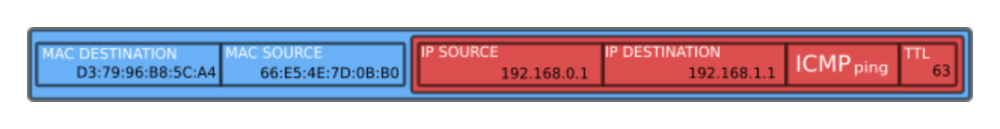

            On peut observer dans Filius cette trame, en se positionnant sur l'interface `192.168.1.254` du routeur, ou sur `192.168.1.1` :

            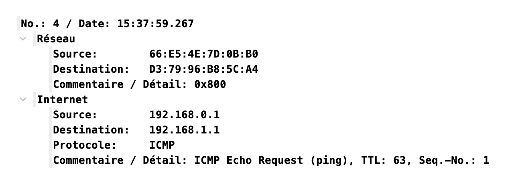

Le ping/ARP nous montre comment on atteint une machine. Maintenant, nous allons déterminer comment réagir en cas de perte du message. 

---

## Protocole du bit alterné 🔁✅

Les données circulent sous forme de **trames** et le réseau peut, parfois, être perturbé (pertes, retards, duplications).
Le **protocole du bit alterné** est un protocole très simple qui montre comment on peut rendre une transmission **fiable**, même si des trames disparaissent.

### Contexte simple

Pour rendre la suite du cours plus concrète, nous allons nous placer dans une situation simple : 

- Alice veut envoyer à Bob un message M, qu'elle a prédécoupé en sous-messages M0, M1, M2,...
- Alice envoie ses sous-messages à une cadence $\Delta t$ fixée (appelé **timeout**)

!!! info "En pratique"
    En pratique, les sous-messages partent quand leur acquittement a été reçu ou qu'on a attendu celui-ci trop longtemps : on parle alors de **timeout**

### Situation idéale

Idéalement, tous les sous-messages arrivent à destination dans le bon ordre. La transmission est donc correcte. 

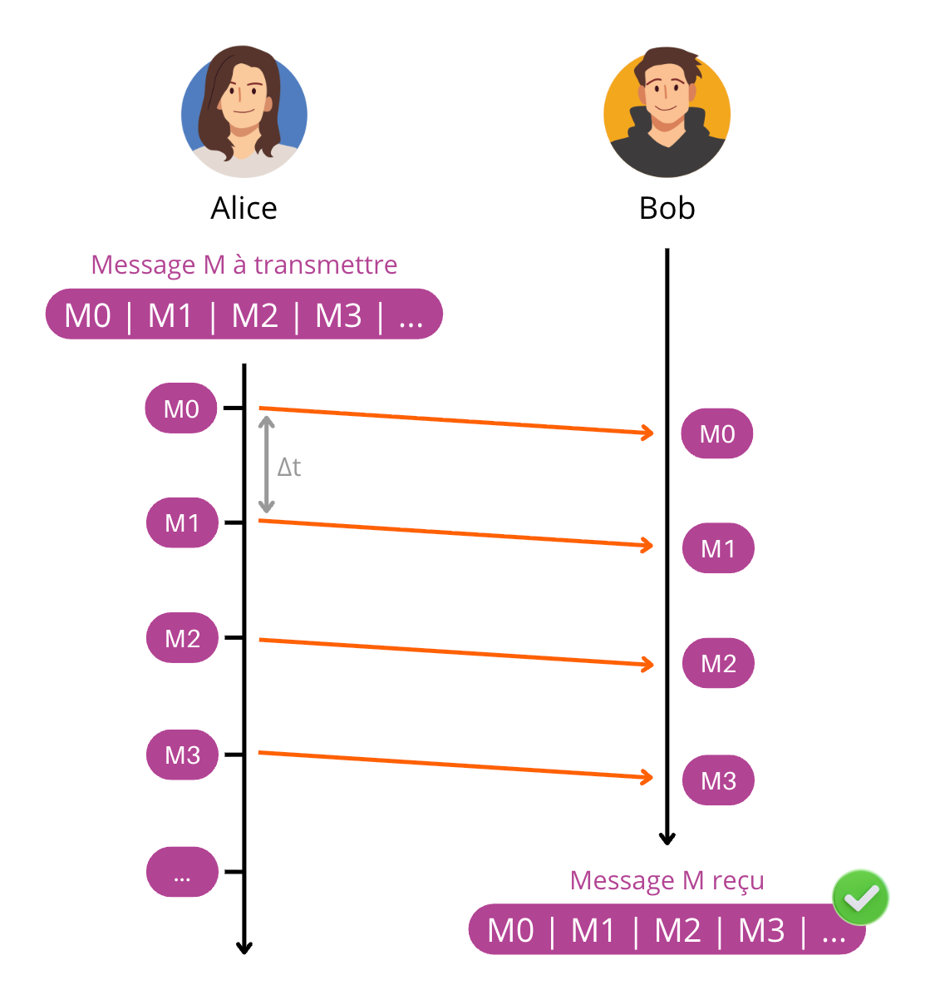

### Situation réelle

Mais parfois, les choses ne se passent pas toujours aussi bien. Car si on maîtrise parfaitement le timing de l'envoi des sous-messages d'Alice, on ne sait pas combien de temps vont mettre ces sous-messages pour arriver, ni même (attention je vais passer dans un tunnel) s'ils ne vont pas être détruits en route.

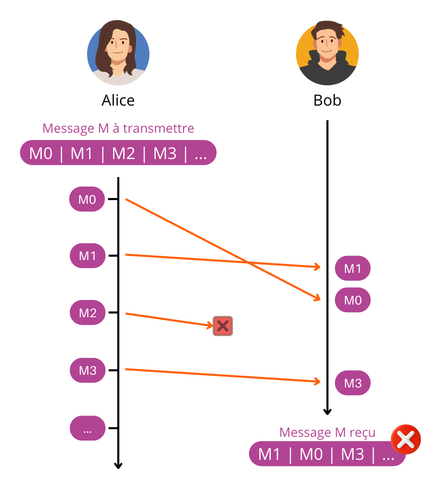

Par exemple, dans ce schéma, le sous-message M0 a pris plus de temps à arriver et se retrouve donc après le sous-message M1. De plus, le sous-message M2 s'est perdu en cours de route... 

### Une solution naïve...

Que pourrais-t-on faire pour éviter de tels problèmes ?

Comme le fait le protocole TCP, il serait envisageable de numéroter les sous-messages afin que Bob puisse les remettre dans l'ordre une fois arrivés, ou même redemander spécifiquement des sous-messages perdus. Cette méthode est très efficace, mais chère en ressources. Essayons de trouver une solution plus basique...

Nous allons demander à Bob d'envoyer un signal, un accusé de réception, pour dire à Alice qu'il vient de recevoir son message. Nous appelerons ce signal **ACK** (de l'anglais *ACKnowledgment*, "accusé de réception").   
Ce signal ACK permettra à Alice de renvoyer un message qu'elle considèrera comme perdu : 

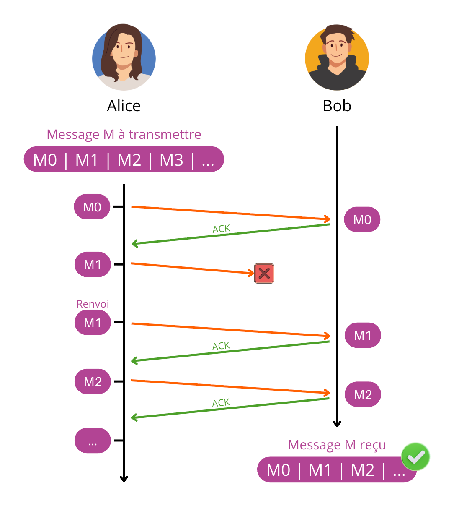

Dans cet exemple, le message M1 se perd. Bob n'envoie donc pas d'ACK. Alice suppose (avec raison) que ce message n'est pas parvenu jusqu'à Bob, et donc renvoie le message M1.

### ... mais peu efficace

Si les problèmes de message perdu, les problèmes de temporalité évoqués précédemment ne sont eux pas résolu...

Dans cet exemple, le deuxième ACK de Bob a mis trop de temps pour arriver (ou s'est perdu en route) et donc Alice a supposé que son sous-message M1 n'était pas arrivé. Elle l'a donc renvoyé, et Bob se retrouve avec deux fois le sous-message M1. La transmission est incorrecte.

En faisant transiter un message entre Bob et Alice, nous **multiplions par 2 la probabilité que des problèmes techniques de transmission interviennent**. Et pour l'instant rien ne nous permet de les détecter.

### Principe du bit alterné

Bob va maintenant intégrer une méthode de **validation** du sous-message reçu. Il pourra décider de le **garder** ou de l'**écarter** : le but est d'éviter les doublons.

Pour cela, Alice ajoute à chaque sous-message un **bit de contrôle** (numéro de séquence) qui alterne : 0 puis 1 puis 0 puis 1…  
On l'appelle souvent **bit alterné** (ou bit de séquence).

- Alice envoie `Mi` avec un bit `b` (0 ou 1).
- Bob renvoie un acquittement **ACKb** pour confirmer : "j'ai reçu la trame numérotée b".

!!! definition "Acquittement (ACK)"
    Un **ACK** (accusé de réception) est un message envoyé par le récepteur pour confirmer une réception.
    - **ACK0** : "la trame 0 a été reçue"
    - **ACK1** : "la trame 1 a été reçue"

!!! methode "Règle côté émetteur (Alice)"
    1. Envoyer le message `Mi` avec le bit `b`.
    2. Attendre **ACKb** (avec un **timeout**).
    3. Si le timeout expire (pas d'ACK reçu) : **réémettre** `Mi` avec le même bit `b`.
    4. Quand ACKb est reçu : passer au message suivant et **inverser** le bit (`b ← 1 - b`).

!!! methode "Règle côté récepteur (Bob)"
    Bob garde en mémoire le bit **attendu**.

    - Si Bob reçoit une trame avec le bit **attendu** :
        - il **accepte** le message,
        - il renvoie **ACK** correspondant,
        - puis il change le bit attendu (0 ↔ 1).
    - Si Bob reçoit une trame avec le bit **non attendu** :
        - c'est un **doublon** (réémission),
        - il **rejette** le message (il ne le livre pas deux fois),
        - mais il renvoie quand même l'ACK correspondant au dernier message valide (pour "rassurer" Alice).

L'ensemble de ces règles portent le nom de **protocole du bit alterné**. 

!!! definition "Protocole du bit alterné"
    L'émetteur numérote les trames avec un bit qui alterne : **0 puis 1 puis 0 puis 1...**  
    Le récepteur répond avec **ACK0** ou **ACK1**.  
    Si l'ACK n'arrive pas à temps, l'émetteur **réémet**.

Observons ce protocole dans plusieurs cas :

=== "Perte d'un sous-message"
    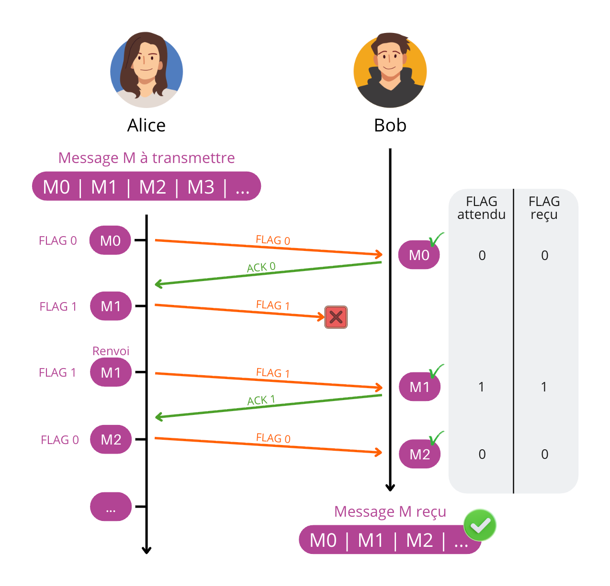

    Ici, le message `M1` se perd. N'ayant pas reçu **ACK1** avant le timeout, Alice **réémet** `M1` avec le même bit.

=== "Perte d'un ACK"
    

    Ici, **ACK1** se perd. Alice réémet `M1`.  
    Bob détecte que c'est un **doublon** (bit non attendu), donc il ne relivre pas `M1`, mais il renvoie **ACK1**.

=== "Retard d'un sous-message"
    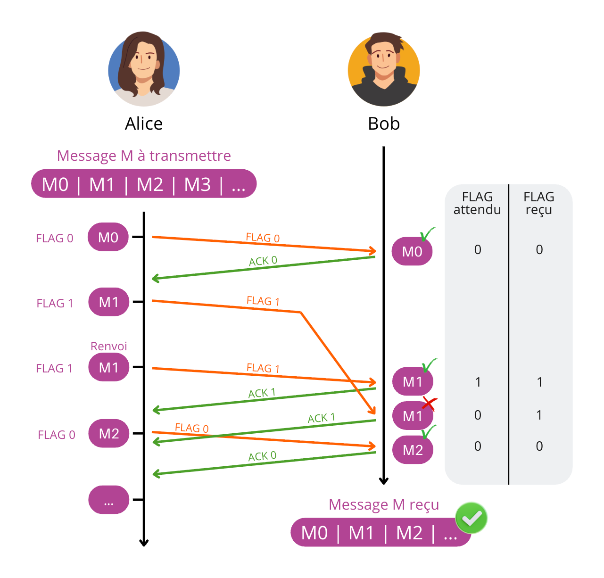

    Ici, `M1` arrive en retard. Alice réémet `M1` après timeout.  
    Bob reçoit une première fois `M1` (bit attendu) → il accepte + ACK1.  
    Puis l'ancien `M1` en retard arrive (bit non attendu) → doublon → rejet + renvoi ACK1.

!!! warning "Limites"
    Ce protocole n'autorise qu'**un seul message "en vol"** à la fois (stop-and-wait).  
    Il est donc simple, mais peu efficace si le réseau est lent.

!!! tip "Point historique"
    Le protocole du bit alterné est un **exemple classique de protocole ARQ** (réémission sur erreur/perte).
    Il sert surtout à comprendre les mécanismes de fiabilisation utilisés dans des protocoles plus complexes.

---

## À retenir 📌

!!! info "À retenir"
    - Un **protocole** = des règles communes pour communiquer.
    - Les couches permettent de répartir les rôles : **application / transport / réseau / liaison**.
    - **IP** achemine, **TCP** fiabilise, **HTTP** échange des ressources web, **DNS** traduit un nom en IP.
    - Le découpage en **paquets** rend la transmission plus robuste (réémission partielle).
    - L'**encapsulation** ajoute des informations à chaque couche pour transporter correctement les données.
    - Le **bit alterné** est un modèle simple de fiabilisation : alternance 0/1 + ACK + retransmission.