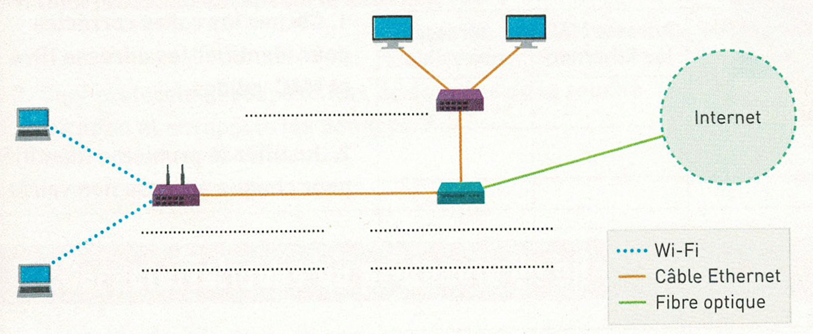

# Exercices 

Vous trouverez ci-dessous les exercices de cette séquence.

- Les exercices marqués avec :fontawesome-solid-pencil: se réalisent **sans ordinateur**.  
  Ceux indiqués par :fontawesome-solid-laptop: nécessitent **un ordinateur**.

- Le **niveau de difficulté** est indiqué par des étoiles :  
    <ul style="list-style: none;">
        <li>:fontawesome-solid-star: :fontawesome-regular-star: :fontawesome-regular-star: → Exercices pour **s'approprier les notions**.</li>
        <li>:fontawesome-solid-star: :fontawesome-solid-star: :fontawesome-regular-star: → Exercices pour **renforcer vos compétences**.</li>
        <li>:fontawesome-solid-star: :fontawesome-solid-star: :fontawesome-solid-star: → Exercices pour vous **challenger** et tester vos acquis.</li>
    </ul>

Les corrections sont généralement disponibles, mais elles ne doivent être consultées **qu'après validation de votre production par l'enseignant**.

---

## Architecture d'un réseau

!!! exopapier "Exercice 1 - :fontawesome-solid-star: :fontawesome-regular-star: :fontawesome-regular-star:" 
    Compléter le schéma ci-dessous avec les mots suivants : commutateur, point d'accès, routeur, passerelle

    

    ??? success "Correction"

        - À gauche : un commutateur, mais aussi un point d'accès
        - En bas : un routeur, deux passerelles
        - En haut : un commutateur

!!! exopapier "Exercice 1 - :fontawesome-solid-star: :fontawesome-regular-star: :fontawesome-regular-star:" 
    Dans un réseau domestique, la box Internet sert en général de routeur. Des pannes surviennent sur le réseau domestique ci-contre : il fonctionne normalement, sauf certains ordinateurs. 

    
    
    Identifier le(s) équipement(s) mis en cause et/ou le(s) câble(s) Ethernet qui peu(ven)t être débranché(s) ou coupé(s) dans les cas suivants :

    1. Pierre et Antoine n'ont plus accès à Internet, mais Noémie et Aziz peuvent toujours y accéder.
    2. Plus aucun habitant n'a accès à Internet.
    3. Noémie n'a plus accès à Internet.
    4. Pierre ne parvient pas à accéder à son site web préféré, mais a accès à d'autres sites web.
    5. Pierre et Antoine n'ont plus accès à Internet, mais peuvent communiquer ensemble.

    ??? success "Correction"

        1. Le point d'accès
        2. Le cable ADSL en amont de la box internet ou la box internet en elle-même 
        3. Le cable Ethernet entre la box et le PC de Noémie
        4. Le serveur sur lequel le site préféré de Pierre est hébergé
        5. Le cable Ethernet entre la box et le point d'accès. 

!!! exopapier "Exercice 1 - :fontawesome-solid-star: :fontawesome-regular-star: :fontawesome-regular-star:" 
    Cocher les cases correctes pour identifier les adresses IPv4 et MAC valides. Justifier le problème identifié pour chaque adresse non valide.

    | Adresse | Adresse IPv4 valide | Adresse MAC (ou Ethernet) | Adresse non valide |
    |---|---|---|---|
    | `20.1.13.10` | | | |
    | `7D:A9:C5:67:E6:F3` | | | |
    | `17.11.16.4` | | | |
    | `7d:a9:c5:67:e6:f3` | | | |
    | `4.5.6.7` | | | |
    | `124.252.2.257` | | | |
    | `7A:A9:D5:67:E6:F3` | | | |
    | `7F:A9:D5:67:E6:FG` | | | |
    | `13.12.13.7` | | | |
    | `1.2.3.8` | | | |
    | `200.200.200.200` | | | |

    ??? success "Correction"

        | Adresse | Adresse IPv4 valide | Adresse MAC (ou Ethernet) | Adresse non valide |
        |---|---|---|---|
        | `20.1.13.10` | ✅ | | |
        | `7D:A9:C5:67:E6:F3` | | ✅ | |
        | `17.11.16.4` | ✅ | | |
        | `7d:a9:c5:67:e6:f3` | | ✅ | |
        | `4.5.6.7` | ✅ | | |
        | `124.252.2.257` | | | ✅ — 257 dépasse 255, valeur impossible pour un octet IPv4 |
        | `7A:A9:D5:67:E6:F3` | | ✅ | |
        | `7F:A9:D5:67:E6:FG` | | | ✅ — "FG" contient G, qui n'est pas un caractère hexadécimal valide |
        | `13.12.13.7` | ✅ | | |
        | `1.2.3.8` | ✅ | | |
        | `200.200.200.200` | ✅ | | |

!!! exopapier "Exercice 1 - :fontawesome-solid-star: :fontawesome-regular-star: :fontawesome-regular-star:" 
    Quelle est la commande Linux qui permet :

    1. d'obtenir des informations d'un nom de domaine passé en argument ? 

    2. de tester l'accessibilité d'une machine dont l'adresse est passée en argument ?

    3. d'afficher les informations des interfaces réseaux ? 

    4. de configurer les interfaces réseaux ? 

    5. de déterminer une route entre un émetteur et un récepteur ?

    ??? success "Correction"

        1. d'obtenir des informations d'un nom de domaine passé en argument ? `nslookup` (ou `dig`)
        2. de tester l'accessibilité d'une machine dont l'adresse est passée en argument ? `ping`
        3. d'afficher les informations des interfaces réseaux ? `ifconfig` (ou `ip a`)
        4. de configurer les interfaces réseaux ? `ifconfig` (ou `ip link`)
        5. de déterminer une route entre un émetteur et un récepteur ? `traceroute` (ou `tracepath`)

!!! exopapier "Exercice 1 - :fontawesome-solid-star: :fontawesome-regular-star: :fontawesome-regular-star:" 
    Déterminer  la dernière adresse IP disponible pour une machine. 

    1. Adresse du réseau : `155.18.10.0`, sous-masque : `255.255.255.0`
    2. Adresse du réseau : `137.117.25.0/24`
    3. Adresse du réseau : `145.110.0.0/16`

    ??? success "Correction"

        1. `155.18.10.254`
        2. Le masque de sous réseau est donc `11111111.11111111.11111111.00000000` soit `255.255.255.0`. La derniere adresse est donc `137.117.25.254`
        3. Le masque de sous réseau est donc `11111111.11111111.00000000.00000000` soit `255.255.0.0`. La dernière adresse est donc `145.110.255.254`

!!! exopapier "Exercice 1 - :fontawesome-solid-star: :fontawesome-solid-star: :fontawesome-regular-star:" 
    Déterminer  la dernière adresse IP disponible pour une machine. 

    1. Adresse du réseau : `166.102.192.0/18`
    2. Adresse du réseau : `166.102.192.0/19`

    ??? success "Correction"

        1. Le masque de sous réseau est : `11111111.11111111.11000000.00000000`. Il reste donc 6 bits libre pour l'IP machine sur le 3e octet soit $2^6=64$ valeurs possibles. Notre réseau commence à `192`, grâce au 32 valeurs, nous pouvons donc aller de $[192; 192+64-1]$ soit `255`. La dernière adresse IP est donc `166.102.255.254`.
        2. Le masque de sous réseau est : `11111111.11111111.11100000.00000000`. Il reste donc 5 bits libre pour l'IP machine sur le 3e octet soit $2^5=32$ valeurs possibles. Notre réseau commence à `192`, grâce au 32 valeurs, nous pouvons donc aller de $[192; 192+32-1]$ soit `223`. La dernière adresse IP est donc `166.102.223.254`.

!!! exopapier "Exercice 1 - :fontawesome-solid-star: :fontawesome-solid-star: :fontawesome-regular-star:" 
    BAC - Nouvelle Calédonie 2022 (partie 1/3)

    Une modélisation de ce nouveau réseau de cette microentreprise est schématisée ci-dessous : 

    

    1. Indiquer l'adresse IP du "Réseau services"
    2. Indiquer le nombre d'adresses IP encore disponibles qui peuvent être attribuées au server web
    3. Indiquer l'adresse IP de la passerelle donnant au server web l'accès à Internet. 

    ??? success "Correction"

        1. Le masque étant `255.255.255.0`, les trois premiers octets forment la partie réseau de l'IP. Le "réseau services" aura donc pour IP `192.168.254.0`
        2. Il reste un octet libre pour les parties machines de l'IP soit 256 adresses. Or, il faut enlever `192.168.254.0` pour l'adresse du réseau, `192.168.254.255` pour le broadcast, ainsi que `192.168.254.1` et `192.168.254.2` qui sont déjà attribué. Il reste donc 252 adresses IP disponible sur ce réseau. 
        3. Le serveur web accède à internet via le routeur 2, dont l'adresse sur le réseau services est `192.168.254.2`. C'est donc cette adresse qui est l'adresse de passerelle pour le serveur web.

!!! exopapier "Exercice 1 - :fontawesome-solid-star: :fontawesome-solid-star: :fontawesome-regular-star:" 
    BAC - Nouvelle Calédonie 2022 (partie 2/3)

    La figure ci-dessous, représente un extrait d’une capture de trame réseau effectuée au niveau du serveur DNS (`192.168.0.253`), alors que le poste de travail `192.168.0.11` accédait au site web `https://www.monsite.sme/` hébergé par le serveur web.

    | No | Source        | Destination   | Proto. | Couche      | Commentaire                         |
    |---:|--------------|---------------|:------:|-------------|--------------------------------------|
    | 1  | 192.168.0.11  | 192.168.0.253 | ARP    | Internet    | Adresse MAC de 192.168.0.253 ?       |
    | 2  | 192.168.0.253 | 192.168.0.11  | ARP    | Internet    | 192.168.0.253 → 8A:FD:54:49:D0:CC    |
    | 3  | 192.168.0.11  | 192.168.0.253 |        | Application |                                      |
    | 4  | 192.168.0.253 | 192.168.0.11  |        | Application |                                      |

    Indiquer l'adresse physique/MAC du serveur DNS

    ??? success "Correction"

        La ligne 2 montre que l'adresse MAC du serveur DNS est `8A:FD:54:49:D0:CC`.

!!! exopapier "Exercice 1 - :fontawesome-solid-star: :fontawesome-solid-star: :fontawesome-solid-star:" 
    On souhaite pouvoir raccorder 1000 machines sur le même réseau IP. Donner le plus petit masque permettant de définir un tel sous-réseau. Même question avec 3000 machines.

    Noter à chaque fois le masque en notation décimale pointée, puis CIDR.

    ??? success "Correction"
        On cherche donc $h$ tel que $2^h-2$ soit supérieur au nombre de machines (on enlève 2 addresses : le réseau et le broadcast).

        - Pour 1000 machines, 
  
            - $2^9-2 = 510$ donc non 
            - $2^{10}-2=1022$ donc ok. 

            Le masque de sous réseau est donc : `11111111.11111111.11111100.00000000` soit `255.255.252.0` et notation CIDR : `/22`

        - Pour 3000 machines, 
  
            - $2^{11}-2 = 2046$ donc non 
            - $2^{12}-2=4094$ donc ok. 

            Le masque de sous réseau est donc : `11111111.11111111.11110000.00000000` soit `255.255.240.0` et notation CIDR : `/20`

!!! exopapier "Exercice 1 - :fontawesome-solid-star: :fontawesome-solid-star: :fontawesome-solid-star:" 
    On considère le masque `255.255.252.0`. Parmi les adresses suivantes, indiquer lesquelles appartiennent au même sous-réseau:

    1. `129.175.127.1`
    2. `129.175.130.10`
    3. `129.175.128.17`
    4. `129.175.131.110`
    5. `129.175.132.8`

    ??? success "Correction"

        Le masque étant `255.255.252.0` soit `11111111.11111111.11111100.00000000`, les machines sont donc sur le même sous-réseau si les 22 premiers bits sont identiques. Les deux premiers octets étant 255 et le dernier étant 0, l'appartenance au même sous réseau va donc se jouer sur les 6 bits de poids fort du troisième octet. 

        1. `252 & 127 = 124`
        2. `252 & 130 = 128` 
        3. `252 & 128 = 128`
        4. `252 & 131 = 128`
        5. `252 & 132 = 132`

        Ainsi, les machines 2, 3 et 4 sont sur le même sous-réseau.

!!! exopapier "Exercice 1 - :fontawesome-solid-star: :fontawesome-solid-star: :fontawesome-solid-star:" 
    Une attaque émanant de trois machines situées dans un même réseau local et visant une infrastructure sensible dont vous êtes le chef de la sécurité informatique vient d'être détectée. L'équipe sous vos ordres a pu déterminer rapidement six adresses IP potentielles parmi lesquelles se trouvent les trois machines à l'origine de l'attaque :

    1. Machine 1 : `129.175.127.1/22`
    2. Machine 2 : `129.175.13.10/22`
    3. Machine 3 : `129.175.128.7/22`
    4. Machine 4 : `129.175.131.110/22`
    5. Machine 5 : `129.175.132.58/22`
    6. Machine 6 : `129.175.129.12/22`

    Identifier les trois machines à l'origine de l'attaque et donner leurs parties hôtes (partie machine de l'IP).

    ??? success "Correction"

        Toutes les machines ont pour masque de sous réseau `11111111.11111111.11111100.00000000` soit `255.255.252.0`.

        On commence par déterminer à quel sous-réseau elles appartiennent : 

        - `127 & 252 = 124`
        - `13 & 252 = 12`
        - `128 & 252 = 128`
        - `131 & 252 = 128`
        - `132 & 252 = 132`
        - `129 & 252 = 128`

        Les trois machines de l'attaque sont donc `129.175.128.7/22`, `129.175.131.110/22` et `129.175.129.12/22`.

        - $128_{10} = 10000000_2$. On ne garde que les 2 bits de poids faible. Soit `0.0.0.7`
        - $131_{10} = 10000011_{2}$. On ne garde que les 2 bits de poids faible. Soit `0.0.3.110`
        - $129_{10} = 10000001_2$. On ne garde que les 2 bits de poids faible. Soit `0.0.1.12`

        ??? expert "Alternative"

            En `/22`, la partie hôte correspond à : (3ᵉ octet modulo 4) + 4ᵉ octet (modulo 4 car on a 2 bits libres donc $2^2=4$).

            - `128 % 4 = 0` -> `0.0.0.7`
            - `131 % 4 = 3` -> `0.0.3.110`
            - `129 % 4 = 1` -> `0.0.1.12`
        

---

## Protocoles de communication

!!! exopapier "Exercice 1 - :fontawesome-solid-star: :fontawesome-regular-star: :fontawesome-regular-star:"
    Associer chaque protocole à ses caractéristiques.

    Protocoles : 

    - Protocole IP
    - Protocole TCP
    - Protocole DNS
    - Protocole HTTP

    Caractéristiques : 

    - Permet d'accéder à un site web à partir d'une URL. 
    - Permet de surfer sur Internet quand on a l'adresse IP du serveur web.
    - Assure la fiabilité de transmission.
    - Normes de communication pour les routeurs.
    - Normes de communication entre l'émetteur et le récepteur.

    ??? success "Correction"
        | Protocole      | Caractéristique |
        |----------------|-----------------|
        | Protocole IP   | • Normes de communication pour les routeurs. |
        | Protocole TCP  | • Assure la fiabilité de transmission. |
        |                | • Normes de communication entre l'émetteur et le récepteur. |
        | Protocole DNS  | • Permet d'accéder à un site web à partir d'une URL. |
        | Protocole HTTP | • Permet de surfer sur Internet quand on a l'adresse IP du serveur web. |

!!! exopapier "Exercice 1 - :fontawesome-solid-star: :fontawesome-regular-star: :fontawesome-regular-star:"
    D'après le schéma ci-contre :

    | Couches     | Exemples de protocoles |
    |-------------|------------------------|
    | APPLICATION | HTTP                   |
    | TRANSPORT   | TCP                    |
    | RÉSEAU      | IP                     |

    1. Quel protocole encapsule le segment TCP ?
    2. Quel protocole découpe le flux de données de la couche application et encapsule les données ?

    ??? success "Correction"
        1. Le protocole **IP** (couche Réseau) encapsule le segment TCP.
        2. Le protocole **TCP** (couche Transport) découpe le flux de données de la couche application et encapsule les données dans des segments.

!!! exopapier "Exercice 1 - :fontawesome-solid-star: :fontawesome-regular-star: :fontawesome-regular-star:"
    Le protocole du bit alterné permet :

    - [ ] d'augmenter le débit de la communication.
    - [ ] de gérer les petits retards de transmission de l'émetteur.
    - [ ] de gérer les petits retards de transmission du récepteur.
    - [ ] de vérifier l'intégrité des trames.
    - [ ] de gérer les pertes de trames de l'émetteur au récepteur.
    - [ ] de gérer les pertes d'acquittements.
    - [ ] de numéroter les trames.
    - [ ] de numéroter les acquittements.
    - [ ] d'envoyer plusieurs trames non acquittées.
    - [ ] d'assurer que c'est toujours la bonne trame qui est acquittée.

    ??? success "Correction"
        - [ ] d'augmenter le débit de la communication.
        - [ ] de gérer les petits retards de transmission de l'émetteur.
        - [ ] de gérer les petits retards de transmission du récepteur.
        - [ ] de vérifier l'intégrité des trames.
        - [x] de gérer les pertes de trames de l'émetteur au récepteur.
        - [x] de gérer les pertes d'acquittements.
        - [x] de numéroter les trames.
        - [x] de numéroter les acquittements.
        - [ ] d'envoyer plusieurs trames non acquittées.
        - [x] d'assurer que c'est toujours la bonne trame qui est acquittée.

!!! exopapier "Exercice 1 - :fontawesome-solid-star: :fontawesome-regular-star: :fontawesome-regular-star:"
    1. Un récepteur vient d'envoyer un ACK1. Il reçoit une trame avec le bit à 1. Quelle sera sa réponse ?
    2. L'émetteur a envoyé une trame avec le bit à 1 et reçoit un ACK0. Quelle sera sa réponse ?

    ??? success "Correction"
        1. Le récepteur a déjà acquitté la trame avec le bit à 1 (en envoyant ACK1). Recevoir à nouveau une trame avec le bit à 1 signifie que son ACK1 a été perdu. Il **renverra donc un ACK1** pour acquitter à nouveau cette trame.
        2. L'émetteur reçoit un ACK0 alors qu'il attendait un ACK1 : l'acquittement ne correspond pas à la trame envoyée. L'émetteur considère que sa trame a été perdue et **réémettra la trame avec le bit à 1**.

!!! exopapier "Exercice 1 - :fontawesome-solid-star: :fontawesome-solid-star: :fontawesome-regular-star:" 
    BAC - Nouvelle Calédonie 2022 (partie 3/3)

    En utilisant les détails de la trame N°4 (ci-dessous) ci-dessous, 

    
    
    1. Indiquer le protocole utilisé pour cette trame au niveau de la couche transport.
    2. Indiquer l'adresse IP du serveur web

    ??? success "Correction"

        1. Protocole UDP
        2. Le commentaire de la couche Application indique que l'adresse IP du serveur web est `192.168.254.201`.