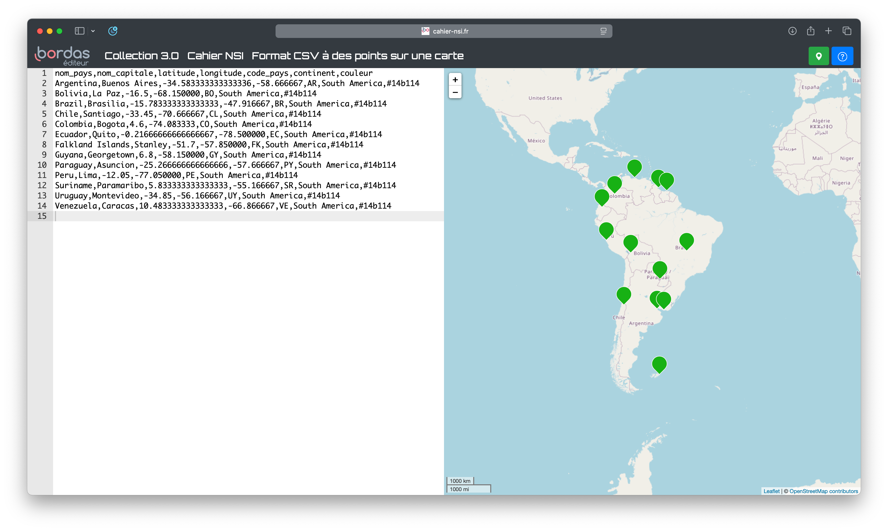

# Exercices 

Vous trouverez ci-dessous les exercices de cette séquence.

- Les exercices marqués avec :fontawesome-solid-pencil: se réalisent **sans ordinateur**.  
  Ceux indiqués par :fontawesome-solid-laptop: nécessitent **un ordinateur**.

- Le **niveau de difficulté** est indiqué par des étoiles :  
    <ul style="list-style: none;">
        <li>:fontawesome-solid-star: :fontawesome-regular-star: :fontawesome-regular-star: → Exercices pour **s'approprier les notions**.</li>
        <li>:fontawesome-solid-star: :fontawesome-solid-star: :fontawesome-regular-star: → Exercices pour **renforcer vos compétences**.</li>
        <li>:fontawesome-solid-star: :fontawesome-solid-star: :fontawesome-solid-star: → Exercices pour vous **challenger** et tester vos acquis.</li>
    </ul>

Les corrections sont généralement disponibles, mais elles ne doivent être consultées **qu'après validation de votre production par l'enseignant**.

---

## Tables de données

!!! exopapier "Exercice 1 - :fontawesome-solid-star: :fontawesome-regular-star: :fontawesome-regular-star:"
    On donne l'affectation suivante : 

    ```python
    billets = [
        {'nom': 'Riton', 'dest': 'Rio'},
        {'nom': 'Rita', 'dest': 'Roanne'},
        {'nom': 'Florence', 'dest': 'Florence'},
    ]
    ```

    1. Quelle expression Python a pour valeur `Riton` après cette affectation ? 
        - `billet['Riton']`
        - `billets['Riton'][0]`
        - `nom[0]['billets']`
        - `billets[0]['nom']`

    2. Qu'affiche le programme Python suivant après l'affectation ci-dessus ?

        ```python
        for i in range(len(billets)):
            if billets[i]['noms'] == billets[i]['dest']:
                print(i)
        ```

    ??? success "Correction"
        1. `billets[0]['nom']` puisque `Riton` correponds au `nom` du premier enregistrement de la table (indice 0).

        2. Un seul enregistrement correspond au critère de sélection : `Florence` qui va à `Florence`. Son enregistrement étant le 3e de liste, son indice `i` sera donc 2.

!!! exopapier "Exercice 2 - :fontawesome-solid-star: :fontawesome-solid-star: :fontawesome-regular-star:"
    Qu'affiche le programme Python suivant ?

    ```python
    voyages = [
        {'nom': 'Riton', 'dest': 'Rio'},
        {'nom': 'Rita', 'dest': 'Roanne'},
        {'nom': 'Florence', 'dest': 'Florence'},
    ]

    durees = {
        {'dest': 'Rio', 'nbheures': 12},
        {'dest': 'Roanne', 'nbheures': 1},
    }

    for i in range(len(voyages)):
        for j in range(len(durees)):
            if voyages[i]['dest'] == durees[j]['dest'] and durees[j]['dest'] >= 2 :
                print(voyages[i]['nom'])
    ```

    ??? success "Correction"
        Seul le voyage à Rio dure plus de 2 heures (n'ayant pas d'information pour Florence). Ainsi,  le programme affichera uniquement `Riton`.

!!! exopapier "Exercice 3 - :fontawesome-solid-star: :fontawesome-regular-star: :fontawesome-regular-star:"
    Trouver toutes les erreurs de syntaxe dans le fichier CSV ci-dessous : 

    ```CSV linenums="1"
    Titre,Auteur,Extrait,Année 
    Air vif,Eluard,J'ai regardé devant moi,1951
    Je vis...,Labé,J'ai chaud extrême en endurant froidure
    Heureux..,du Bellay,Heureux qui comme Ulysse, à fait...,1552
    "La voix,Baudelaire,Mon berceau s'adossait...",1857
    ```

    ??? success "Correction"
        Ligne 1 : ok

        Ligne 2 : ok

        Ligne 3 : Il manque la valeur pour `Année` : `Je vis...,Labé,J'ai chaud extrême en endurant froidure,1555`


        Ligne 4 : La virgule dans la citation va poser problème puisqu'il s'agit également du délimiteur. Il faut entourer la citation de guillemets : `Heureux..,du Bellay,"Heureux qui comme Ulysse, à fait...",1552`

        Ligne 5 : Les guillemets sont mals positionnés. Lors que l'importation, seul `Titre` et `Auteur` auront une valeur. Version rectifiée : `La voix,Baudelaire,Mon berceau s'adossait...,1857`

!!! exopapier "Exercice 4 - :fontawesome-solid-star: :fontawesome-regular-star: :fontawesome-regular-star:"
    On souhaite stocker dans une table l'inventaire d'un magasin.
    
    Ce dernier vend des biens dont il possède une certaine quantité en stock.Les produits peuvent être indisponibles (épuisés chez le fournisseur) et être en vente libre ou non. Proposer des noms de descripteurs et types Python pour une telle table d'inventaire.

    ??? success "Correction"
        - **produit** : le nom du produit (*chaine de caractères*)
        - **prix** : le prix du produit (*nombre flottant*)
        - **quantité** : la quantité d'exemplaire en stock magasin (*nombre entier*)
        - **épuisé** : indique si le produit est toujours en stock fournisseur (*booléen*)
        - **libre** : indique si le produit est en vente libre (*booléen*)

!!! exopapier "Exercice 5 - :fontawesome-solid-star: :fontawesome-regular-star: :fontawesome-regular-star:"
    On considère la table suivante :

    | réf. | désignation | prix | qté |
    | ---  | ---         | ---  | --- |
    |18635 | lot crayons HB | 2,30 | 1 |
    |15223 | stylo rouge | 1,50 | 3   |
    |20112 | cahier petits carreaux | 3,50 | 2 |

    Écrire cette table au format CSV

    ??? success "Correction"
        Avec pour délimiteur le symbole `;` : 

        ```CSV
        réf.;désignation;prix;qté
        18635;lot de crayons HB;2,30;1
        15223;stylo rouge;1,50;3
        20112;cahier petits carreaux;3,50;2
        ```

        Avec pour délimiteur le symbole `,` : 

        ```CSV
        réf.,désignation,prix,qté
        18635,lot de crayons HB,"2,30",1
        15223,stylo rouge,"1,50",3
        20112,cahier petits carreaux,"3,50",2
        ```

!!! exoordi "Exercice 6 - :fontawesome-solid-star: :fontawesome-regular-star: :fontawesome-regular-star:"
    1. Télécharger ce fichier : [pokedex.csv :fontawesome-solid-file-csv:](../../files/NSI/CSV/pokedex.csv)
    2. Ouvrir ce fichier CSV avec LibreOffice Calc. Observer l'importance de préciser les délimitateurs.
    3. L'ouvrir ensuite avec un éditeur de texte pour observer sa construction.

!!! exoordi "Exercice 7 - :fontawesome-solid-star: :fontawesome-regular-star: :fontawesome-regular-star:"
    1. Ouvrir LibreOffice Calc et créer un tableau ayant 3 colonnes : $n$, $n^2$ et $n^3$ et 21 lignes (descripteurs + $n$ allant de 1 à 20).

    2. Enregistrer le fichier

    3. Aller dans le menu `Fichier` puis `Enregistrer sous` et enfin choisir `text csv`. Choisir la virgule comme séparateur.

    4. Ouvrir ensuite le fichier `csv` ainsi créé avec un éditeur de texte et observer la structure du document.


---

## Importation et exportation

!!! exoordi "Exercice 8 - :fontawesome-solid-star: :fontawesome-regular-star: :fontawesome-regular-star:" 
    1. Télécharger le fichier Python [capitales.py :fontawesome-solid-file-code:](../../files/NSI/CSV/capitables.py) et le fichier CSV [capitales.csv :fontawesome-solid-file-csv:](../../files/NSI/CSV/capitales.csv) et les mettre dans le même répertoire.
    2. Écrire l'instruction d'appel de la fonction `lecture_fichier()` qui permet de lire le fichier `capitales.csv` et d'affecter son contenu dans une variable appelée `table`.
    3. Écrire une instruction Python qui permette d'afficher les descripteurs de la table ainsi importée.
    4. Combien de capitales différentes contient la variable `table` ?

    ??? success "Correction"
        1. Pas de correction
        2. `table = lecture_fichier("capitales.csv")`
        3. `print(table[0])`
        4. `print(len(table)-1)`

!!! exoordi "Exercice 9 - :fontawesome-solid-star: :fontawesome-regular-star: :fontawesome-regular-star:"
    On considère le fichier CSV construit à l'exercice 5. 

    1. Écrire un programme qui lit le fichier CSV et en extrait une table de données sous la forme d'une liste de liste.
    2. Modifier le programme pour qu'il génère une liste de dictionnaire.

    ??? success "Correction"
        Dans cette correction, le fichier CSV est nommé : `test.csv`.

        1. 
        ```python
        import csv

        with open("test.csv", newline="") as fichier:
            lecteur = csv.reader(fichier, delimiter=";")
            table = list(lecteur)
        ```

        2. 
        ```python
        with open("test.csv", newline="") as fichier:
            lecteur = csv.DictReader(fichier, delimiter=";")
            table2 = list(lecteur)
        ```

!!! exopapier "Exercice 10 - :fontawesome-solid-star: :fontawesome-solid-star: :fontawesome-regular-star:"
    Voici la spécification d'une fonction `lecture_fichier` permettant d'importer un fichier CSV ayant pour séparateur la virgule: 

    ```python title="Importation de fichier CSV" linenums="1"
    def lecture_fichier(nom_fichier: str) -> list :
        '''
        Définie et renvoie une liste de listes contenant toutes les données d'un fichier CSV passé en argument.

        - nom_fichier : le nom de fichier CSV à importer
        '''
        with open(..., newline="") as ...:
            lecteur = ...
            table = list(...)
        
        return ...
    ```

    1. Compléter la fonction en remplacant tous les `...`.
    2. On propose de simplifier la fonction. Compléter cette nouvelle version qui crée la fonction en compréhension : 
        ```python
        def lecture_fichier(nom_fichier):
            with open(..., newline="") as ...:
                return [... for ... in csv.reader(...)]

        ```

    ??? success "Correction"
        1.  
        ```python
        def lecture_fichier(nom_fichier: str) -> list :
            '''
            Définie et renvoie une liste de listes contenant toutes les données d'un fichier CSV passé en argument.

            - nom_fichier : le nom de fichier CSV à importer
            '''
            with open(nom_fichier, newline="") as fichier:
            lecteur = csv.reader(ficher, delimiter=",")
            table = list(lecteur)
        
            return table
        ```

        2. 
        ```python
        def lecture_fichier(nom_fichier):
            with open(nom_fichier, newline="") as fichier:
                return [ligne for ligne in csv.reader(fichier)]

        ```

!!! exoordi "Exercice 11 - :fontawesome-solid-star: :fontawesome-solid-star: :fontawesome-regular-star:"
    1. Télécharger ce fichier : [pokedex.csv :fontawesome-solid-file-csv:](../../files/NSI/CSV/pokedex.csv)
    2. Copier et exécuter ce code : 

        ```python
        import csv

        with open('pokedex.csv') as fichier: #On charge le document CSV dans une variable "fichier"
            table = []
            for enregistrement in csv.DictReader(fichier, delimiter=';'): #On applique la fonction "DictReader" au fichier en précisant le délimiteur 
                table.append(dict(enregistrement))
        ```
    3. Contrôler que la variable `table` est bien une liste de dictionnaire.

    4. Le code précédent construit la liste `table` par ajouts successifs. Transformer le code pour la construire en compréhension.

    ??? success "Correction"
        Question 4 :

        ```python 
        import csv

        with open('pokedex.csv') as fichier: #On charge le document CSV dans une variable "fichier"
            table = [enregistrement for enregistrement in csv.DictReader(fichier, delimiter=";")]
        ```

!!! exopapier "Exerice 12 - :fontawesome-solid-star: :fontawesome-solid-star: :fontawesome-regular-star:"
    Voici une proposition de fonction permettant l'exportation d'une liste de liste Python en fichier CSV : 

    ```python title="Fonction exportation" linenums="1"
    def exporter(nom_fichier: str, table: list) -> None:
        '''
        Écrit dans un fichier le contenu d'une table.

        - nom_fichier: le nom de fichier à créer, d'extension CSV. S'il existe, il sera écrasé, sinon il sera créé.
        - table : la table à exporter dans le fichier
        '''

        with open(..., "...", newline="") as ...: 
            writer = csv.writer(..., delimiter=",")
            writer.writerows(...)
    ```

    1. Compléter la fonction.
    2. En vous basant sur cette fonction, donner la spécification d'une fonction `exporter_dictionnaire` qui exporte en CSV une liste de dictionnaire.

    ??? success "Correction"
        1. 
        ```python 
        def exporter(nom_fichier, table):

        with open(nom_fichier, "w", newline="") as fichier: 
            writer = csv.writer(fichier, delimiter=",")
            writer.writerows(table)
        ```

        2. 
        ```python
        def exporter(nom_fichier: str, table: list, descripteurs: list) -> None:
            '''
            Écrit dans un fichier le contenu d'une table en connaissant ses descripteurs.

            - nom_fichier: le nom de fichier à créer, d'extension CSV. S'il existe, il sera écrasé, sinon il sera créé.
            - table : la table à exporter dans le fichier
            - descripteurs: une liste de str contenant les descripteurs de la table.
            '''

            with open(nom_fichier, "w", newline="") as fichier: 
                writer = csv.DictWriter(fichier, descripteurs, delimiter=";")
                writer.writeheader()
                writer.writerows(table)
        ```

---

## Manipulation et traitement

!!! exopapier "Exercice 13 - :fontawesome-solid-star: :fontawesome-regular-star: :fontawesome-regular-star:"
    1. Créer un fichier `capitales.py`
    2. Télecharger le fichier CSV [capitales.csv :fontawesome-solid-file-csv:](../../files/NSI/CSV/capitales.csv) dans le même répertoire que le fichier Python.
    3. Importer ce fichier dans une variable `table`.
    4. Créer une liste `noms_capitales` contenant uniquement les noms de toutes les capitales du fichier. 
    5. Créer une liste `europe` contenant toutes les entrées de la table relatives à une capitale Européenne. 

    ??? success "Correction" 
        1. Pas de correction
        2. Pas de correction
        3. `table = lecture_fichier("capitales.csv")`
        4. `noms_capitales=[info[1] for info in table]`
        5. `europe=[info for info in table if info[5]=='Europe']`

!!! exoordi "Exercice 14 - :fontawesome-solid-star: :fontawesome-regular-star: :fontawesome-regular-star:"
    1. Télécharger ce fichier : [pokedex.csv :fontawesome-solid-file-csv:](../../files/NSI/CSV/pokedex.csv)
    2. Importer ce fichier dans une variable `pokedex`.
    3. Créer une nouvelle table `feu` contenant uniquement les pokémons de type feu.
    4. Combien y-a-t-il de pokémon de type feu ?
    5. Créer une liste `noms_pokemon_feu` ne contenant que le nom de chacun de ces pokémons.

    ??? success "Correction"
        1. Pas de correction
        2. 
        ```python
        import csv

        with open("pokedex.csv", newline="") as fichier:
            lecteur = csv.reader(fichier, delimiter=";")
            pokedex = list(lecteur)
        ```
        3. `feu = [pokemon for pokemon in pokedex if pokemon[2]=="feu"]`
        4. `len(feu)` : Il y a 29 pokémons de type feu dans ce pokedex.
        5. `nom_pokemon_feu = [pokemon[1] for pokemon in feu]`

!!! exoordi "Exercice 15 - :fontawesome-solid-star: :fontawesome-solid-star: :fontawesome-regular-star:"
    À partir du fichier `pokedex.csv` télécharger à l'exercice précédent, créer une liste en compréhension ne contenant que les prénoms des pokémons plante ayant plus de 80 points de vitesse.

    ??? success "Correction"
        `pokemon_plante_rapide = [pokemon[1] for pokemon in pokedex if pokemon[2]=='plante' and int(pokemon[6])>=80]`

        Soit : `['Méganium', 'Massko', 'Jungko', 'Ceriflor', 'Phyllali', 'Lianaja', 'Majaspic', 'Feuiloutan', 'Fragilady']`

!!! exoordi "Exercice 16 - :fontawesome-solid-star: :fontawesome-solid-star: :fontawesome-regular-star:"
    1. Créer un fichier `recherche_capitales.py`
    2. Télecharger le fichier CSV [capitales.csv :fontawesome-solid-file-csv:](../../files/NSI/CSV/capitales.csv) dans le même répertoire que le fichier Python.
    3. Importer ce fichier dans une variable `table`.
    4. Stocker dans une variable `amerique_du_sud` tous les enregistrements de la table concernant une capitale sur le continent sud-américains.
    5. Exporter le résultat de la recherche dans un fichier CSV nommé `recherche1.csv`.
    6. Aller sur [ce site](https://www.cahier-nsi.fr/livecsvmap2/) est vérifier le contenu de `recherche1.csv`.

    ??? success "Correction"
        1. Pas de correction
        2. Pas de correction
        3. 
        ```python
        import csv

        with open("capitales.csv", "r") as fichier:
            lecteur = csv.reader(fichier, delimiter=",")
            table = list(lecteur)
        ```
        4. 
        ```python
        amerique_du_sud = [capitale for capitale in table if capitale[5]=='South America']
        ```
        5. 
        ```python 
        with open('recherche1.csv', 'w') as fichier:
            writer = csv.writer(fichier, delimiter=",")
            writer.writerow(table[0])
            writer.writerows(amerique_du_sud)
        ```
        6. Voici une capture d'écran du résultat attendu :
        

!!! exoordi "Exercice 17 - :fontawesome-solid-star: :fontawesome-solid-star: :fontawesome-regular-star:"
    En utilisant le fichier `capitales.csv` de l'exercice précédent, 

    1. Créer une liste en compréhension ne contenant que la longitude de Paris.
    2. Rechercher toutes les capitales ayant une longitude voisine de celle de Paris, c'est-à-dire distantes de plus ou moins 1 degré de longitude. 

    ??? success "Correction"
        1. `longitude_paris = [capitale[3] for capitale in table if capitale[1]=="Paris"]`

        2. 
        ```python
        voisines = [capitale[1] for capitale in table if longitude_paris[0]-1<=float(capitale[3])<=longitude_paris[0]+1]
        ```
        Remarque : Il sera peut-être nécessaire d'enlever les descripteurs de la table afin de ne pas causer d'erreur de conversion : `table.pop(0)`.