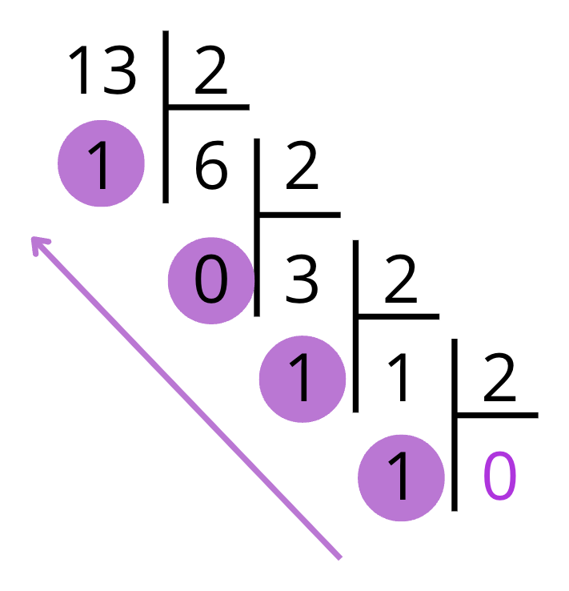
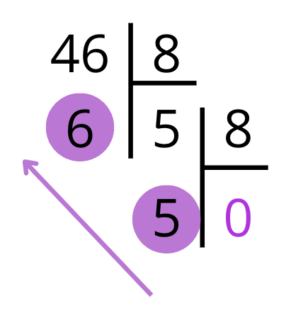
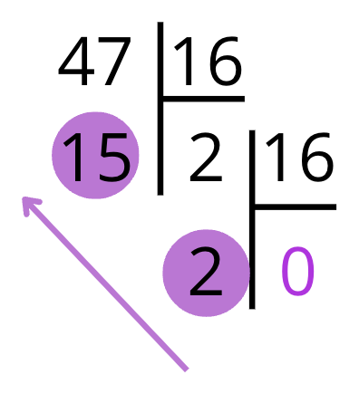

# Représentation des entiers en base 2, 8, 10 et 16 🔢

Avant de découvrir des systèmes de numération utilisés en informatique, il est utile de prendre un moment pour **réfléchir à notre propre manière de compter**.  
On utilise tous les jours des nombres, mais **sait-on vraiment comment notre système fonctionne ?** Pourquoi utilisons-nous ces dix chiffres ? Quelle est l’importance de la position dans un nombre ?

Comprendre cela nous aidera à mieux saisir les bases que nous allons aborder ensuite… et à ne pas les considérer comme des bizarreries informatiques.

---

## Le système décimal de position 🔟

Le système de numération que nous utilisons tous les jours est appelé **système de numération décimal de position**.

!!! definition "Définition : Système de numération décimal de position"
    Notre système de numération est appelé **système de numération décimal de position** car :  

    - **Décimal** ➝ parce qu’il utilise **10 chiffres** : 0, 1, 2, 3, 4, 5, 6, 7, 8, 9  
    - **De position** ➝ car **la valeur d’un chiffre dépend de sa place** dans le nombre : le **même chiffre** peut avoir **des valeurs différentes** selon sa position.

Prenons par exemple le nombre $343$. Les deux chiffres $3$ n'ont pas la même valeur : 

| Chiffre | Position (puissance de 10) | Valeur |
|---------|-----------------------------|--------|
| 3       | centaines ($10^2$)             | 300    |
| 4       | dizaines ($10^1$)              | 40     |
| 3       | unités ($10^0$)                | 3      |

Donc $343 = 3\times 10^2 + 4\times 10^1 + 3\times 10^0$

!!! info "Comparaison avec des systèmes de numération plus anciens"
    Dans notre système, la position de chaque chiffre dans l'écriture du nombre correspond à la puissance de 10 par laquelle on le multiplie.
    
    Ce fonctionnement est **très différent** des systèmes de numération que nous avons rencontré dans le TP précédent : 

    - Dans le **système égyptien**, chaque symbole avait une valeur **fixe**, qu’il soit placé avant ou après.
    - Dans le **système romain**, les lettres s’ajoutent ou se soustraient, **mais leur position n’a pas de poids multiplicatif**.

---

## Notion de base

Pour parler du "système postionnel de numération à 10 chiffres", il est courant de parler de **base 10**. Cette notion peut s’étendre à d’autres bases :

!!! definition "Écriture d'un entier en base $b$"
    Une **base n** est un système de numération positionnel comportant $n$ chiffres différents. Autrement dit :

    - Choisir une base, c'est choisir la "taille" du paquet, et donc le nombre de chiffres dont on aura besoin : en base $b$, il y a $b$ chiffres.
    - La position de chaque chiffre correspond à la puissance de $b$ par laquelle on le multiplie.

!!! info "Notation"
    On précisera la base utilisée (si différente de 10) en **indice en fin du nombre**.  
    Par exemple, le nombre $342_5$ est écrit en base 5.

Dans la suite, nous travaillerons principalement avec les trois bases suivantes : 

!!! definition "Système binaire (base 2)"
    - Le **système binaire** est le système de numération de base $b=2$.
    - Il utilise donc seulement **deux chiffres** : 0 et 1, appelés **bits** (de l'anglais **bi**nary dig**it**, soit "chiffre binaire").
    - Un regroupement de 8 bits est appelé un **octet**.
    - Il est particulièrement adapté à l'**informatique** car il permet d'unifier la logique (Vrai/Faux), le calcul et l'électronique.
    - Avec $n$ bits, on peut représenter $2^n$ nombres. Dans le cas des entiers naturels, on peut compter de $0$ à $2^n-1$...

!!! definition "Système hexadécimal (base 16)"
    - Le **système binaire** est le système de numération de base $b=16$.
    - Il utilise donc **16 chiffres** : 0, 1, 2, 3, 4, 5, 6, 7, 8, 9, A, B, C, D, E et F.
    - Bien qu'il nécessite plus de chiffres, ce système donne des **écritures plus courtes** et particulièrement pratique du fait que 16 est une puissance de 2 : la conversion entre les systèmes binaire et hexadécimal se fait sans calcul, uniquement par **regroupement de 4 bits**.
    - Il permet également de représenter des** adresses mémoires** ou même des [**couleurs**](http://www.proftnj.com/RGB3.htm) !

!!! expert "Pour aller plus loin : le système octal (base 8)"
    À la manière des Simpsons qui n'ont que 8 doigts, il existe également le **système octal** :

    - Le système octal est le système de numération de base $b=8$.
    - Il utilise donc **8 chiffres** : 0, 1, 2, 3, 4, 5, 6 et 7.

Ces bases peuvent sembler nouvelles, mais elles suivent les mêmes règles que le système décimal… à une différence près : le nombre de chiffres utilisé.

Voici un tableau récapitulatif : 

| Base | Nom            | Chiffres utilisés        | Exemple du nombre 10 |
|------|----------------|--------------------------|-----------------------|
| 2    | Binaire        | 0, 1                     | $1010_2$                 |
| 8    | Octale         | 0, 1, 2, 3, 4, 5, 6, 7                    | $12_8$                  |
| 10   | Décimale       | 0, 1, 2, 3, 4, 5, 6, 7, 8, 9                   | $123$                 |
| 16   | Hexadécimale   | 0, 1, 2, 3, 4, 5, 6, 7, 8, 9, A, B, C, D, E, F             | $A8_{16}$                  |

---

## Convertir un entier naturel vers la base 10 🔁

Un nombre en base $n$ peut être facilement converti en base 10. C’est exactement le même principe que celui vu pour le décimal : on **décompose selon les puissances de la base**.

### Méthode générale 🛠️

Soit un nombre écrit dans une base $b$ (par exemple en base 2, 8 ou 16).  
On décompose ce nombre comme une somme de **chiffres × puissances de la base**, en partant de la droite.

!!! methode "Méthode : Conversion de la base $b$ à la base 10 (théorique)"
    Soit $N$ un entier naturel dont l'écriture en base $b$ est la suivante : $N_b = a_n a_{n-1} ... a_1 a_0$.
    
    Alors : $N_{10} = a_n \times b^n + a_{n-1} \times b^{n-1} + \dots + a_1 \times b^1 + a_0 \times b^0$

!!! tip "Astuces"
    - Voici quelques puissances utiles à retenir : 
        - $2^0 =1, 2^1 = 2, 2^2 = 4, 2^3=8, 2^4 = 16, 2^5 = 32, 2^6 = 64, 2^7 = 128, 2^8 = 256$, etc.
        - $8^0 = 1$, $8^1 = 8$, $8^2 = 64$, etc.
        - $16^0 = 1$, $16^1 = 16$, $16^2 = 256$, etc.
    - Voici les correspondances entre chiffres hexadécimaux et décimaux :  

        | Base 10 | 10 | 11 | 12 | 13 | 14 | 15 |
        | --- | --- | --- | --- | --- | --- | ---|
        | Base 16 | A | B | C | D | E | F |

### Exemples 

Voici quelques exemples :

=== "Binaire vers décimal 🧮"

    Convertir $1011_2$ en base 10

    | Rang           | 3     | 2     | 1     | 0     |
    |----------------|-------|-------|-------|-------|
    | Chiffre        | 1     | 0     | 1     | 1     |
    | Puissance de 2 | $2^3$ | $2^2$ | $2^1$ | $2^0$ |
    | Valeur         | 8     | 0     | 2     | 1     |

    Ainsi, $1011_2 = 1\times 2^3 + 0\times 2^2 + 1\times 2^1 + 1\times 2^0 = 8 + 0 + 2 + 1 = 11$

=== "Octal vers décimal 🐙"

    Convertir $3456_8$ en base 10

    | Rang           | 3     | 2     | 1     | 0     |
    |----------------|-------|-------|-------|-------|
    | Chiffre        | 3     | 4     | 5     | 6     |
    | Puissance de 8 | $8^3$ | $8^2$ | $8^1$ | $8^0$ |
    | Valeur         | 1536  | 256   | 40    | 6     |

    On a : $3456_8 = 3\times 8^3 + 4\times 8^2 + 5\times 8^1 + 6 \times 8^0 = 3\times 512 + 4\times 64+ 5\times 8 + 6 \times 1 = 1536 + 256 + 40 + 6 = 1838$

=== "Hexadécimal vers décimal ⬢"

    Convertir $2C8F_{16}$ en base 10  
    
    On rappelle que :  

    - $C_{16}$ correspond à $12$ en base 10;
    - $F_{16}$ correspond à $15$ en base 10.

    | Rang           | 3      | 2      | 1      | 0      |
    |----------------|--------|--------|--------|--------|
    | Chiffre        | 2      | C      | 8      | F      |
    | Puissance de 8 | $16^3$ | $16^2$ | $16^1$ | $16^0$ |
    | Valeur         | 8192   | 3072   | 128    | 15     |

    Ainsi, on a : $2C8F_{16} = 2\times 16^3 + 11\times 16^2 + 8\times 16^1 + 15 \times 16^0 = 2\times 4096 + 11\times 256+ 8\times 16 + 15\times 1 = 8192+ 3072 + 128 + 15 = 11407$

--- 

## Convertir un entier naturel de la base 10 vers une autre base 🔄

Convertir un nombre de la base 10 vers une autre base (comme 2, 8 ou 16), c’est exprimer ce nombre **comme une somme de puissances décroissantes de la nouvelle base**.  
Mais au lieu de faire la décomposition "à la main", on utilise une méthode **plus rapide** : la **division euclidienne répétée**.

### Méthode générale 🛠️

!!! methode "Méthode : Conversion de la base 10 vers la base $b$"
    Pour convertir un entier naturel $N$ en base $b$ :
    
    1. Diviser $N$ par $b$ et noter le **reste**.
    2. Diviser le **quotient obtenu** par $b$, et noter à nouveau le reste.
    3. Répéter jusqu’à ce que le quotient soit nul.
    4. **Lire les restes de bas en haut** : cela donne le nombre en base $b$.

### Exemples 

Comme précédemment, voici quelques exemples pratiques : 

=== "Décimal → Binaire 🧮"

    Convertir $13_{10}$ en base 2 :

    

    
    

    Lecture des restes de bas en haut → **$13_{10} = 1101_2$**

=== "Décimal → Octal 🐙"

    Convertir $46_{10}$ en base 8 :

    

    
    

    Lecture des restes de bas en haut → **$46_{10} = 56_8$**

=== "Décimal → Hexadécimal ⬢"

    Convertir $47_{10}$ en base 16 :

    

    
    

    Rappel : **15 en hexadécimal = F**  
    Lecture des restes de bas en haut → **$47_{10} = 2F_{16}$**

### Avec Python

Nous aurons l'occasion de programmer nous même des fonctions permettant d'effectuer des conversions entre les différentes bases. Toutefois, la bibliothèque Python possède déjà des fonctions permettant des conversions de la base 10 vers les bases 2 et 16. 

!!! python "Fonctions `bin` et `hex`"
    - `bin(i)` convertit un nombre entier `i` en binaire dans une chaine de caractère avec le préfixe `0b`.

        Par exemple, `bin(11)` renvoie `'0b1011'`. Ainsi $11_{10} = 1011_2$.

    - `hex(i)` convertit un nombre entier `i` en hexadécimal dans une chaine de caractère avec le préfixe `0x`.

        Par exemple, `hex(195)` renvoie `0xc3`. Ainsi, $195_{10}=C3_{16}$

    - `int(chaine, base)` convertit la chaine écrite dans la base passée en paramètre en un nombre entier décimal.

        Par exemple, `int('1110', base=2)` renvoie `14` et `int('1110', base=16)` renvoie `4368`.

--- 

## Addition et multiplication posée dans une base ➕

Jusqu’à présent, nous avons appris à **représenter les entiers dans différentes bases**.  
Mais que se passe-t-il lorsqu’on veut **effectuer des calculs**, comme une addition ou une multiplication ?  
Pas besoin d’algorithmes complexes : on peut **poser les opérations**, comme en base 10… en suivant les règles de la base !

Dans cette partie, nous allons voir comment effectuer :
- une **addition posée**
- une **multiplication posée**
dans une base quelconque, en particulier **la base 2**.

### Addition posée 🔢

Poser une addition dans une base, c’est appliquer **les mêmes étapes** qu’en base 10 : on **ajoute colonne par colonne**, en partant de la droite, et on **garde la retenue** pour la colonne suivante.

En base 2, il n’y a que deux chiffres : **0** et **1**. On obtient donc :

| $a$ | $b$ | $a + b$ | Retenue ? | Résultat |
|----|-----|---------|-----------|----------|
| 0  | 0   | 0       | 0         | 0        |
| 0  | 1   | 1       | 0         | 1        |
| 1  | 0   | 1       | 0         | 1        |
| 1  | 1   | 2       | 1         | 0        |
| 1  | 1 + 1 retenue | 3         | 1         | 1        |

!!! methode "Méthode : Addition posée dans une base $b$"
    1. Aligner les deux nombres.
    2. Additionner **chiffre par chiffre**, en partant de la droite.
    3. Si la somme dépasse la base $b$, on **garde le reste** et on **retient 1**.
    4. Ajouter la **retenue** à la colonne suivante.

Prenons pour exemple, la somme suivante : $1011_2 + 1101_2$

On pose l'addition colonne par colonne, avec les retenues au-dessus :

\[
\begin{array}{ccccc}
  & (1) & (1) & (1) & (1) \\
  & 1 & 0 & 1 & 1 \\
+ & 1 & 1 & 0 & 1 \\
\hline
1 & 1 & 0 & 0 & 0
\end{array}
\]

Donc : $1011_2 + 1101_2 = \boxed{11000_2}$

### Multiplication posée ✖️

La multiplication posée fonctionne de la **même façon qu’en base 10** :

1. On **multiplie chaque chiffre du second nombre** par l’ensemble du premier.
2. On **décale** chaque ligne d’un cran vers la gauche.
3. On **additionne** toutes les lignes intermédiaires.

!!! methode "Méthode : Multiplication posée dans une base $b$"
    1. Multiplier chaque chiffre du second nombre (de droite à gauche) par tous les chiffres du premier.
    2. Appliquer les règles de la base pour chaque multiplication.
    3. Décaler chaque ligne comme en base 10.
    4. Faire la somme finale.

Prenons pour exemple le produit suivant : $101_2 \times 11_2$.

On décompose le calcul ligne par ligne, puis on additionne :

\[
\begin{array}{ccccc}
      &      & 1 & 0 & 1 \\
\times&      &   & 1 & 1 \\
\hline
      &      & 1 & 0 & 1 \\
+     &    1 & 0 & 1 &   \\
\hline
      & 1    & 1 & 1 & 1 
\end{array}
\]

Donc :  $101_2 \times 11_2 = \boxed{1111_2}$

### Astuces et erreurs fréquentes ❗

!!! warning "Attention aux erreurs fréquentes"
    - **Oublier la retenue** lors d’une addition → résultat faux
    - **Ne pas regrouper les bits par 4** lors de conversion hexadécimale (erreur classique)
    - **Mal décaler** les lignes lors d’une multiplication
    - Penser que $1 + 1 = 1$ en binaire… alors que c’est $10_2$ (retenue obligatoire)
    - Ne pas **vérifier le résultat en base 10** : toujours utile en contrôle 😉

---

## En résumé

Voici une carte mentale qui vous résume les différentes méthodes à utiliser pour convertir un entier naturel d'une base à l'autre. 

Nous savons désormais :

- [x] Représenter **n’importe quel entier naturel** dans les bases 2, 8, 10 et 16  
- [x] **Convertir un entier** d’une base à une autre (base 10 → autre base et inversement)  
- [x] Lire et écrire **des nombres binaires, octaux et hexadécimaux**  
- [x] Réaliser des **additions et multiplications posées** dans une base donnée (notamment la base 2)

Ces compétences sont essentielles pour aborder la suite : la **représentation des entiers relatifs**.