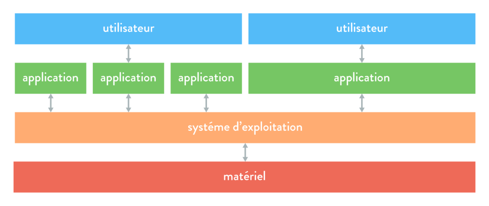

# Le système d'exploitation : une interface entre l'utilisateur et la machine 💾

Lorsqu’un utilisateur souhaite exécuter une **action** sur un ordinateur, il ne peut pas s’adresser directement au matériel. En effet, cela impliquerait d'utiliser un **langage de bas niveau**, complexe et réservé aux experts en informatique 🛠️.

Pour interagir avec la machine, l’utilisateur passe donc par :

- **Un logiciel** 🎛️ (exemple : un navigateur web, un éditeur de texte…), ou
- **Une interface de commande** ⌨️ (comme un terminal permettant d'exécuter des instructions).

Dans les deux cas, ce n’est **pas** le matériel qui est sollicité directement, mais le **système d’exploitation** 🖥️, qui joue le rôle d’**intermédiaire** entre l’utilisateur et les composants matériels.

!!! info "A retenir !" 
    Le système d’exploitation facilite l’utilisation de l’ordinateur en permettant à l’utilisateur de lui transmettre des instructions **sans** avoir à manipuler directement le matériel.

--- 

## 1 - Un peu d’histoire 🏛️  

#### Avant les années 50 : pas de système d’exploitation 📜  
Jusqu’aux années **1950**, les ordinateurs étaient réservés aux **programmeurs**, qui devaient interagir **directement** avec le matériel. Il **n’existait pas de système d’exploitation**, et les rôles de **programmeur** et d’**opérateur** étaient confondus.  

#### Les années 60 : naissance des premiers systèmes d’exploitation 🚀  
Avec l’arrivée des premiers **systèmes d’exploitation** dans les années **1960**, de nouvelles fonctionnalités apparaissent :  
- **Ordonnancement des tâches** 🗂️ pour optimiser l’utilisation des ordinateurs,  
- **Séparation des rôles** entre programmeurs et opérateurs pour améliorer l’organisation.  

#### Les années 70 : partage des ressources ⚡  
Dans les années **1970**, le développement des systèmes d’exploitation s’accélère. L’objectif principal est alors d’**optimiser** l’usage des calculateurs en permettant le **partage des ressources matérielles** entre plusieurs programmes exécutés simultanément.  

#### Depuis les années 80 : sophistication et interconnexion 🌍  
À partir des années **1980**, les systèmes d’exploitation deviennent **plus complexes et performants**, notamment grâce à :  
- L’**essor de la micro-informatique** 🖥️,  
- Le développement des **réseaux locaux** et d’**Internet** 🌐,  
- L’**interconnexion** entre systèmes hétérogènes.  

!!! info "À retenir !"
    Les systèmes d’exploitation ont évolué pour répondre aux besoins croissants en termes de **gestion des ressources**, **efficacité** et **connectivité**.

---

## 2 - Définition d’un système d’exploitation 🖥️  

Un **ordinateur personnel** (ou *Personal Computer*, PC, en anglais) est capable d’exécuter **plusieurs logiciels simultanément** pour un utilisateur.  
Un **serveur**, quant à lui, va encore plus loin : il peut non seulement exécuter plusieurs applications en parallèle, mais aussi **gérer plusieurs utilisateurs en même temps**.  

Dans ces conditions, les **ressources matérielles** d’un ordinateur (processeur, mémoire, disque, etc.) doivent être **partagées** entre les **différentes applications** et **utilisateurs** qui y accèdent.  

C’est le **système d’exploitation** qui assure cette gestion et garantit un accès **équilibré** aux ressources disponibles.  

!!! definition "Définition : Système d'exploitation"
    Un **système d’exploitation** est un ensemble de programmes permettant de gérer les ressources matérielles et logicielles d’un ordinateur. Il sert d’interface entre l’utilisateur et la machine.
    
    **Windows**, **macOS** ou encore **Linux** sont tous trois des systèmes d’exploitation pour ordinateur fixe et portable.

Le système d’exploitation est, en effet, un intermédiaire entre le **matériel** (« hardware » en anglais) et les **applications** (« software » en anglais) : 
 

        

!!! info "À retenir !" 
    **OS** est l’abréviation de **Operating System**, traduction anglais de **Système d’Opération**.  
    Cette abréviation est couramment employée, y compris chez les francophones.

--- 

## 3 - Les fonctions d’un système d’exploitation ⚙️  

Le **système d’exploitation** assure plusieurs fonctions essentielles pour garantir le bon fonctionnement d’un ordinateur.  

#### 🔄 Gestion des ressources  
L’une de ses fonctions principales est de gérer l’accès aux différentes **ressources matérielles** :  

- **Processeur** 🖥️ : planifie et ordonne l’exécution des tâches,  
- **Mémoire vive** 💾 : alloue et libère l’espace nécessaire aux programmes,  
- **Périphériques d’entrée/sortie** 🎛️ : gère l’accès aux composants comme le clavier, la souris, la carte réseau…  *(Nous détaillerons ces notions ultérieurement.)*  

#### 📂 Gestion des fichiers  
Le système d’exploitation :  

- Assure le **stockage des fichiers** sur le disque dur,  
- Organise ce stockage pour une meilleure accessibilité,  
- Matérialise le concept de fichier (*qui, à la base, est purement abstrait*),  
- Permet de **manipuler les fichiers** comme des objets (déplacement, suppression, modification…).  

#### 👥 Gestion des utilisateurs et de leurs droits  
- Un système d’exploitation peut gérer **plusieurs utilisateurs**,  
- Il définit et applique des **droits d’accès** aux fichiers et aux ressources,  
- Il sécurise les accès en fonction des autorisations attribuées à chaque utilisateur.  

!!! info "À retenir !"  
    Un système d’exploitation assure principalement la **gestion des ressources matérielles**, des **fichiers** et des **utilisateurs** afin de garantir un fonctionnement fluide et sécurisé de l’ordinateur.  

--- 

## 4 - Les systèmes d’exploitation libres et propriétaires 💾

Les **systèmes d’exploitation** sont nombreux. Sur leurs **ordinateurs personnels**, les particuliers comme les professionnels utilisent principalement :  
- **Windows** (développé par **Microsoft**),  
- **macOS** (développé par **Apple**),  
- **Linux** (moins répandu chez les particuliers mais souvent utilisé dans le monde professionnel).  

Les **appareils mobiles** tels que **tablettes et smartphones** possèdent également un système d’exploitation :  
- **Android** (développé par **Google**),  
- **iOS/iPadOS** (développés par **Apple**).  

!!! note "Infos"
    On notera qu'il existe une mutitude de système d'exploitation pour une multitude d'objets !

    On pensera, par exemple, a : 

    - Téléviseurs connectés : **webOS** (par LG), **Androïd TV** (par Google), **tvOS** (par Apple), ...
    - Montres connectées : **watchOS** (par Apple), **Wear OS** (par Google), ...
    - Frigos connectées : **Family Hub** (par Samsung), **Hitachi Fridgee** (par Hitachi), ... 

Bien que tous ces **systèmes d’exploitation** remplissent les **mêmes fonctions**, **certains sont libres tandis que d’autres sont propriétaires**.

!!! definition "Définition : Logiciel libre"
    Un **logiciel libre** (*free software* en anglais) est un logiciel dont le **code source est accessible et modifiable**.  
    Il peut être **consulté, modifié et redistribué sans restriction financière**.

**Exemples :** 

- **Linux** est un système libre, offrant plusieurs variantes comme **Debian** ou **Ubuntu**.  
- **Android** est **partiellement libre**, car même s'il repose sur un noyaux Linux, certaines parties du système sont propriétaires.
- En opposition, **Windows, macOS et iOS** sont **des logiciels propriétaires** : leur code source est fermé et ils sont soumis à des licences restreintes.

!!! info "À retenir !"  
    **Linux est un système d’exploitation libre**, contrairement à **Windows** et **macOS**, qui sont des systèmes **propriétaires**.  

!!! tip "Astuce 💡"  
    Lors de l’achat d’un **ordinateur neuf**, un **système d’exploitation préinstallé** (Windows ou macOS) est souvent inclus dans le prix.  
    💰 **Il est possible d’acheter un ordinateur sans OS et d’y installer Linux gratuitement !**  