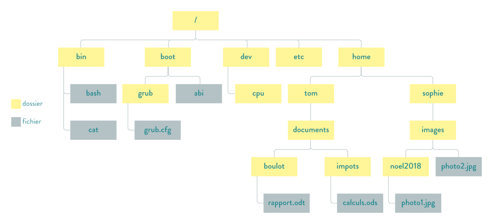

# Interface en ligne de commande 🖥️⌨️

Nous avons vu que le **système d’exploitation** est un élément central dans l’utilisation d’un ordinateur. Mais comment lui donner des **ordres** ?  

Avant l'apparition d'**interface graphique** manipulable à la souris 🖱️, avec Mac OS en 1984, il fallait passer par le terminale de contrôle pour exploiter le système d'opération grâce a différentes **commandes en mode texte**

Bien que des outils plus ergonomiques existent aujourd'hui, il est parfois **essentiel** de savoir utiliser le **mode texte**, notamment pour :  

- **Interagir directement avec le système** sans interface graphique,  
- **Dépanner un ordinateur en cas de dysfonctionnement**,  
- **Automatiser certaines tâches** via des scripts.  

Dans cette partie, nous allons nous intéresser aux **commandes fondamentales** du **terminal Linux**.

📌 **Objectif** : apprendre à exécuter des commandes **Linux** pour mieux comprendre et contrôler le système d’exploitation.  

---

## 1 - Accéder aux commandes en mode texte ⌨️  

Avant de pouvoir exécuter des **commandes en mode texte**, il est nécessaire d’ouvrir une application spécifique permettant d’interagir avec le **système d’exploitation**.  

Sur **Linux** et ses différentes variantes, l’application permettant d’accéder aux commandes en mode texte est généralement appelée **Terminal** ou **Console**.  

!!! info "Différence entre le Terminal et la Console"
    Le **terminal** est un **application** du système d'exploitation qui ouvre une console dans une interface graphique, il permet de lancer des commandes.

    La **console**, quant à elle, est une **interface textuelle** qui permet une "communication" entre l'homme et la machine avec uniquement un écran et un clavier.

    Dans la pratique, les deux s'utilisent de la même manière.

    !!! tip "Astuce"  
        En cas de problème avec l’interface graphique, **utiliser `Ctrl + Alt + Fxx`** permet d’accéder à une console qui peut permettre de résoudre le dysfonctionnement.

#### Ouvrir le terminal avec un raccourci clavier ⌨️  
Pour ouvrir rapidement un terminal sous Linux, vous pouvez utilisez le raccourci clavier **`Ctrl + Alt + T`**. 


METTRE IMAGE DU TERMINAL

---

## 2 - Les commandes de base 🏗️

Dans cette section, nous allons découvrir les **commandes fondamentales** permettant de **manipuler les fichiers** et d’organiser leur structure sous **Linux**.  

### L’arborescence des fichiers 🌳  
Sous **Linux**, les fichiers sont organisés selon une structure en **arbre**, appelée **arborescence**.  
Chaque fichier et dossier est placé à un **emplacement précis** dans cette hiérarchie, avec un **chemin d’accès unique**.  

!!! definition "Définition : Arborescence des fichiers"  
    L’**arborescence** est une organisation hiérarchique des fichiers et répertoires sous Linux, où chaque élément est placé dans une structure en **arbre** à partir d’un dossier racine (`/`).  

Pour la suite de cette leçon, nous allons utiliser l'arborescence suivante : 

<div style="display: flex; justify-content: center;">
        
</div>

À tout moment, toute application se trouve à un endroit de cette arborescence. On le désigne comme le **répertoire courant**.

!!! info "À retenir !"
    Pour localiser un fichier ou un dossier dans cette **arborescence**, on peut utiliser deux types de **chemins** :  

    - **Chemin absolu** 📍 : démarre toujours à la **racine (`/`)**.  
      *Exemple* : `/home/tom/documents/boulot/rapport.odt`  
    - **Chemin relatif** 🔄 : démarre **à partir du dossier courant** et ne commence pas par `/`.  
        *Exemples* :  
        *Depuis le dossier `tom` :* `documents/boulot/rapport.odt` .  
        *Depuis le dossier `images` : *`../../tom/documents/boulot/rapport.odt` .
        
    **Remarque** :  
    - `..` permet de remonter d’un **niveau supérieur** dans l’arborescence.  
    - `.` représente le **dossier courant**. 

### Les commandes de bases ⌨️
Voici les commandes les plus fréquemment utilisées : 

| Commande   | Signification (en anglais)   | Explication  | Exemple  |
|------------|-----------------------------|-------------|---------|
| `pwd`      | print working directory      | Afficher le chemin du répertoire courant.  | `pwd`  |
| `cd xxx`   | change directory             | Changer de répertoire courant (`cd` doit être suivi du chemin relatif ou absolu vers le nouveau répertoire).  | `cd /home/sophie/image/noel2018` (chemin absolu) ou `cd ../../sophie/image/noel2018` (chemin relatif)  |
| `ls`       | list                         | Lister le contenu du répertoire courant.  | `ls`  |
| `mkdir xxx`| make directory               | Créer un répertoire dans le répertoire courant (`mkdir` doit être suivi du nom du répertoire à créer).  | `mkdir finances` (crée un répertoire nommé "finances")  |
| `rm xxx`   | remove                       | Supprimer un fichier ou un répertoire dans le répertoire courant (`rm` doit être suivi du nom du fichier ou répertoire à supprimer).  | `rm rapport.odt` (supprime le fichier "rapport.odt")  |
| `cp xxx yyy` | copy                        | Créer une copie du fichier `xxx` sous le nom `yyy` dans le répertoire courant. | `cp rapport.odt copierapport.odt` (crée une copie de `rapport.odt` nommée `copierapport.odt`) |


!!! warning "Suppression d'un répertoire non vide 🚨"  
    Si un répertoire **n'est pas vide**, il faut utiliser l'option `-r` pour une **suppression récursive** :  
    - **Commande** : `rm -r nom_du_répertoire`  
    - Cela supprimera **tous les fichiers et sous-répertoires** qu'il contient.

!!! info "Agir hors du répertoire courant 📂"  
    Les commandes peuvent aussi être utilisées **hors du répertoire courant** en indiquant un **chemin relatif ou absolu**.  

    **Exemple** : Pour copier le document `rapport.odt` (situé dans `/home/tom/documents/boulot/`) et le sauvegarder sous `copierapport.odt` dans `/home/sophie/images/` :  
    ```bash
    cp /home/tom/documents/boulot/rapport.odt /home/sophie/images/copierapport.odt
    ```

### Informations système 🖥️  

En plus des commandes permettant de **manipuler les fichiers et l’arborescence**, il existe plusieurs commandes utiles pour obtenir des **informations système**.  

| Commande      | Signification (en anglais) | Explication  | Exemple  |
|--------------|----------------------------|-------------|---------|
| `date`       | date                        | Affiche la date et l’heure actuelles réglées sur l’ordinateur.  | `date` |
| `free`       | memory usage                | Donne un résumé de l'utilisation de la mémoire RAM.  | `free` |
| `ping xxx`   | packet internet groper      | Vérifie la connectivité avec un équipement réseau via son adresse IP.  | `ping 192.168.1.1` |

!!! info "À retenir !"  
    La commande **`ping`** permet de tester la **connectivité réseau** de son ordinateur avec un autre appareil.  
    Elle sera étudiée plus en détail dans le chapitre **"Adresse IP et réseau local"**.

!!! tip "Les bonnes pratiques"
    * On ne tape jamais soi-même les chemins en entier, on utilisera la touche `TAB` (tabulation) pour exploitier **l'auto-complétion**.
    * Pour naviger dans le terminal, on utilisera les touches **flèche haut ↑** ou **flèche bas ↓**.
    * La commande `history` permet d'obtenir l'historique des commandes précédemment tapées
    * La commande `clear` (ou le raccourci clavier `Ctrl + L` ) permet d'effacer les commandes précédemment rentrées.
    * Pour obtenir de l'aide concernant une commande, on peut saisir `info XXX` ou `man XXX` ou encore `XXX --help` (où `XXX` correspond à une commande, `ls` par exemple).

