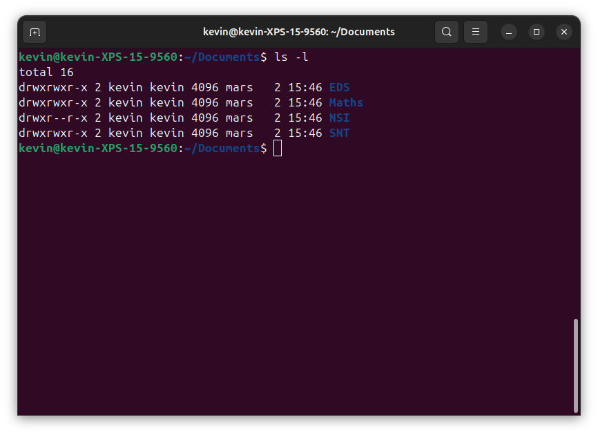
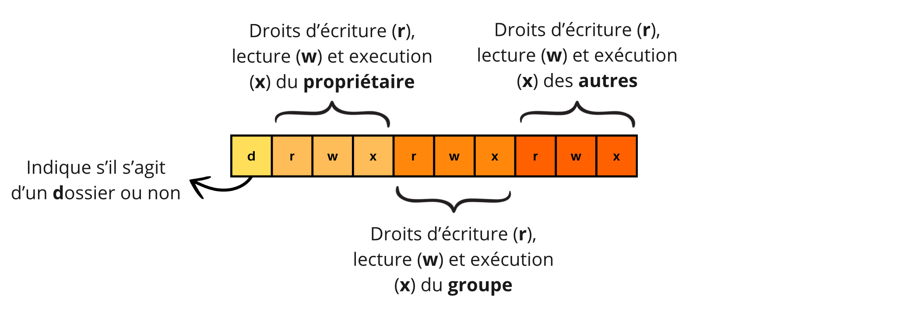
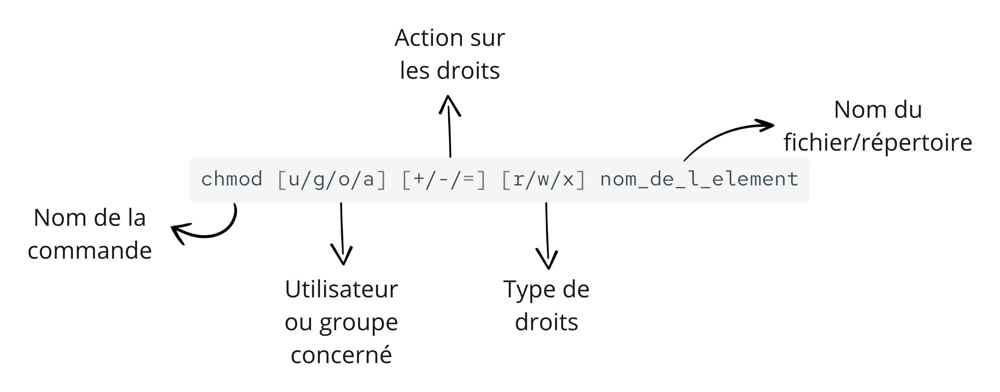

# Gestion des droits d'accès aux fichiers 🔒  

Nous avons vu que le **système d’exploitation** a pour mission de **gérer les utilisateurs** et de leur attribuer les **ressources de l’ordinateur**.  

L’un de ses rôles essentiels est de **réglementer l’accès aux fichiers** afin d’éviter des erreurs ou des incidents. 

En effet :  

* ❌ Un utilisateur ne doit **pas** pouvoir **modifier ou supprimer** les fichiers d’un autre utilisateur.  
* ❌ Un utilisateur ne doit **pas** pouvoir supprimer des **dossiers critiques du système**, sous peine de provoquer des **dysfonctionnements** ou **pannes**.  

Sous **Linux**, ces accès sont **strictement contrôlés** par un système de **droits d’accès** appliqué aux fichiers et répertoires.  

📌 **Objectif** : comprendre comment Linux gère les droits d’accès aux fichiers et comment ils peuvent être modifiés.  

---

## 1 - Organisation des utilisateurs sous Linux 👥  

Sous **Linux**, les utilisateurs sont organisés de manière à faciliter la **gestion des droits d’accès**.  

### L’utilisateur "root" : le super-utilisateur 🛠️  
Il existe un **utilisateur spécial** qui dispose de **tous les droits** sur le système :  
- Cet utilisateur est appelé **"root"** ou **"administrateur"**.  
- Il peut **modifier, supprimer et accéder** à tous les fichiers et configurations du système.  
- Son utilisation doit être **limitée** pour éviter des erreurs critiques.  

### Les groupes d’utilisateurs 📂  
Pour simplifier la gestion des droits, les utilisateurs peuvent être **regroupés en "groupes"** :  
- Un **groupe** permet d’attribuer **des droits communs** à plusieurs utilisateurs.  
- Plutôt que d’accorder des droits individuellement à chaque utilisateur, on accorde ces **droits au groupe**, et tous ses membres en bénéficient automatiquement.  

!!! info "À retenir !"  
    L’utilisateur **root** a **tous les pouvoirs** sur le système. Pour éviter de devoir gérer les droits individuellement, **Linux permet d’organiser les utilisateurs en groupes** et d’attribuer les permissions à un **groupe entier** plutôt qu’à chaque utilisateur séparément.

---

## 2 -  Types d’accès accordés 🔑  

Sous **Linux**, chaque fichier et répertoire est associé à des **droits d’accès** qui définissent ce que les utilisateurs peuvent faire avec.  

!!! info "Quels droits peut-on accorder sur un fichier ou un répertoire ?"  
    Sous Linux, trois types de **droits d’accès** peuvent être accordés :  

    - **Lecture** (`r` pour *read*) 📖 : permet de **lire** le contenu de l’élément.  
    - **Écriture** (`w` pour *write*) ✍️ : permet de **modifier** le contenu de l’élément.  
    - **Exécution** (`x` pour *execute*) ⚙️ : permet **d’exécuter** l’élément s’il s’agit d’un programme ou d’un script.  

!!! info "À qui peut-on accorder ces droits ?"  
    Les **droits d’accès** sont attribués à **trois catégories d’utilisateurs** :  

    - **Le propriétaire** (`u` pour *user*) 👤 : l’utilisateur qui possède l’élément.  
    - **Le groupe** (`g` pour *group*) 👥 : l’ensemble des utilisateurs appartenant au même groupe.  
    - **Les autres utilisateurs** (`o` pour *other*) 🌍 : tous ceux qui **ne sont ni propriétaires ni membres du groupe** associé à l’élément.  

    🔹 **Remarque** :  
    Il existe aussi une quatrième catégorie, **"Tous les utilisateurs"** (`a` pour *all*), qui désigne **tous** les utilisateurs du système, sans distinction.

Détaillons la réponse de Linux à la commande « ls » évoquée précédemment, dont voici un exemple.



On observe :  

* la ligne de commande `ls-l` : l’option `-l` permet d’obtenir une réponse avec plus de détails que dans celle de la commande `ls` seule, en particulier les droits d’accès.   
* deux lignes de réponse se suivent, organisées suivant la présentation suivante : 

    

    Dans l'image précédente, on remarque ainsi que : 

    - Pour les dossiers nommés **EDS**, **Maths** et **SNT**, le propriétaires et le groupe possèdent tous les droits (lecture, écriture et exécution) alors que les autres en possèdent que les droits de lecture et d'exécution.
    - Pour le dossier nommé **NSI**, le propriétaire a tous les droit, le groupe seulement le droit de lecture et les autres le droit de lecture et d'exécution.

--- 

## 3 - Outils pour gérer les droits d’accès 🛠️  

Sous **Linux**, nous pouvons gérer les droits d’accès aux fichiers et répertoires avec des **commandes en mode texte**. Cela permet :  

- **D’ajouter ou de supprimer des droits** sur un élément,  
- **De changer le propriétaire** ou **le groupe** d’un élément.  

### Commandes principales 📌  

| Commande | Signification | Explication | Exemples |
|----------|--------------|-------------|---------|
| `chown`  | change owner | Modifier le **propriétaire** ou le **groupe** d’un fichier/répertoire. | `chown toto:myhome boulot` (change le propriétaire du répertoire `boulot` en `toto`) <br> `chown myhome:titi boulot` (change le groupe du répertoire `boulot` en `titi`) |
| `chmod`  | change mode  | Modifier les **droits d’accès** sur un fichier ou un répertoire. | `chmod g+w boulot` (ajoute le droit d’écriture au groupe pour `boulot`) <br> `chmod o-r Documentation_FGMS-001-FRA-v1.01.pdf` (retire le droit de lecture aux "autres" utilisateurs) |

### Syntaxe de `chown` 📝

On pourra en utiliser des variantes en fonction de l'objectif :

* Changer le propriétaire d'un fichier :
    ```bash
    chown nouvel_utilisateur unfichier
    ```

* Changer le groupe propriétaire d'un fichier : 
    ```bash
    chgrp nouveau_groupe unfichier
    ```

* Changer le propriétaire et/ou le groupe propriétaire d'un fichier : 
    ```bash
    chown nouvel_utilisateur:nouveau_groupe unfichier
    ```

### Syntaxe de `chmod` 📝 

Pour comprendre le fonctionnement de la commande `chmod`, il faut se rappeler que : 

 - **u** signifie *user* (propriétaire);
 - **g** signifie *group* (groupe);
 - **o** signifie *other* (autres);
 - **a** signifie *all* (tous).

Ainsi que des opérations suivantes : 

- **+** signifie : *"Ajouter le droit"*
- **-** signifie : *"Supprimer le droit"*
- **=** signifie : *"Affecter le droit"*

La structure gérérale de la commande est la suivante : 



Voici quelques exemples pratiques : 

* Ajouter le droit d'écriture au groupe sur `rapport.odt` :
    ```bash
    chmod g+w rapport.odt
    ```

* Enlever le droit de lecture aux autres sur `photo2.jpg` :
    ```bash
    chmod o-r photo2.jpg
    ```

* Ajouter le droit d'écriture et d'exécution au propriétaire sur `calculs.ods` et enlever le droit d'écriture aux autres : 
    ```bash
    chmod u+wx,o-wx calculs.ods
    ```

    ou encore :

    ```bash
    chmod u=rwx,o=r calculs.ods
    ```