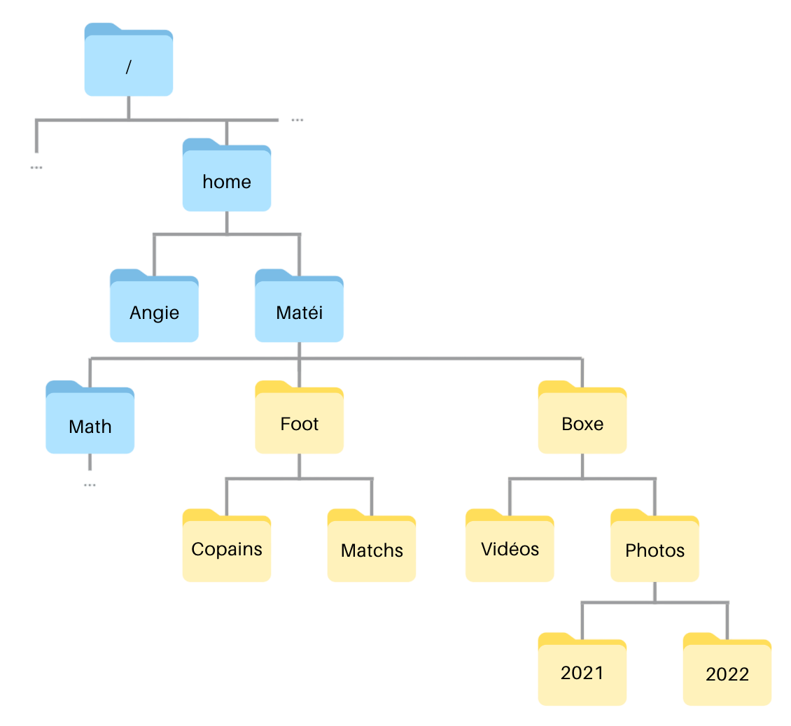

# Exercices 

Vous trouverez ci-dessous les exercices de cette séquence.

- Les exercices marqués avec :fontawesome-solid-pencil: se réalisent **sans ordinateur**.  
- Ceux indiqués par :fontawesome-solid-laptop: nécessitent **un ordinateur**.

Les corrections sont généralement disponibles, mais elles ne doivent être consultées **qu'après validation de votre production par l'enseignant**.

---

## Système d'exploitation 

!!! exopapier "Exercice 1"
    D'après la page Wikipédia "[Liste des distributions GNU/Linux](https://fr.wikipedia.org/wiki/Liste_des_distributions_GNU/Linux)", quelles sont les 4 variantes de Linux les plus populaires ? Pourquoi y a-t-il autant de variantes ?

    ??? success "Correction"
        Classement Alexa (octobre 2020) : Ubuntu, RedHat, Debian, CentOS

        Classe SimilarWeb (juin 2020) : Ubuntu, RedHat, Linux Mint, ArchLinux

        Linux est un système d'exploitation libre et gratuit, qui permet donc à tout un chacun d'utiliser le code source pour réaliser une version dérivée. Ces versions dérivées (aussi appelées **distributions**) se distinguent souvent seulement par les applications qu'elles incluent.

---

## Interface en ligne de commande

!!! exopapier "Exercice 2" 
    Voici un extrait du système de fichiers de l'ordinateur de Fredo, qui a pour système d'exploitation Linux : 

    

    1. Depuis le répertoire `home`, le chemin `/home/Fredo/NSI` est-il correct ? Si oui, est-il absolu ou relatif ? Justifier.

    2. Depuis le répertoire `Fredo`, déterminer le chemin absolu et le chemin relatif pour aller dans le répertoire `Exos`.

    3. Depuis le répertoire `Exos`, déterminer le chemin absolu et le chemin relatif pour aller dans le répertoire `Fiches`.

    4. Depuis le répertoire `Fiches`, déterminer le chemin absolu et le chemin relatif pour aller dans le répertoire `DS`.

    ??? success "Correction"
        1. Le chemin est bien correct. Il s'agit d'un chemin **absolu** puis il commence à la racine *`/`* de l'arborescence. Le chemin absolu aurait été : `Fredo/NSI`.

        2. Chemin absolu : `/home/Fredo/NSI/Exos`

            Chemin relatif : `NSI/Exos`

        3. Chemin absolu : `/home/Fredo/Maths/Fiches`

            Chemin relatif : `../../Maths/Fiches`
    
        4. Chemin absolu : `home/Fredo/Maths/DS`

            Chemin relatif : `../DS`


!!! exopapier "Exercice 3" 
    Noémie vient d'installer Linux sur son ordinateur. Les fichiers de l'arborescence ci-dessous étaient déjà présents. Elle a dressé la liste des commandes qu'elle a utilisées pour créer l'arborescence de ses fichiers personnels : 

    <div class="grid" markdown>

    - `cd /home/Noémie mkdir Photos`
    - `home`
    - `mkdir Vidéo cd Vidéo`
    - `Noémie`
    - `mkdir Copines`
    - `cd ..`
    - `mkdir Vacances`
    - `mkdir Vacances/Avril`
    - `mkdir Vacances/Juillet`
    - `mkdir /home/Noémie/Vidéo/Danse`

    

    </div>

    Compléter l'arborescence de fichier de Noémie.

!!! exoordi "Exercice 4"
    Matéi veut ajouter les répertoires jaunes à son répertoire personnel. 

    

    1. Allez sur [ce site :octicons-link-external-16:](https://www.cahier-nsi.fr/jslinux/). Attendre la demande de login, puis saisir le login "Matéi" avec le mot de passe "NSI".

    2. Tester la commande pour vérifier que vous êtes bien dans le répertoire `Matéi`

    3. Tester la commande pour créer un répertoire `Foot` dans le répertoire `Matéi`.

    4. Tester la commande pour se déplacer dans le répertoire `Foot`.

    5. Tester la commande pour créer les deux répertoires `Copains` et `Matchs`. 

    6. Sans changer de répertoire, tester la commande pour créer le répertoire `Boxe`.

    7. Se déplacer dans le répertoire `Boxe`

    8. Tester la commande pour créer les répertoires `Vidéos` et `Photos`. 

    9. Sans changer de répertoire courant, tester la commande pour créer les répertoires `2021` et `2022`.

    ??? success "Correction"
        1. Aucune correction nécessaire.
        2. `pwd`
        3. `mkdir Foot` puis vérifier avec `ls`
        4. `cd Foot` puis vérifer avec `pwd`
        5. `mkdir Copains Matchs` puis vérifier avec `ls`
        6. `mkdir ../Boxe` puis vérifer avec `cd ..` et `ls`.
        7. `cd ../Boxe`
        8. `mkdir Vidéos Photos` puis vérifier avec `ls`
        9. `mkdir Photos/2021 Photos/2022` puis vérifier avec `cd Photos` et `ls`.


!!! exopapier "Exerice 5"
    On se place à la racine de l'arborescence suivante : 

    

    1. Dans cette arborescence, après avoir effectué la commande `cd b`, quel est le résultat de la commande `ls` ?

    2. Depuis le répertoire `b`, quelle commande faut-il alors effectuer pour que la commande `ls` affiche `f7 f8` ?

    ??? success "Correction"
        1. `f2 e`

        2. `ls ../c/g`

!!! exopapier "Exercice 6"
    On se place à nouveau à la racine de l'arborescence de l'exercice précédent.

    1. Après avoir effectué la commande `cd b`, quelles commandes faut-il exécuter pour copier le fichier `f1` dans le répertoire `d` et afficher le contenu de ce répertoire ?

    2. Quel(s) commande(s) faut-il ensuite exécuter pour que la commande `pwd` affiche `/r/c/f` ?

    ??? success "Correction"
        ```bash title="Terminal" linenums="1"
        cp ../f1 ../a/d
        ls ../a/d

        cd ../c/f
        ```
