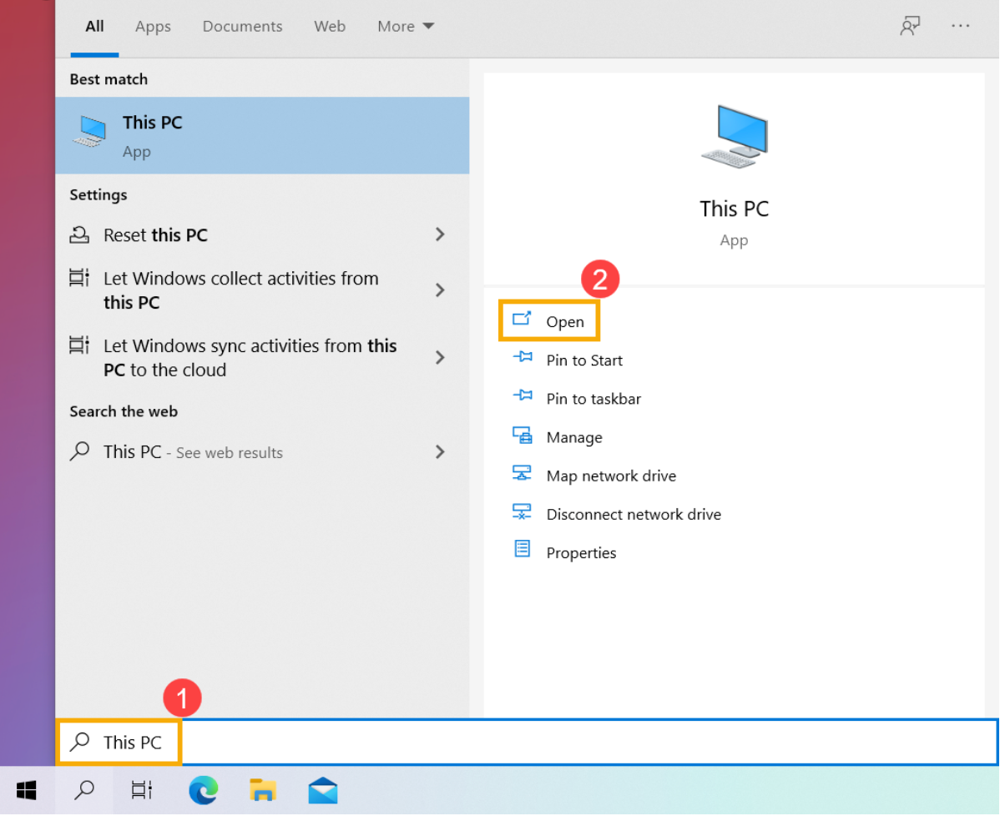
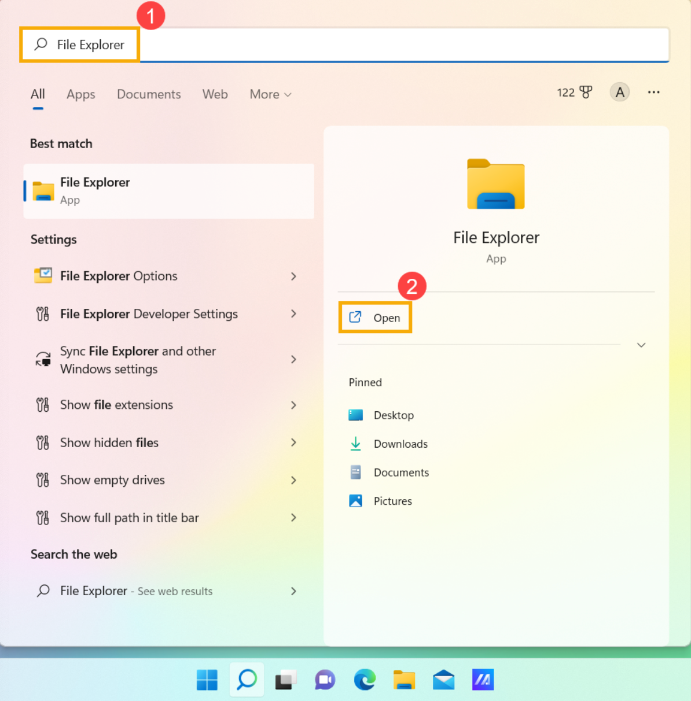
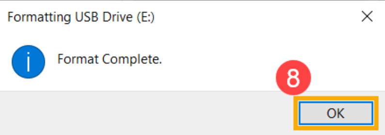
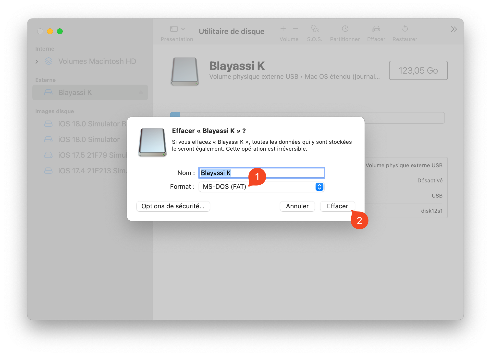
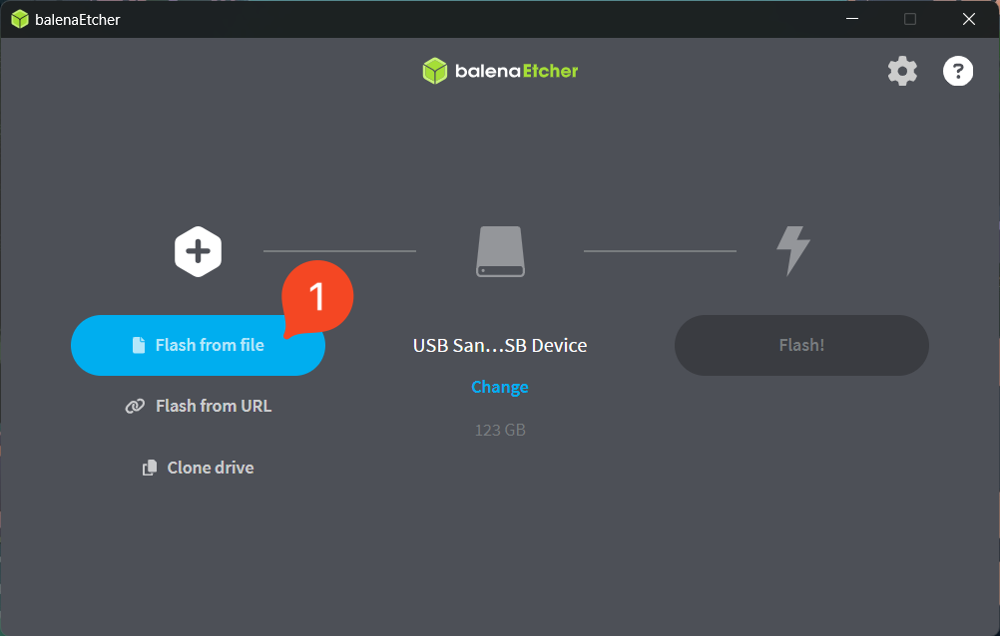
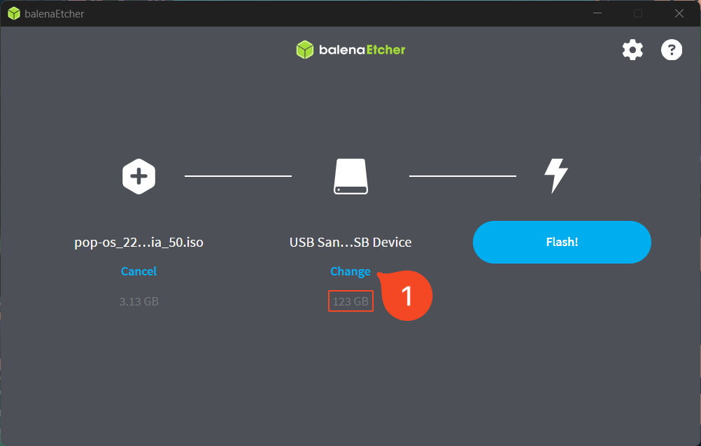
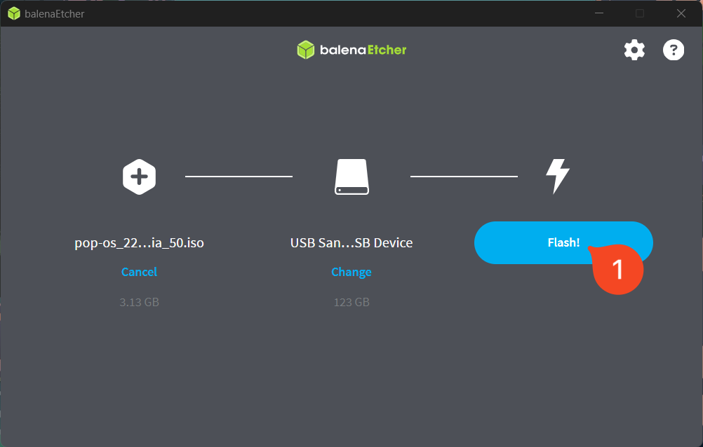
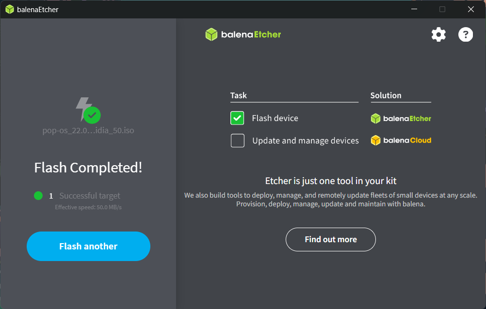

# Installation de Linux

## 🎯 Introduction  

Nous allons préparer un **environnement de travail portable** en créant une **clé USB bootable** contenant une **distribution Linux**. 

#### Pourquoi faire cela ? 💡
- **Découvrir Linux** : Nous allons utiliser cet environnement tout au long de l’année en NSI.  
- **Travailler sur n’importe quel ordinateur** sans modifier le système installé.  
- **Apprendre à installer un OS** sur un support externe, une compétence essentielle en informatique.  

#### Objectifs du TP  📌
✅ Télécharger et préparer une image d’installation de Linux.  
✅ Créer une clé USB bootable.  
✅ Démarrer un ordinateur sur cette clé pour tester et utiliser Linux.

#### Résultats 🚀 

À la fin de ce TP, vous serez capables d’utiliser un système Linux sans toucher au disque dur de votre machine.

👉 **Passons à la première étape !** ⬇️ 

---

## 1️⃣ Préparation

Pour réaliser ce TP, il vous faudra : 

- Une clé USB de 8GB ou supérieur 
- Un disque dur ou SSD de 128Go ou plus (pour avoir suffisament de place)
- L'image (ISO) de la distribution EDUbuntu (Long Term Release) disponible gratuitement [ici :octicons-link-external-16:](https://www.edubuntu.org/download.html). 
- Le logiciel balenaEtcher disponible gratuitement sur Windows, macOS ou Linux [ici :octicons-link-external-16:](https://etcher.balena.io)

---

## 2️⃣ Préparer la clé USB

Nous allons formatez votre clé USB au format FAT32. Vous pouvez ignorer cette étape si votre clé USB est déjà dans le bon format.

!!! warning "Attention !"
    Pensez à sauvegarder toutes les données de votre clé USB avant de procéder au formattage. 
    
    **Celles-ci seront définitivement supprimées !**

=== "Windows"

    1. Ouvrez l'application **Explorateur de fichiers** (windows 11) ou **Ce PC** (windows 10)

        

        <figure style="text-align: center;">
        
        <figcaption style="margin-top: 5px; font-style: italic; color: gray;">Windows 10</figcaption>
        </figure>
        <figure style="text-align: center;">
        
        <figcaption style="margin-top: 5px; font-style: italic; color: gray;">Windows 11</figcaption>
        </figure>
        

    2. Cliquez avec le bonuton droit sur votre clé USB, puis sélectionnez **Formater**

        

        
        
  

    3. Sélectionnez **Système de fichiers** sur **FAT32**, puis cliquez sur **Démarrer**

        

        
        
  

        ??? warning "Si vous avez plus de 32Go"
            Si vous avez une clé USB de plus de 32Go, il est probable que l'option `FAT32` ne soit pas disponible dans les options de formattage. Dans ce cas, il vous faudra passer par le logiciel [FAT32 Format](https://www.lesnumeriques.com/telecharger/fat32-format-19934) pour formatter la clé.

    4. Une notification va apparaitre pour vous rappeler que toutes les données sur la clé USB seront supprimées. Cliquez sur **OK** pour commencer à formater votre clé USB.

        

        
        
  

    5. Une nouvelle notification apparaitra lorsque le formatage de votre clé USB sera terminé. Cliquez sur **OK** pour fermet la fenêtre.

        

        
        
  

=== "macOS" 

    1. Appuyez simultanément sur les touches `command` et la barre espace puis saisissez **Utilitaire de disque** pour ouvrir l'application.

        

        
        

    
    2. Sélectionnez votre clé USB dans la liste de gauche puis sélectionnez **Effacer** dans le menu du haut.

        

        
        

    3. Dans **Format**, sélectionnez **MS-DOT (FAT)** puis cliquez sur **Effacer**

        

        
        

---

## 3️⃣ Création de la clé USB bootable

Maintenant que notre clé USB est prête, nous allons créer une partition bootable sur cette dernière. 

1. Lancez le logiciel **balenaEtcher** téléchargé précédemment.

    

    
    
 

2. Cliquez sur **Flash form file** et sélectionnez le fichier ISO téléchargé précédemment.

    

    
    
 

3. Si nécessaire, sélectionnez votre clé USB en appuyant sur le bouton **Change**. Pensez à controler que le périphérique sélectionné est le bon !

    

    
    

4. Appuyez sur **Flash!**

    

    
    

5. Patientez... Etcher va commencer par flasher votre clé USB.

    

    
    

6. Patientez... Etcher va ensuite vérifier le dispositif créé.

    

    
    

7. Fermez le logiciel une fois que ce dernier indique avoir terminé !

    

    
    

---

## 4️⃣ Démarrer sur la clé USB

Notre clé USB bootable est enfin prête ! Il nous reste plus qu'à démarrer dessus pour pouvoir configurer notre distribution Linux.

1. Éteindre complètement votre ordinateur
2. Redémarrer votre ordinateur et lancer le menu de boot du BIOS (généralement F2 ou F12).

---

## 5️⃣ Installer EDUbuntu

---

## 6️⃣ Terminer la configuration

