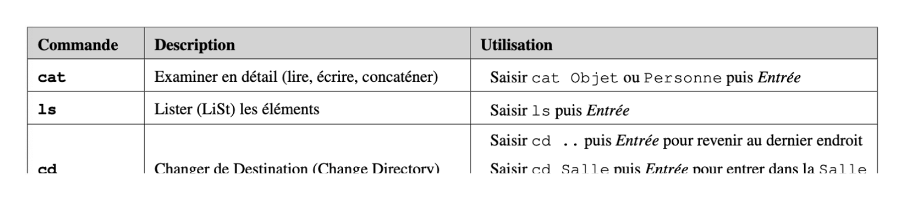

## 🎯 Introduction  

Après avoir créé un environnement Linux sur clé USB, nous allons maintenant **explorer les lignes de commande** à travers un **jeu interactif** 🎮  : **Terminus** 

#### Pourquoi faire cela ? 💡  
- **Découvrir l’univers du terminal Linux** de manière ludique.  
- **Apprendre les commandes de base** (navigation, manipulation de fichiers…).  
- **Comprendre l’intérêt de la ligne de commande** pour interagir efficacement avec un système.  

#### Objectifs du TP 📌  
✅ Se familiariser avec le terminal Linux à travers un jeu de rôle interactif.  
✅ Apprendre à naviguer dans un environnement en ligne de commande.  
✅ Manipuler des fichiers et exécuter des commandes essentielles.  

#### Résultats 🚀  
Vous serez plongés dans un monde où chaque commande vous aidera à progresser ! Prêt à relever le défi et à devenir un expert du terminal ?  

---

## 1️⃣ Consignes

Vous allez accéder dans quelques instants à l'univers fictif de Terminus. 

Dans ce jeu, tu vas incarner une personne qui devait effacer un fichier à totu prix, mais a oublié ou se situait ce dernier. Il te faudra utiliser les **commandes Linux** que tu découvrira tout au long du chemin pour progresser dans le Terminal et localiser le fichier à effacer. 

Il va donc falloir vous guider par le jeu, mais attention ! - vous devez noter sur un papier chaque nouvelle commande que vous apprenez. Vous pouvez par exemple construire un tableau de ce type :

    

Je vous recommande également de créer une "carte" du jeu au fur et à mesure que vous avancer dans l'histoire. Par exemple : 

    

--- 

## 2️⃣ Let's go !

👉 **Lancez [Terminus :octicons-link-external-16:](https://luffah.xyz/bidules/Terminus/) et commencez votre aventure !** 

--- 

## 3️⃣ Restitution de votre travail

Une fois votre travail terminé, déposer votre tableau sur **EcoleDirecte**.