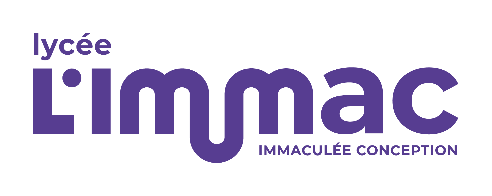

<h1 style="display: flex; justify-content: space-between; align-items: center;">
  Bienvenue !
  
</h1>

???+ warning "Attention"
    Ce site est en cours d'élaboration. 
    
    De nombreux contenus sont encore absents et le contenu déjà présent peut être incomplet ou contenir des erreurs. 

Bienvenue à tous, chers élèves de **Seconde** et **Première** ! Ce site a été spécialement conçu pour vous accompagner tout au long de l'année scolaire dans les disciplines suivantes :

- **Sciences Numériques et Technologie (SNT)** - Classe de Seconde
- **Enseignement de Spécialité Mathématiques (EDS Maths)** - Classe de Première
- **Enseignement de Spécialité Numérique et Sciences Informatiques (EDS NSI)** - Classe de Première

## Objectifs du site

- **Simplifier votre apprentissage** : Retrouvez toutes les ressources nécessaires pour réussir dans chaque discipline.
- **Centraliser les informations** : Accédez aux cours, aux exercices et aux projets en un seul endroit.
- **Encourager l'autonomie** : Utilisez les outils interactifs et les supports en ligne pour approfondir vos connaissances à votre rythme.

## Comment naviguer sur le site ?

- **Menu principal** : Utilisez le menu en haut de la page pour accéder aux différentes disciplines.
- **Ressources** : Cliquez sur la discipline de votre choix pour consulter les cours, fiches méthodologiques et exercices.
- **Projets** : Retrouvez des idées de projets collaboratifs, des sujets d'étude et des tutoriels détaillés.

## Contact

Une question, un problème ou une suggestion ?
👉 **Envoyez-moi un message via l'ENT** ou passez me voir en classe.

---

Bonne navigation et bon courage pour cette année scolaire riche en découvertes et en apprentissages ! 🌟
